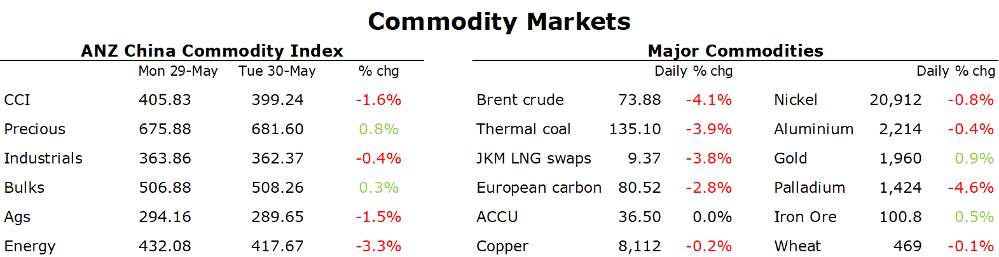

# Oil slump amid signs of weak physical demand

**Date:** June 01, 2023  
**Publisher:** Breakwave Advisors | **Category:** Market Insights  
**Original URL:** [https://www.breakwaveadvisors.com/insights/2023/6/1/oil-slump-amid-signs-of-weak-physical-demand](https://www.breakwaveadvisors.com/insights/2023/6/1/oil-slump-amid-signs-of-weak-physical-demand)  

---

*By*[*Daniel Hynes*](https://www.linkedin.com/in/dahynes/)

Signs of weak underlying demand saw further downward pressure on commodity markets. This offset a broader pick up in risk appetite following the US debt ceiling deal.

> **Figure 1: 1685485357138**  
> **Interactive Data & Source:** [Linkedin](https://www.linkedin.com/newsletters/commodities-wrap-6692196755876012032/?fbclid=IwAR3kiXJqZdxmp9ZcRwBNI7FsBySI-XSC0pfPur1qzjt7OZp7PTE59Tsl1QI) | [Local Asset](file:///C:/Users/Dell/Github/Shipping/corpus/03-breakwave/insights/2023/assets/2023-06-01_oil-slump-amid-signs-of-weak-physical-demand_img_1685485357138_95cbef9776ad.png)

Crude oil slumped amid signs of weakness in the physical market. WTI crude fell below USD70/bbl after stockpiles at Cushing, the delivery point for the US crude future rose 1.05mbbls last week, according to Wood Mackenzie data. This has seen the near-term discount for spot prices over July futures fall to USD0.3/bbl, indicating weak demand. Easing supply-side issues also weighed on sentiment. Several oil sand producers have indicated they are likely to bring back output that has been curtailed by recent wildfires in Canada. The market is also getting increasingly frustrated with Russia’s promise to reduce supply. Crude oil exports are edging lower but still show no signs of the 0.5mb/d cut it insisted the country is making. This comes ahead of its meeting with fellow members of the OPEC+ alliance to review its production agreement. The group is scheduled to meet on 3-4 June.

European gas inched higher as supply outages outweighed increasing renewable energy power generation. The Kollsnes gas processing plant in Norway will have outages this week. The Montoir LNG import facility in France in also scheduled for a shutdown. Lower nuclear output in France is also providing some support to the market. However, strong German solar power generation has offset the need for gas. Over the weekend, power generation hit unprecedent levels, which is expected to remain high this week. North Asian LNG prices bounced off a two year low but remain under pressure amid weak demand. Most major importers remain on the sidelines amid expectations of further falls in prices. Demand in China remains weak, highlighted by prices for trucked LNG hitting their lowest level in more than two years.

Copper was steady as improved risk appetite was offset by signs of China’s disappointing economic recovery continuing to weigh on the demand outlook. The Hang Shen China Enterprises Index dropped sharply, taking its losses from a 27 January peak to 20%. Lacklustre earnings have stoked fears of further economic weakness. The market appears to be struggling with the adjustment that China’s era of rapid growth is over. Nevertheless, a short-term bounce is still on the cards. Grid investment is up 10% year-to-date, while electric vehicle sales are up 44%. The strong EV market has also boosted lithium prices in recent weeks. Chile government agency, Cochilco sees the battery-metal market remaining tight through next year, with demand growing steadily at more than 16% y/y on average through 2035.

Sentiment remains weak in the iron ore market. Futures in China fell on news that Vale is looking to expand output. Its pushing ahead with a USD2.7bn investment plan to boost output in Brazil's Amazon region. It’s currently on track to add 30mt of capacity.

Gold gained as US Treasury yields slumped on hopes the US congress will approve a debt ceiling deal that will avert a default.

Data source:[Commodities Wrap](https://www.linkedin.com/newsletters/commodities-wrap-6692196755876012032/?fbclid=IwAR3kiXJqZdxmp9ZcRwBNI7FsBySI-XSC0pfPur1qzjt7OZp7PTE59Tsl1QI)
