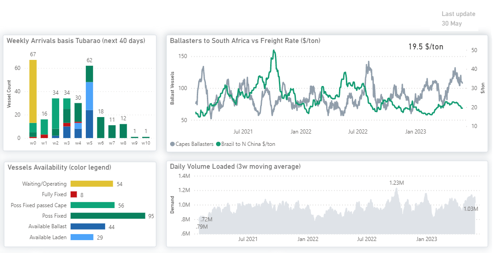
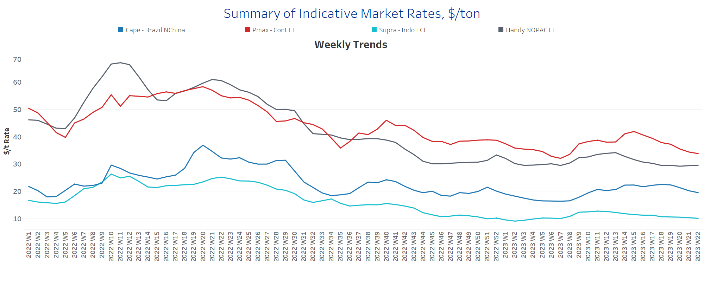
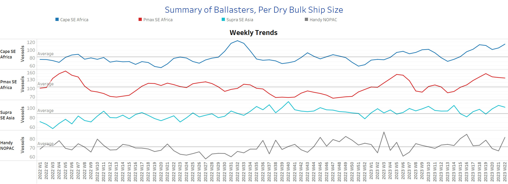
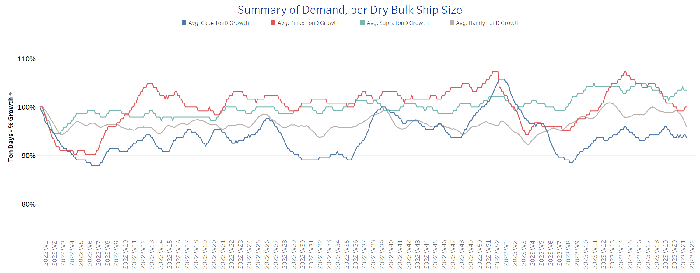
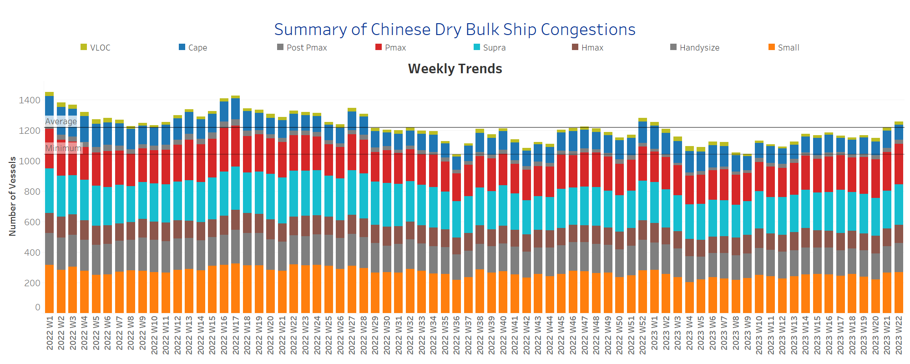

# Signal Dry Bulk Weekly Report

**Date:** June 01, 2023  
**Publisher:** Breakwave Advisors | **Category:** Market Insights  
**Original URL:** [https://www.breakwaveadvisors.com/insights/2023/6/1/signal-dry-bulk-weekly-report](https://www.breakwaveadvisors.com/insights/2023/6/1/signal-dry-bulk-weekly-report)  

---

## Chart of the Week Dry Bulk: Ballasters to South Africa

The number of ballasters has been steadily increasing since the beginning of April

> **Figure 1: Data Source: The Signal Ocean Platform**  
> *Data Source: The Signal Ocean Platform, C3 Dashboard*  
> **Interactive Data & Source:** [Signal Ocean Platform](https://go.signalocean.com/e/983831/dry-dynamic-c3/2p15qb/323368539?h=2znq_HgXwCtivbRVlMf0BjvUjZ4xiO725308zuBNEVg) | [Local Asset](file:///C:/Users/Dell/Github/Shipping/corpus/03-breakwave/insights/2023/assets/2023-06-01_signal-dry-bulk-weekly-report_img_unnamed-2023-06-01t114651023_9abb5011d4ba.png)

[Signal Ocean Platform](https://go.signalocean.com/e/983831/dry-dynamic-c3/2p15qb/323368539?h=2znq_HgXwCtivbRVlMf0BjvUjZ4xiO725308zuBNEVg)

The Chinese economy is grappling with challenges as the property sector weakens and iron ore prices slide. Chinese demand for iron ore is on a decreasing trend, while it seems that we are nearing the end of an era for Chinese construction. Chinese steel producers have expressed the need for production cuts this year due to a batch of worrisome macroeconomic and property sector data. The decline in property investment by 16.2% in April has intensified the pressure, leading to a contraction in new housing prices for the 12th consecutive month. Furthermore, the bearish sentiment has been reinforced by abundant supply, with key producers Australia and Brazil reporting robust output.

Observing the image above, it is evident that there has been a consistent rise in the number of Capesize ballasters heading to South Africa since the start of April. This increase coincides with the Brazil to North China rates plummeting to below $20/ton. The current levels are among the lowest recorded this year, indicating a prevailing negative sentiment for Capesize Brazil to North China rates. This downward trend is expected to persist throughout the second half of the year.

For more information on this week's trends, see the analysis sections below:
Freight Market, Supply, Demand and Port Congestion

## Section 1/ Freight - Market Rates ($/T) Weaker

‘The Big Picture’ - Capesize and Panamax Bulkers and Smaller Ship Sizes

> **Figure 2: Dry Freight Market Ends May with Weaker Momentum in the Capesize**  
> *The dry freight market ends May with weaker momentum in the Capesize and Panamax segments, while there are some signs of an upward correction in the smaller vessel categories.*  
> **Interactive Data & Source:** [Signal Ocean Platform](https://www.thesignalgroup.com/signal-ocean-platform) | [Local Asset](file:///C:/Users/Dell/Github/Shipping/corpus/03-breakwave/insights/2023/assets/2023-06-01_signal-dry-bulk-weekly-report_img_unnamed-2023-06-01t114804182_c1768cab8917.png)

- ***Capesize****vessel freight rates fell below $20/tonne, down $2/tonne from two weeks ago and with signs of a continued downward correction over the past four weeks.*
- ***Panamax****vessel freight rates from**the**Continent to the Far East fell below $34/tonne, down nearly $8/tonne from the week 15 peak.*
- ***Supramax****freight rates for the Indo-ECI route continued to hover around $10.5/tonne, showing stability with no significant fluctuations over the past five weeks.*
- ***Handysize****freight rates for the NOPAC Far East route increased slightly to $29.5/tonne, with a slight upward trend since the last week of May.*

## Section 2/ Supply - Ballasters (# Vessels) Increasing

> **Figure 3: Supply Trend Lines for Key Load Areas**  
> **Interactive Data & Source:** [Signal Ocean Platform](https://www.thesignalgroup.com/signal-ocean-platform) | [Local Asset](file:///C:/Users/Dell/Github/Shipping/corpus/03-breakwave/insights/2023/assets/2023-06-01_signal-dry-bulk-weekly-report_img_unnamed-2023-06-01t115209676_80865cb9af53.png)

### ​​​​

The number of ballasters continues to show an upward trend for the larger ship categories, while an increase was also recorded for the smaller ships at the end of May.

- Capesize SE Africa: The current number of ships increased to 115, 15 more than two weeks ago and 62% more than the last low in week 16.
- Panamax SE Africa: The number of vessels was 135, and despite signs of a slight downward correction, it remained significantly elevated at nearly 30 vessels above the average for the year.
- Supramax SE Asia: The number of vessels remained above 100 in the last days of May, 22 more than the low in week 20 and almost 13 more than the annual average.
- Handysize NOPAC: The number of vessels is now 82, almost 16 more than the previous week and 35% above the low in week 6.

> **Figure 4: Section 3/ Demand - TonDays Weaker**  
> **Interactive Data & Source:** [Signal Ocean Platform](https://www.thesignalgroup.com/signal-ocean-platform) | [Local Asset](file:///C:/Users/Dell/Github/Shipping/corpus/03-breakwave/insights/2023/assets/2023-06-01_signal-dry-bulk-weekly-report_img_unnamed-2023-06-01t115534146_d0e16d77c442.png)

The growth in demand ton days has continued to weaken, with the Panamax segment experiencing the most significant downward revision.

- Capesize: The current trend appears to have lost the momentum it had earlier in May, with growth rates declining as the month comes to an end.
- Panamax: The data shows a significant downward correction and has reached levels not seen since the peak in week 6, and there are no signs of stronger growth rates in the foreseeable future.
- Supramax: It is intriguing to observe an upward correction in ton days growth within the Supramax vessel size, marking a notable rebound from the previous low point almost four weeks ago. This positive development suggests that there is a potential for stronger momentum in the upcoming days.
- Handysize: The heightened uncertainty surrounding Black Sea grain exports has had a dampening effect on the growth rates of demand that were observed in previous weeks. Despite the extension deal in place, there has been a consecutive decrease, and we are still awaiting signs of recovery.

## Section 4/ Port Congestion - No of Vessels Increasingdry Bulk Ships Congested at Chinese Ports

> **Figure 5: Market Chart 5**  
> **Interactive Data & Source:** [Signal Ocean Platform](https://www.thesignalgroup.com/signal-ocean-platform) | [Local Asset](file:///C:/Users/Dell/Github/Shipping/corpus/03-breakwave/insights/2023/assets/2023-06-01_signal-dry-bulk-weekly-report_img_unnamed-2023-06-01t115619393_43cbbf17dbc0.png)

May ends another increase in congestion, reaching a new high for the year, with signs of a downward correction in the Capesize segment.

- Capesize: The number of vessels now stands at 100, 13 fewer than in the last week of May.
- Panamax: The number of vessels increased to 266, 10 more than the previous week, which is the highest level since the beginning of the year.
- Supramax: The current number of ships has increased to 266, 7% more than two weeks ago.
- Handysize: The number of congested vessels increased to 189, up 15 vessels from the previous week and the highest level since the beginning of the year.

Data Source:[Signal Ocean Platform](https://www.thesignalgroup.com/signal-ocean-platform)
