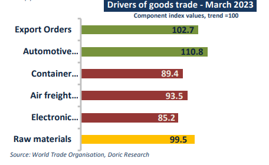
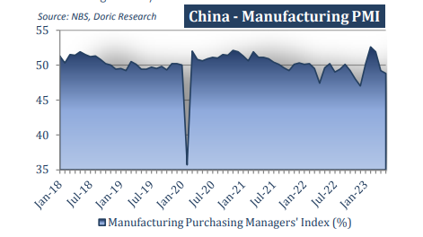
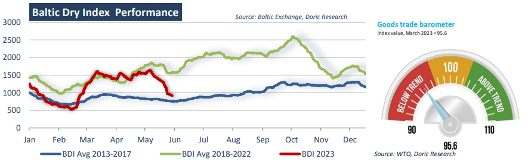

# Doric Weekly Market Insight

**Date:** June 05, 2023  
**Publisher:** Breakwave Advisors | **Category:** Market Insights  
**Original URL:** [https://www.breakwaveadvisors.com/insights/2023/6/5/doric-weekly-market-insight](https://www.breakwaveadvisors.com/insights/2023/6/5/doric-weekly-market-insight)  

---

## “China’s Raw Material Inventory Index Balanced at 47.6 in May, Indicating a Decline in the Inventory of Major Raw Materials in the Manufacturing Sector”

*By*[*Michalis Voutsinas*](https://www.linkedin.com/in/michalis-voutsinas-587544163/)

Amidst a tumbling spot market and a wounded market sentiment, the World Trade Organization (WTO) published this week the latest update of the “Goods Trade Barometer”. WTO's barometer is a composite leading indicator for world trade, providing real time information on the trajectory of merchandise trade relative to recent trends. The current reading of 95.6 is up compared to the previous four months but well below the baseline value of 100. By decomposing the general index, the automotive products index (110.8) rose firmly above trend on the back of strong sales in the United States and Europe. The highly predictive export orders index (102.7) has also rebounded after a dip following the outbreak of war in Ukraine. Meanwhile, indices representing container shipping (89.4), air freight (93.5) and electronic components trade (85.2) continue to signal weakness, while the index of raw materials trade (99.0) was exactly on trend. The mixture of signals from the component indices suggests that the road to trade recovery may be bumpy.

> **Figure 1: 1 (5)**  
> [Local Asset](file:///C:/Users/Dell/Github/Shipping/corpus/03-breakwave/insights/2023/assets/2023-06-05_doric-weekly-market-insight_img_128529_a285fa55839e.png)

Following a 2.4 percent quarter-on-quarter decline, the volume of world merchandise trade was down 0.8 percent year-on-year in the final quarter of 2022. The slump was driven by several related factors including the ongoing war in Ukraine, stubbornly high inflation in advanced economies, and tighter monetary policy globally, according to the Geneva-based intergovernmental organization. Although, the relaxation of the draconian zero-Covid policy restrictions in China appears to have boosted port traffic in the country, this was outweighed by falling throughput in European ports. Preliminary data suggest that international trade remained depressed in Q1 of 2023 as well, but increased export orders point to a turnaround in the following quarters. In this context, WTO forecast merchandise trade growth to be 1.7 percent in the current trading year.

Whilst WTO’s prophetic export orders index is pointing to a possible trade recovery, albeit bumpy, another main index of the prevailing direction of economic trends in the manufacturing sector took a step back last month. In particular, the Purchasing Manager Index (PMI) of China's manufacturing industry came at 48.8 percent, decreasing 0.4 percentage point from the previous month and lingering below the threshold of 50-points that separates expansion from contraction. In reference to sub-indices, the supplier delivery time index was the only one above the threshold, with the remaining four drifting lower. The production index balanced at 49.6 percent, indicating that manufacturing production activities have slowed down month-onmonth. Pointing to softer demand conditions for the manufacturing industry, the new order index lay at 48.3 percent. The employment Index was 48.4 percent, falling by 0.4 percentage point from the previous month. The supplier delivery time index was 50.5 percent, pointing to a decreasing delivery time of raw material suppliers in the manufacturing industry. The raw material inventory index was 47.6 percent, indicating that the inventory of major raw materials in the manufacturing industry was in decline.

> **Figure 2: 1 (6)**  
> [Local Asset](file:///C:/Users/Dell/Github/Shipping/corpus/03-breakwave/insights/2023/assets/2023-06-05_doric-weekly-market-insight_img_128629_dbf5af42140f.png)

Weakness in China's manufacturing sector has been matched by soft outcomes in other important parts of the world's second-largest economy. Property investment and sales took a dive in April, at the same time as industrial profits were falling as much as 20.6 percent. Against this backdrop, Baltic Dry Index concluded in the three-digits this week for the first time since late February, currently balancing well-below the respective average value of the previous five years. As far as sub-markets go, the fact that Handies are currently outperforming all other segments at $9,805 daily is striking.

> **Figure 3: 1 (7)**  
> [Local Asset](file:///C:/Users/Dell/Github/Shipping/corpus/03-breakwave/insights/2023/assets/2023-06-05_doric-weekly-market-insight_img_128729_4816772dc34b.png)
