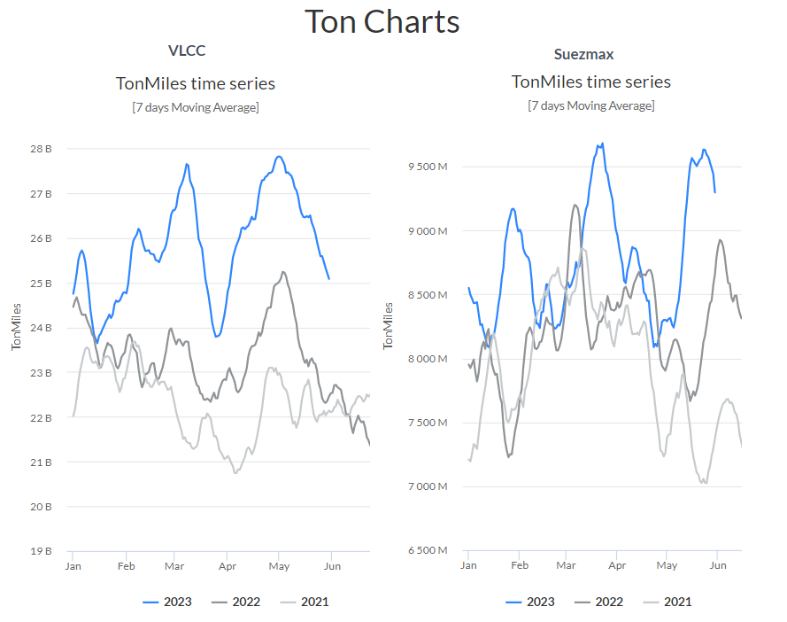
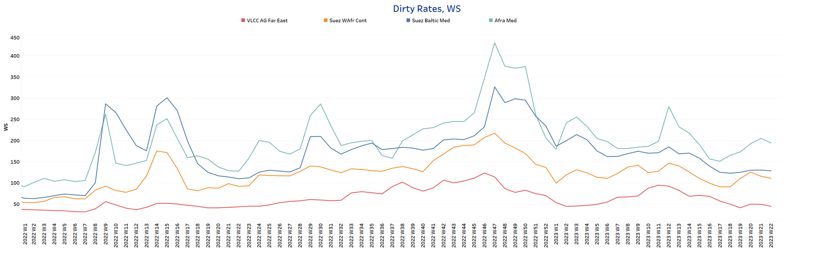
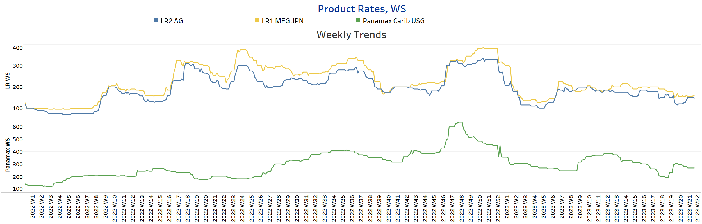
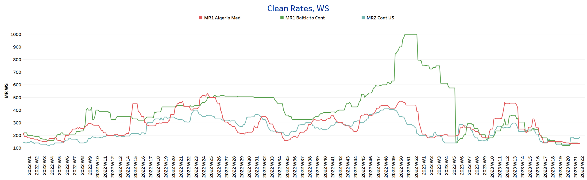
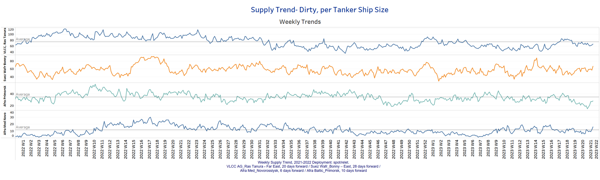
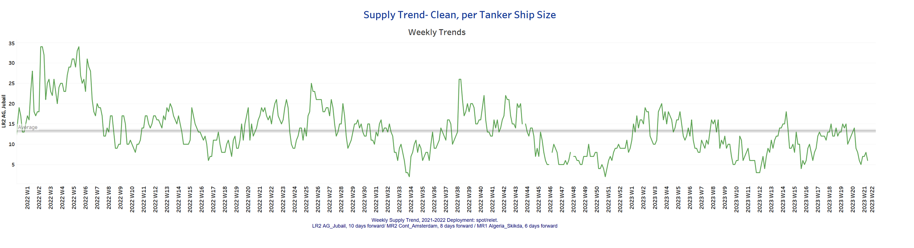
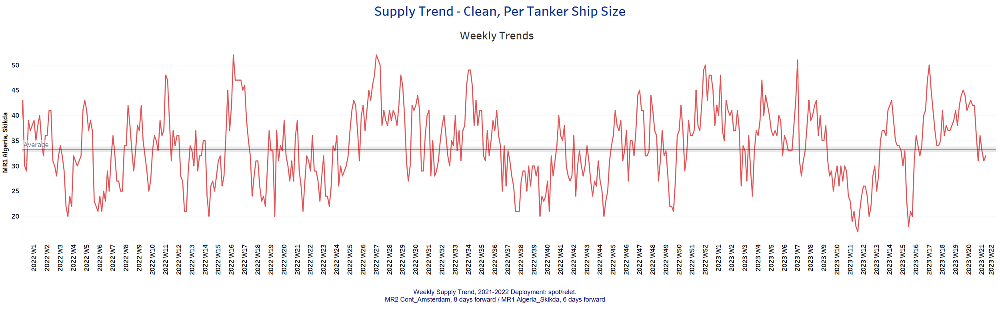
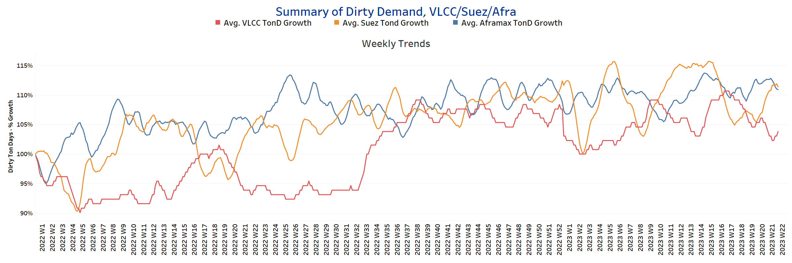
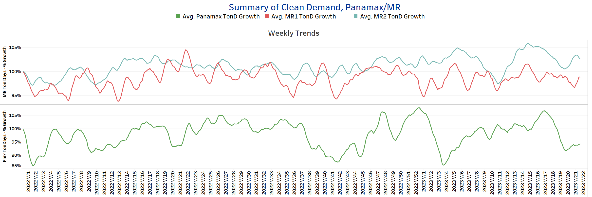

# Signal Tanker Weekly Report

**Date:** June 05, 2023  
**Publisher:** Breakwave Advisors | **Category:** Market Insights  
**Original URL:** [https://www.breakwaveadvisors.com/insights/2023/6/5/signal-tanker-weekly-report](https://www.breakwaveadvisors.com/insights/2023/6/5/signal-tanker-weekly-report)  

---

## Chart of the Week: Dirty Ton Miles

> **Figure 1: VLCC Growth in Ton-Miles Declines vs. Better Outlook for Suezmax\**  
> **Interactive Data & Source:** [Signal Ocean Platform](https://go.signalocean.com/e/983831/tanker-dynamic-oilflows/2p1dqx/323633154?h=GYf1pH_Zrw1ISo2rLKkQ-mt7nlY03zuBOD9Z5HOSAc8) | [Local Asset](file:///C:/Users/Dell/Github/Shipping/corpus/03-breakwave/insights/2023/assets/2023-06-05_signal-tanker-weekly-report_img_unnamed-2023-06-05t120630421_f962124df506.png)

Data Source: The Signal Ocean Platform- Oil Flows

As May drew to a close, the sentiment in the crude freight market for VLCC tankers continued to lag behind the heights witnessed in the first quarter of the year. The demand ton miles for VLCC tankers has been on a declining trend, significantly impacting freight rates. Conversely, the Suezmax tanker size is experiencing a positive surge, with dirty ton miles to all destinations growing at a faster pace compared to the previous quarter. Consequently, it appears that the first half of the year will end on a stronger note for Suezmax crude tanker shipments, while the VLCC segment faces substantial challenges due to the recent increase in vessel supply and the downward trajectory of dirty ton miles. (see image above)

Meanwhile, the tanker freight market is anticipated to encounter additional risks and challenges in the near future. One significant factor contributing to this is the potential introduction of Europe's 11th Russian sanctions package. As discussions and negotiations progress, there is growing speculation that new sanctions may be imposed on Russia, particularly in relation to its energy sector. The uncertainty surrounding the potential sanctions is likely to create a cautious and hesitant market sentiment among tanker operators and investors. It may also trigger a period of increased volatility and unpredictability in freight rates, as market participants adjust their strategies and evaluate the evolving geopolitical landscape.

​​​For more information on this week's trends, see the analysis sections below:
Freight Market, Supply and Demand

## Section 1/ Freight - Market Rates (WS)

> **Figure 2: ‘Dirty’ VLCC - Suezmax - Aframax Weaker**  
> **Interactive Data & Source:** [Signal Ocean Platform](https://www.thesignalgroup.com/signal-ocean-platform) | [Local Asset](file:///C:/Users/Dell/Github/Shipping/corpus/03-breakwave/insights/2023/assets/2023-06-05_signal-tanker-weekly-report_img_unnamed-2023-06-05t120743065_4c470b0e180f.png)

Overall sentiment in the crude oil freight market remained weaker in May, except for the Aframax Med route, which finally saw a rebound after the last low in week 17.

- VLCC AG-FE freight rates have fallen to WS45, a 60% drop from the peak observed in week 12.
- Suezmax freight rates from West Africa to continental Europe continued their weaker trend, settling around WS110, 12 points below the peak in week 20.
- Aframax Med freight rates have dropped below the 200 WS threshold but are still above the threshold reached in week 17. Rates are now at WS190, 40 points higher than in week 17.

> **Figure 3: ‘Product’ Lr Steady**  
> **Interactive Data & Source:** [Signal Ocean Platform](https://www.thesignalgroup.com/signal-ocean-platform) | [Local Asset](file:///C:/Users/Dell/Github/Shipping/corpus/03-breakwave/insights/2023/assets/2023-06-05_signal-tanker-weekly-report_img_unnamed-2023-06-05t120820794_f2f1e7938e13.png)

- LR2 AG freight rates continue to be stable and are now around 148 WS, while LR1 MEG Jpn rates also continue to be around 158 WS with no fluctuations.

Product’ Panamax - Softening

- Panamax Carib-to-USG rates continued the downward trend of the last two weeks and are now at 270 WS, 30 points lower than two weeks ago.

> **Figure 4: ‘Clean’ MR2 - Weaker | MR1 - Steady**  
> **Interactive Data & Source:** [Signal Ocean Platform](https://www.thesignalgroup.com/signal-ocean-platform) | [Local Asset](file:///C:/Users/Dell/Github/Shipping/corpus/03-breakwave/insights/2023/assets/2023-06-05_signal-tanker-weekly-report_img_unnamed-2023-06-05t120920448_c542e4c3ca2b.png)

- The MR1 rates for shipments from Algeria to the Mediterranean have shown continued weakness, staying consistent with the previous week's settled levels of around WS135. Notably, the MR1 rates for the Baltic Continent have now matched the rates for the Algeria-Mediterranean route, reaching the same levels.

- MR2 rates for shipments from the Continent to the US have demonstrated a persistent upward trend, remaining steady at approximately WS180. Notably, this marks a significant surge of nearly 60 points compared to the levels recorded in mid-May.

## Section 2/ Supply - (# Vessels) Increasing'dirty' Supply Trend Lines for Key Load Areas

> **Figure 5: Market Chart 5**  
> **Interactive Data & Source:** [Signal Ocean Platform](https://www.thesignalgroup.com/signal-ocean-platform) | [Local Asset](file:///C:/Users/Dell/Github/Shipping/corpus/03-breakwave/insights/2023/assets/2023-06-05_signal-tanker-weekly-report_img_unnamed-2023-06-05t121018455_03ef155632f0.png)

Despite an overall increasing trend in the supply of crude oil tankers, recent data reveals that both the VLCC Ras Tanura and Aframax Baltic are currently experiencing levels below the annual average.

- VLCC Ras Tanura: The current vessel count stands at 67, reflecting a deviation of 7 vessels from the annual average and a significant drop of nearly 17 vessels compared to the peak observed just four weeks ago.
- Suezmax Wafr Bonny: The current vessel count is 67, up 50% from the low of three weeks ago, and it looks like there will be another increase in early June.
- Aframax Primorsk: The number of ships rose to 28, a significant increase of 13 ships compared to the count a week ago, but still 6 ships below the average for the year.
- Aframax Med Novo: The number of vessels shows a slight upward trend and stands at 16, which is 5 ships more than the annual average.

> **Figure 6: ‘Clean’ Supply Trend Lines for Key Load Areas | LR2 | Decreasing**  
> **Interactive Data & Source:** [Signal Ocean Platform](https://www.thesignalgroup.com/signal-ocean-platform) | [Local Asset](file:///C:/Users/Dell/Github/Shipping/corpus/03-breakwave/insights/2023/assets/2023-06-05_signal-tanker-weekly-report_img_unnamed-2023-06-05t121106252_e30472b8b1da.png)

## ‘Clean’ Supply Trend Lines for Key Load Areas |MR1| Decreasing

> **Figure 7: Market Chart 7**  
> **Interactive Data & Source:** [Signal Ocean Platform](https://www.thesignalgroup.com/signal-ocean-platform) | [Local Asset](file:///C:/Users/Dell/Github/Shipping/corpus/03-breakwave/insights/2023/assets/2023-06-05_signal-tanker-weekly-report_img_unnamed-2023-06-05t121148458_2a91b15628dc.png)

- Clean LR2 AG Jubail: The significant downward trend recorded in the last three weeks continues in early June. The number of ships now stands at 6, 7 lower than the average for the year.

- Clean MR1 Algeria Skikda: The number of ships decreased to 32 after the increase in the previous week, which is 12 less than the previous week and is almost close to the average for the year.

## Section 3 - Demand - Ton Days

> **Figure 8: ‘Dirty’ | VLCC - Suezmax - Aframax - Increasing**  
> **Interactive Data & Source:** [Signal Ocean Platform](https://www.thesignalgroup.com/signal-ocean-platform) | [Local Asset](file:///C:/Users/Dell/Github/Shipping/corpus/03-breakwave/insights/2023/assets/2023-06-05_signal-tanker-weekly-report_img_unnamed-2023-06-05t121310537_e698a2957a63.png)

## ‘Clean’ |Panamax - MR Increasing

> **Figure 9: Panamax - MR Increasing**  
> **Interactive Data & Source:** [Signal Ocean Platform](https://www.thesignalgroup.com/signal-ocean-platform) | [Local Asset](file:///C:/Users/Dell/Github/Shipping/corpus/03-breakwave/insights/2023/assets/2023-06-05_signal-tanker-weekly-report_img_unnamed-2023-06-05t121359044_6b06234d5270.png)

- Dirty demand ton-days: The demand for crude oil tankers in the Suezmax segment has remained considerably strong, indicating a positive outlook. Additionally, there are early indications of a recovery in the growth of VLCC ton days, suggesting a ​​​potential turnaround in this sector.

- Clean demand ton-days / Panamax demand: The conclusion of May provided further confirmation of the positive trends observed in preceding weeks, signaling a continued upward movement in growth. However, it is worth noting that the current level falls considerably short of the peak recorded in weeks 17 and 18.
- Clean MR: A similar pattern to that observed in the Panamax segment can also be seen in the MR size category, particularly in the MR2 size. Over the past two weeks, there has been a notable uptick in firmness in ton days growth within this segment.

Data Source:[Signal Ocean Platform](https://www.thesignalgroup.com/signal-ocean-platform)
