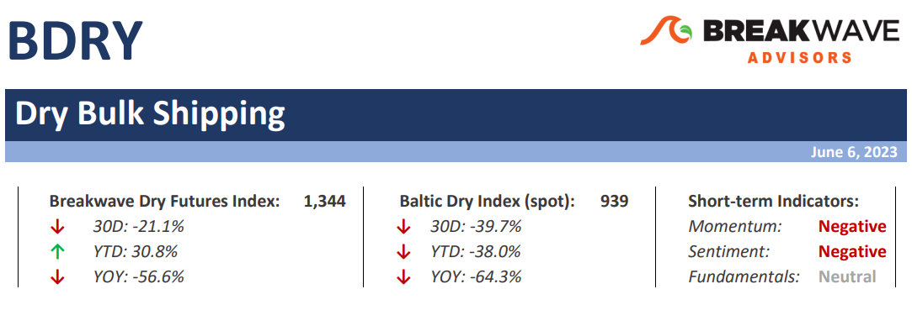
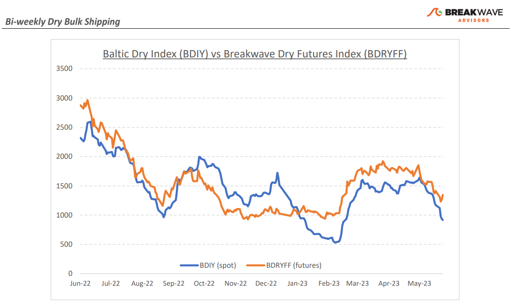
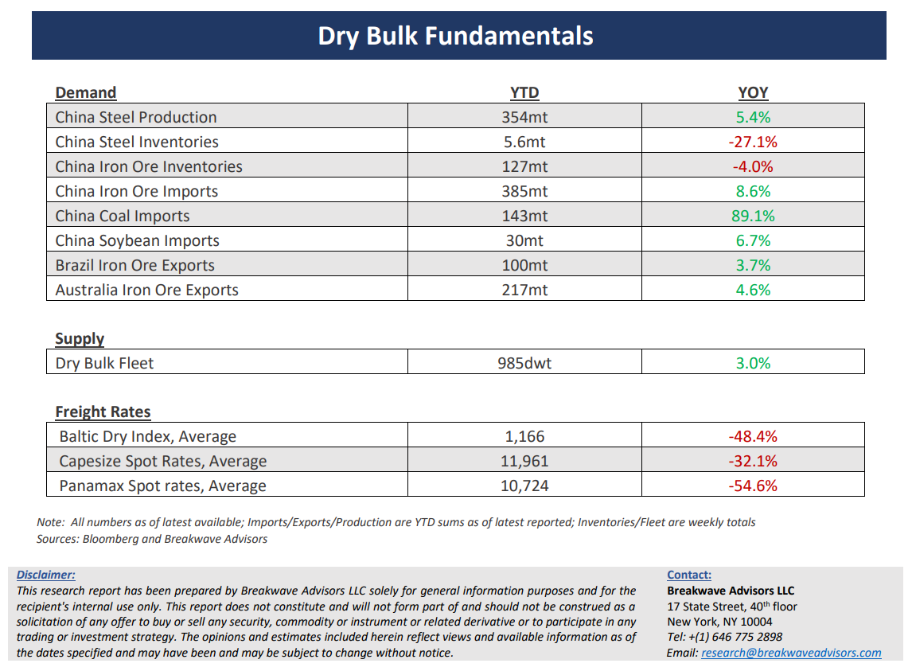

# Breakwave Bi-Weekly Dry Bulk Report - June 6, 2023

**Date:** June 06, 2023  
**Publisher:** Breakwave Advisors | **Category:** Market Insights  
**Original URL:** [https://www.breakwaveadvisors.com/insights/2023/6/5/breakwave-bi-weekly-dry-bulk-report-june-6-2023](https://www.breakwaveadvisors.com/insights/2023/6/5/breakwave-bi-weekly-dry-bulk-report-june-6-2023)  

---

> **Figure 1: Dbreporttop**  
> **Interactive Data & Source:** [Breakwave Advisors Market Insights](https://www.breakwaveadvisors.com/publications) | [Local Asset](file:///C:/Users/Dell/Github/Shipping/corpus/03-breakwave/insights/2023/assets/2023-06-06_breakwave-bi-weekly-dry-bulk-report-june-6-2023_img_dbreporttop_be2a325c829f.png)

**·Shifting tides in the Atlantic is all that matters for Q3 –**The last five years have seen dramatic changes when it comes to the spot Atlantic Capesize market.**Lower iron ore**volumes from Brazil (2018-2023 change of some -35mt) and**higher bauxite**volumes out of Guinea (2018-2023 change of about +42mt) have shifted the balance of shipping quite a bit, although on a total volume basis Brazil still exports ~3x more. However, what shapes Capesize rates is the**spot cargo**volumes. There, the change has been**significantly more dramatic**. We estimate that the addition of more Valemaxes and Guaibamaxes (large iron ore carriers that Vale has been building for years) combined with more dedicated to Vale tonnage have eliminated**more than 65% of spot cargoes**from the Brazilian market when the commited shift in tonnage is combined with the lower volumes. On the other hand, the increased bauxite volumes out of West Africa have**more than doubled**the spot cargoes from that region. All in all,**we estimate**that nowadays**Brazil**accounts for**less than 30% of spot**Capesize trading in the Atlantic fronthaul market with West Africa dominating now the marketable Capesize universe. This is a major shift in market balance, and although it is difficult to change well-established market narratives around Capesizes,**the reality is that the Atlantic market**is now subject to the seasonality of the**W. African exports**more than ever before. As we look into the next quarter, the rainy season is upon us, and historically exports drop by some 30-35% out of the region. Given the forementioned**importance**, it would be crucial to watch the developments in terms of weather, especially as the**futures market**is still pricing a repeat of the**relatively strong third quarters**of the Covid-impacted past few years.

**·China’s reopening trade takes a turn for the worse –**It was not that long ago that market participants were convinced that a China reopening will boost demand for infrastructure and thus demand for major commodities. Following a**short blimp**in activity early in the**spring**, a series of**negative economic**surprises have once again dampened such expectations and recent economic activity out of China once more points to a**gloomy outlook**. The real estate market remains weak, sentiment among major industries is fragile and prices for construction related goods have once again declined towards recent lows. Calls for more stimulus and lower interest rates are back on the table and although such policies might indeed materialize in the near term, more**bold actions are needed**for China’s industrial economy to see a sustained and**meaningful economic recovery**that will have a fundamental positive impact on demand for bulk commodities.

**·Dry bulk focus shifts back to fundamentals –**Following a period of high uncertainty and significant disruptions across the commodity spectrum, the gradual normalization of trade is shifting the market’s attention back to the traditional demand and supply dynamics that have shaped dry bulk profitability for decades. As effective fleet supply growth for the next few years looks marginal, demand will be the main determinant of spot freight rates with China returning back to the driver’s seat as the dominant force of bulk imports and thus shipping demand.

[Subscribe: Bi-Weekly Dry Bulk Report](https://www.breakwaveadvisors.com/publications)

> **Figure 2: Dbreportchart**  
> [Local Asset](file:///C:/Users/Dell/Github/Shipping/corpus/03-breakwave/insights/2023/assets/2023-06-06_breakwave-bi-weekly-dry-bulk-report-june-6-2023_img_dbreportchart_02104c662e8e.png)

> **Figure 3: Dbreportbottom**  
> [Local Asset](file:///C:/Users/Dell/Github/Shipping/corpus/03-breakwave/insights/2023/assets/2023-06-06_breakwave-bi-weekly-dry-bulk-report-june-6-2023_img_dbreportbottom_ce80e10c5a24.png)
