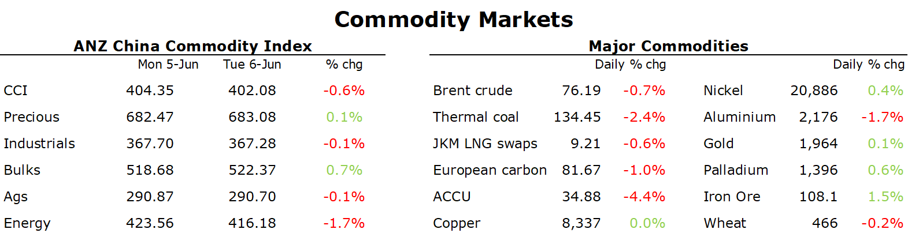

# Oil gives back OPEC driven gains amid demand concerns

**Date:** June 07, 2023  
**Publisher:** Breakwave Advisors | **Category:** Market Insights  
**Original URL:** [https://www.breakwaveadvisors.com/insights/2023/6/7/oil-gives-back-opec-driven-gains-amid-demand-concerns](https://www.breakwaveadvisors.com/insights/2023/6/7/oil-gives-back-opec-driven-gains-amid-demand-concerns)  

---

*By*[*Daniel Hynes*](https://www.linkedin.com/in/dahynes/)

Concerns over demand continue to weigh on commodity markets. Macro headwinds were also present, with a stronger USD impacting investor appetite.

> **Figure 1: Data Source:commodities Wrap**  
> *Data source:Commodities Wrap*  
> **Interactive Data & Source:** [Linkedin](https://www.linkedin.com/newsletters/commodities-wrap-6692196755876012032/?fbclid=IwAR3kiXJqZdxmp9ZcRwBNI7FsBySI-XSC0pfPur1qzjt7OZp7PTE59Tsl1QI) | [Local Asset](file:///C:/Users/Dell/Github/Shipping/corpus/03-breakwave/insights/2023/assets/2023-06-07_oil-gives-back-opec-driven-gains-amid-demand-concerns_img_unnamed-2023-06-06t124835780_be2a3afdafbc.png)

**Crude oil**edged lower, wiping out gains following Saudi Arabia’s surprise production cut amid concerns over demand. The Energy Information Agency said that oil demand in the US will grow at just under 1% in 2023 due to a forecast slump in diesel demand. The distillate fuel is being impacted by tighter monetary policies in the US as the Fed looks to rein in inflation. This is being exacerbated by a US consumer shift to spending on services rather than manufactured goods. The EIA also upgraded its forecast for US supply in its Short Term Energy Outlook. This took the gloss of Saudi Arabia’s surprise production cut. The move will see output fall by an additional 1mb/d in July. Saudi Aramco move to raise official selling prices in Asia also failed to convince traders that global demand remains robust. We still see the risks skewed to a rally in prices in H2 2023 as the market tightens significantly following the production cutbacks. Nevertheless, signs of tightness in the physical market will have to emerge before this move eventuates.

**European gas**gave back some of yesterday’s gains amid signs of weak demand. Inventories continue to build despite recent supply disruptions. Gas Infrastructure Europe estimate they are now 70% full on average. This eased concerns that the ongoing outage at the Norne field in Norway could tighten the market. This helped take the focus off the move by US exporters to target Asia due to higher prices in that region. LNG imports into Europe were about 25% lower last week than a month earlier, according to Bloomberg data. North Asian LNG futures were also lower. Qatar has stepped up its efforts to secure more customers for its expansion plans by offering shorter and cheaper LNG contracts.

**Iron ore**futures extended its recent rally amid hopes of further support from China. Chinese authorities have asked the nation’s banks to lower their deposit rates for at least the second time in less than a year. The chance of another cut to the reserve requirement ratio is also rising, following an opinion piece in the state-run China Securities Journal. This comes after Beijing introduced measures to support the property market, such as reducing the down payment on properties and further relaxing restrictions on residential purchases.

These measures also boosted sentiment in the base metals market, with copper and zinc moving higher. Further drawdowns in inventories is also providing some support.

**Lithium**prices continue to rebound as destocking across the sector eases. However, reports that China is looking to further support the industry also boosted sentiment. Beijing is poised to extend incentives for electric vehicles purchases as part of broader efforts to shake of a sluggish post-pandemic period.
