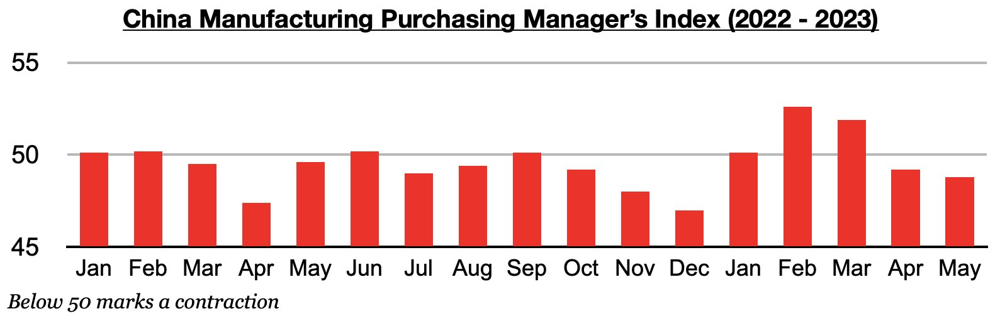
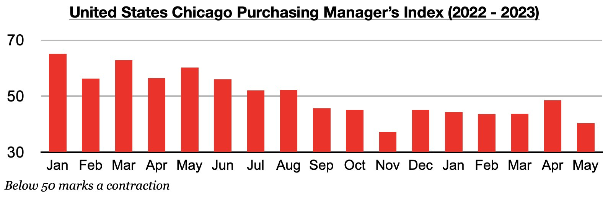
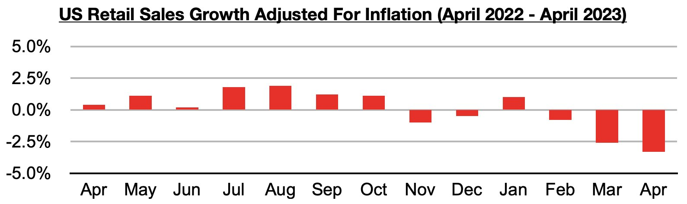

# China's Industrial Sector Continues to Stall; Ongoing Recession in United States and Other Nations

**Date:** June 08, 2023  
**Publisher:** Breakwave Advisors | **Category:** Market Insights  
**Original URL:** [https://www.breakwaveadvisors.com/insights/2023/6/8/chinas-industrial-sector-continues-to-stall-ongoing-recession-in-united-states-and-other-nations](https://www.breakwaveadvisors.com/insights/2023/6/8/chinas-industrial-sector-continues-to-stall-ongoing-recession-in-united-states-and-other-nations)  

---

*By*[*Jeffrey Landsberg*](https://www.linkedin.com/in/jeffrey-landsberg-70ab957/)

China’s manufacturing purchasing managers' index (PMI) fell to 48.8 in May, which has marked a second straight month of contraction. This weak PMI data is not surprising and is down slightly from the 49.2 contraction seen in April. Overall, it remains clear that China’s industrial recovery has stalled in recent months.

> **Figure 1: Chart 1 (75)**  
> [Local Asset](file:///C:/Users/Dell/Github/Shipping/corpus/03-breakwave/insights/2023/assets/2023-06-08_chinas-industrial-sector-continues-to-stall-ongoing-recession-in-united-states-a_img_chart1287529_b678c60375e4.jpg)

Receiving less attention in media and financial markets is that the Chicago PMI (which is a key metric that measures regional US manufacturing strength) was also released last week and showed a crash and almost unprecedented sustained weakness. The Chicago PMI fell to 40.4 points in May, which has marked the ninth straight month of contraction and is down significantly from 48.6 seen in April. Previously, the last time that there were nine straight months of contraction in this key US PMI metric was back in 2009 during the Great Financial Crisis.

> **Figure 2: Chart 2 (64)**  
> [Local Asset](file:///C:/Users/Dell/Github/Shipping/corpus/03-breakwave/insights/2023/assets/2023-06-08_chinas-industrial-sector-continues-to-stall-ongoing-recession-in-united-states-a_img_chart2286429_6e515ed8e4d4.jpg)

China is experiencing weakness, but largely in its industrial sector and nowhere near as badly as is being seen in the United States and in many other nations. We continue to see the United States and other western economies receiving too positive of coverage, and China’s economy receiving far too negative coverage. As we also discussed most recently in our May 22nd Weekly China Report, retail sales growth in the United States have now come in less than inflation during five of the last six months. As with the US PMI contraction, the last time that US retail sales contracted in five out of six months was also back in 2009 during the Great Financial Crisis. In comparison, China’s retail sales have continued to surge and remain well above inflation. China's retail sales adjusted for inflation most recently grew year-on-year by 18.3%.

> **Figure 3: Chart 3 (48)**  
> [Local Asset](file:///C:/Users/Dell/Github/Shipping/corpus/03-breakwave/insights/2023/assets/2023-06-08_chinas-industrial-sector-continues-to-stall-ongoing-recession-in-united-states-a_img_chart3284829_2828bc3d1b0e.jpg)
