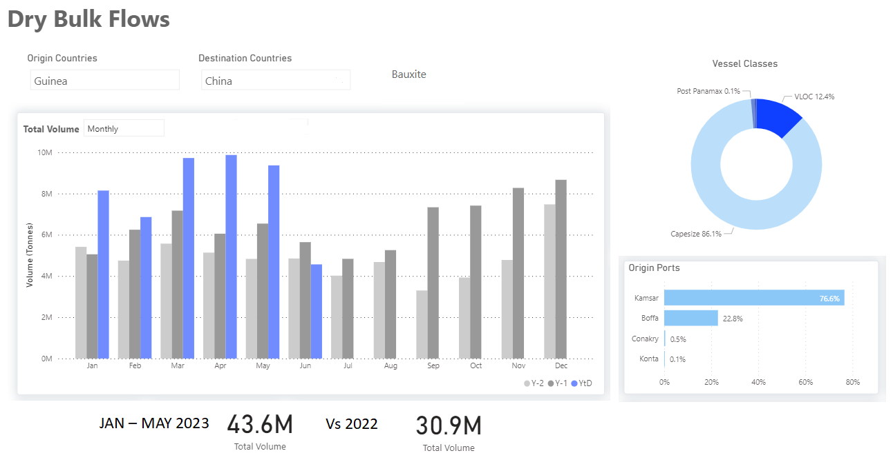
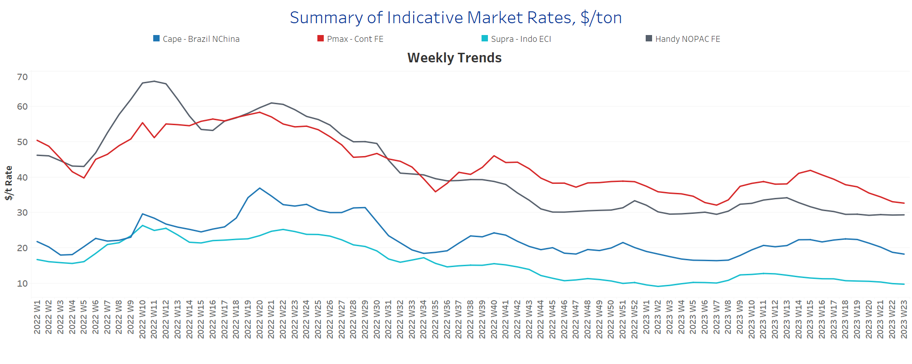
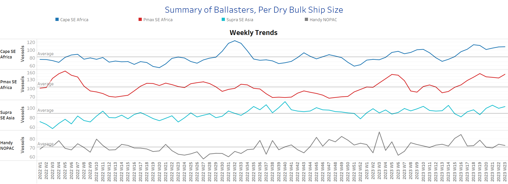
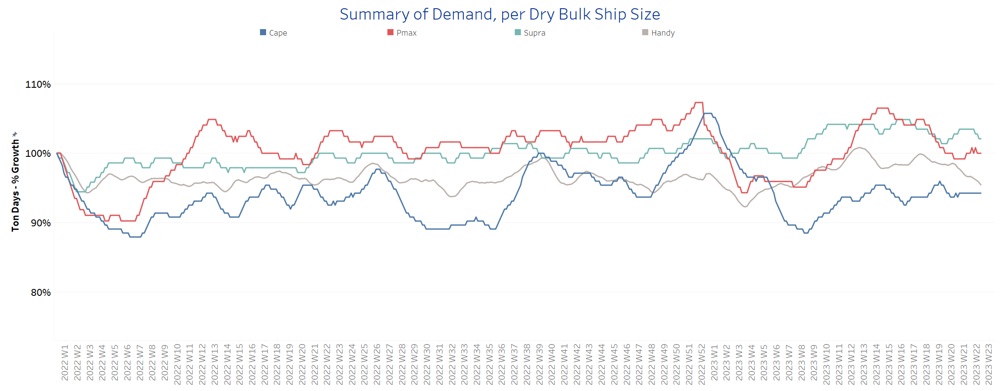
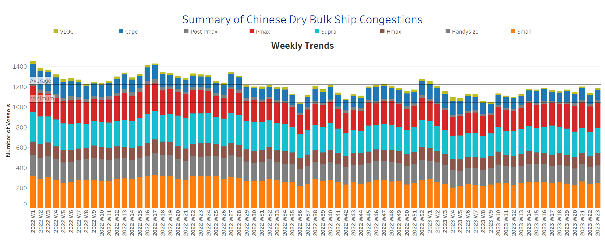

# Signal Dry Bulk Weekly Report

**Date:** June 08, 2023  
**Publisher:** Breakwave Advisors | **Category:** Market Insights  
**Original URL:** [https://www.breakwaveadvisors.com/insights/2023/6/8/xbq09uocapnjex2zcrmjjhbuz587tv](https://www.breakwaveadvisors.com/insights/2023/6/8/xbq09uocapnjex2zcrmjjhbuz587tv)  

---

## Chart of the Week Dry Bulk: Bauxite From Guinea to China in 2023

*The monthly volume of bauxite exports to China has increased by 40% in the first five months*

> **Figure 1: Data Source: The Signal Ocean Platform**  
> *Data Source: The Signal Ocean Platform, Dry Bulk Flows, Bauxite Guinea to China*  
> **Interactive Data & Source:** [Signal Ocean Platform](https://go.signalocean.com/e/983831/amic-drybulkflows-downloadable/2p1rgj/324223008?h=WZR1BecXOJlVxM9PgLY_7FqIjy7EG4ttXbfge9zSJTc) | [Local Asset](file:///C:/Users/Dell/Github/Shipping/corpus/03-breakwave/insights/2023/assets/2023-06-08_xbq09uocapnjex2zcrmjjhbuz587tv_img_unnamed-2023-06-08t115953800_f36ccbbe4c8f.png)

[*https://go.signalocean.com/e/983831/amic-drybulkflows-downloadable/2p1rgj/324223008?h=WZR1BecXOJlVxM9PgLY_7FqIjy7EG4ttXbfge9zSJTc*](https://go.signalocean.com/e/983831/amic-drybulkflows-downloadable/2p1rgj/324223008?h=WZR1BecXOJlVxM9PgLY_7FqIjy7EG4ttXbfge9zSJTc)

The iron ore market experienced a notable increase in prices due to the recent news regarding the Chinese economy stimulus package. According to a report by Mining.com, the most-traded September iron ore on China's Dalian Commodity Exchange concluded daytime trading with a 2.2% rise, reaching 759 yuan ($106.68) per tonne. Earlier in the session, it even reached a peak of 770 yuan, marking its highest level since April 20.
​​​​​​The recently announced Chinese stimulus has instilled a sense of optimism for a potential rebound in the Capesize iron ore market by the end of the first half of the year. Furthermore, the supply of ballasters has continued to stay at elevated levels, surpassing the annual average. This development suggests a potentially favorable outlook for the iron ore market in the coming months.

Meanwhile, there is an intriguing observation in the realm of minor dry bulk commodities. Specifically, the monthly volume of bauxite shipments from Guinea to China has witnessed a remarkable surge of approximately 40% during the initial five months of this year, in comparison to the same period in 2022 (refer to the accompanying image for reference). This substantial growth in Guinean bauxite trade serves as a pivotal factor contributing to increased vessel employment within the Capesize segment.
On the other hand, the grain segment continues to face significant challenges and risk. Recent reports suggest that there may not be a further extension in the Black Sea Grain Initiative for the upcoming July, further amplifying the uncertainties in this sector.

​​​​​For more information on this week's trends, see the analysis sections below:
Freight Market, Supply, Demand and Port Congestion

## Section 1/ Freight - Market Rates ($/T) Weaker

‘The Big Picture’ - Capesize and Panamax Bulkers and Smaller Ship Sizes

> **Figure 2: Market Chart 2**  
> **Interactive Data & Source:** [Signal Ocean Platform](https://www.thesignalgroup.com/signal-ocean-platform) | [Local Asset](file:///C:/Users/Dell/Github/Shipping/corpus/03-breakwave/insights/2023/assets/2023-06-08_xbq09uocapnjex2zcrmjjhbuz587tv_img_unnamed-2023-06-08t120115023_ba513b2b2dc6.png)

The dry freight market has yet to show any signs of revival, with Panamax vessels experiencing the sharpest rate decline.

- Capesize vessel freight rates fell to $18/tonne, down nearly $ 3/tonne from five weeks ago, and there are signs of a further downward correction in June.
- Panamax vessel freight rates from the Continent to the Far East fell below $33/tonne, down nearly $9/tonne from the week 15 peak.
- Supramax freight rates for the Indo-ECI route fell below $10/tonne, showing signs of a downward correction from levels recorded in the weeks ending in March.
- Handysize freight rates for the NOPAC Far East route held levels nearly above $29/tonne, since the ending of week 17, however, there remains to be a steadiness around such performance for the coming days.

## Section 2/ Supply - Ballasters (# Vessels) Increasing

> **Figure 3: Supply Trend Lines for Key Load Areas**  
> **Interactive Data & Source:** [Signal Ocean Platform](https://www.thesignalgroup.com/signal-ocean-platform) | [Local Asset](file:///C:/Users/Dell/Github/Shipping/corpus/03-breakwave/insights/2023/assets/2023-06-08_xbq09uocapnjex2zcrmjjhbuz587tv_img_unnamed-2023-06-08t120228052_09ede6cc7cdc.png)

The number of ballast ships has shown an upward trend in the last three weeks, especially in the larger ship categories Capesize and Panamax, while there has been a downward correction in Handysize.

- Capesize SE Africa: The current number of ships has increased to 108, 7 more than three weeks ago and 50% more than the last low in week 16.
- Panamax SE Africa: The number of vessels reached a high of 148, 70% more than ten weeks ago.
- Supramax SE Asia: The number of vessels exceeded 100 in the last two weeks, almost 13 more than the average for the year, and still rising.
- Handysize NOPAC: The number of vessels is now 73, only 2 more than the annual average and 6 less than four weeks ago.

> **Figure 4: Section 3/ Demand - TonDays Weaker**  
> **Interactive Data & Source:** [Signal Ocean Platform](https://www.thesignalgroup.com/signal-ocean-platform) | [Local Asset](file:///C:/Users/Dell/Github/Shipping/corpus/03-breakwave/insights/2023/assets/2023-06-08_xbq09uocapnjex2zcrmjjhbuz587tv_img_unnamed-2023-06-08t120325809_ba24f97315b1.png)

The first days of June have brought contrasting trends to the dry bulk shipping industry, with notable differences in demand growth between the Panamax and Capesize segments. In the Panamax segment, there has been a significant decline in demand growth compared to previous periods

- Capesize: Demand growth in this segment has remained relatively steady, with signs of continued activity.
- Panamax: The latest data still show a significant downward revision, while there are still no signs of stronger growth rates in the coming days of June.
- Supramax: After an initial positive start to June, the second week brings a shift in market sentiments as downward revisions emerge. Amidst the changing landscape, the Supramax size segment holds potential as coal trading and demand in Far Eastern countries offer opportunities. The robust demand for coal, particularly from key markets in the Far East, presents a promising outlook for Supramax vessels.
- Handysize: The outlook has deteriorated further as long as a new extension of the Black Sea Grains Initiative remains uncertain, while recent growth appears to be the lowest since the beginning of the year.

## Section 4/ Port Congestion - No of Vessels Decreasingdry Bulk Ships Congested at Chinese Ports

> **Figure 5: Market Chart 5**  
> **Interactive Data & Source:** [Signal Ocean Platform](https://www.thesignalgroup.com/signal-ocean-platform) | [Local Asset](file:///C:/Users/Dell/Github/Shipping/corpus/03-breakwave/insights/2023/assets/2023-06-08_xbq09uocapnjex2zcrmjjhbuz587tv_img_unnamed-2023-06-08t120422227_12205e3cfb89.png)

June began with a downward correction in the number of ships, with only the Handysize segment showing an aggressive increase

- Capesize: The number of vessels is holding at a level of almost over 100, with a decrease of 8 ships compared to two weeks ago.
- Panamax: The number of vessels remained at about 250, although there were signs of an increase to more than 260 in the previous week, while there seems to be some steadiness in the first days of June.
- Supramax: The current number of ships is now 245, 16 fewer than three weeks ago.
- Handysize:The number of congested vessels has risen to 172, 8 more than the previous week, reaching the peak of week 19.

Data Source:[Signal Ocean Platform](https://www.thesignalgroup.com/signal-ocean-platform)
