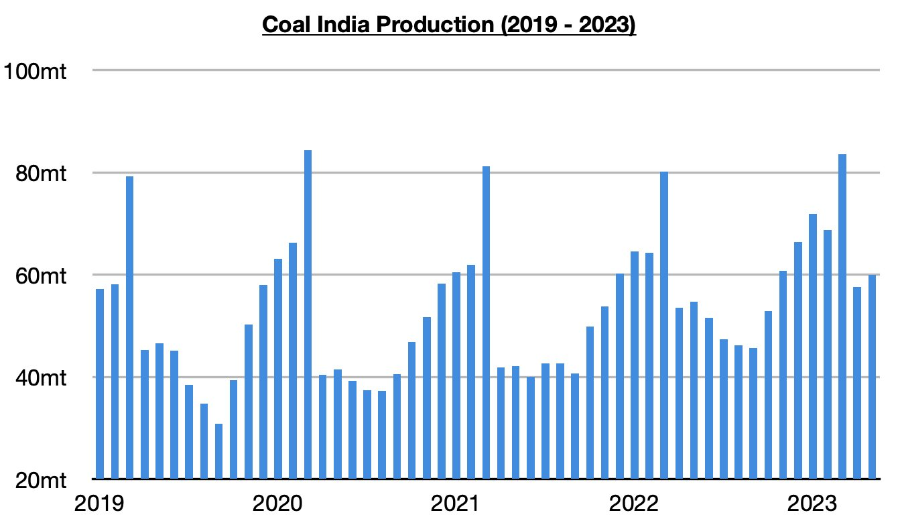
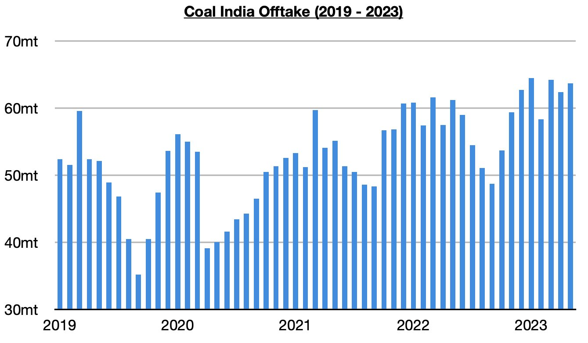
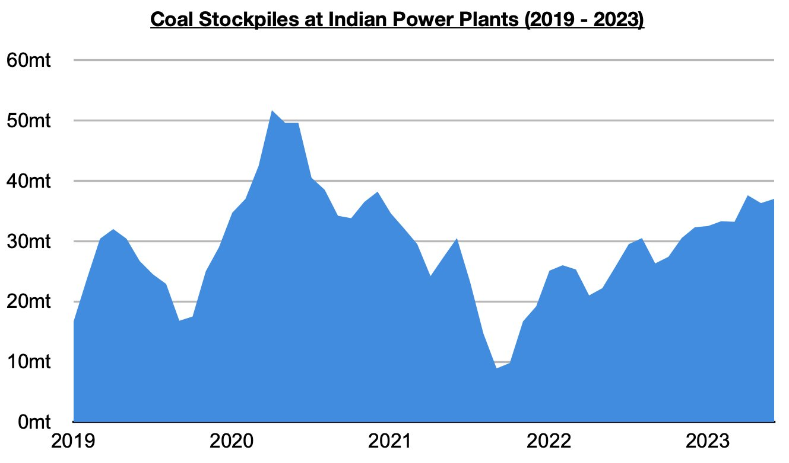

# Significant Amount of Coal Remains Stockpiled in India

**Date:** June 09, 2023  
**Publisher:** Breakwave Advisors | **Category:** Market Insights  
**Original URL:** [https://www.breakwaveadvisors.com/insights/2023/6/9/significant-amount-of-coal-remains-stockpiled-in-india](https://www.breakwaveadvisors.com/insights/2023/6/9/significant-amount-of-coal-remains-stockpiled-in-india)  

---

*By*[*Jeffrey Landsberg*](https://www.linkedin.com/in/jeffrey-landsberg-70ab957/)

As we discussed in Commodore's most recent Weekly Dry Bulk Report, Coal India produced 59.9 million tons of coal last month. This has marked a month-on-month increase of 2.3 million tons (4%) and a year-on-year increase of 5.2 million tons (10%). Coal India’s production has now increased on a year-on-year basis during twenty-four of the last twenty-five months, and last month’s 10% growth has marked the second largest growth seen all year. The days of Coal India producing a chronically low amount of coal remain long gone.

> **Figure 1: Chart 1 (80)**  
> [Local Asset](file:///C:/Users/Dell/Github/Shipping/corpus/03-breakwave/insights/2023/assets/2023-06-09_significant-amount-of-coal-remains-stockpiled-in-india_img_chart1288029_8d2f8d7f074a.jpg)

Offtake (amount sent to customers) totaled 63.7 million tons last month, which marks a month-on-month increase of 1.3 million tons (4%) and a year-on-year increase of 2.5 million tons (4%). Offtake has now increased on a year-on-year basis during twenty-six of the last twenty-seven months, and last month again saw offtake exceed production. Prior to these last two months, the previous five months all saw offtake fall short of production. Coal India’s stockpiles now stand at approximately 61 million tons.

> **Figure 2: Chart 2 (68)**  
> [Local Asset](file:///C:/Users/Dell/Github/Shipping/corpus/03-breakwave/insights/2023/assets/2023-06-09_significant-amount-of-coal-remains-stockpiled-in-india_img_chart2286829_dc74a1ba9c90.jpg)

In addition, stockpiles at the nation's power plants now stand at approximately 37 million tons.

> **Figure 3: Chart 3 (49)**  
> [Local Asset](file:///C:/Users/Dell/Github/Shipping/corpus/03-breakwave/insights/2023/assets/2023-06-09_significant-amount-of-coal-remains-stockpiled-in-india_img_chart3284929_6a46d5bacdd4.jpg)
