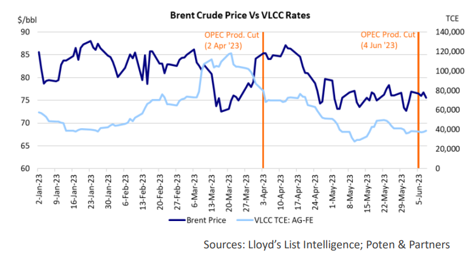
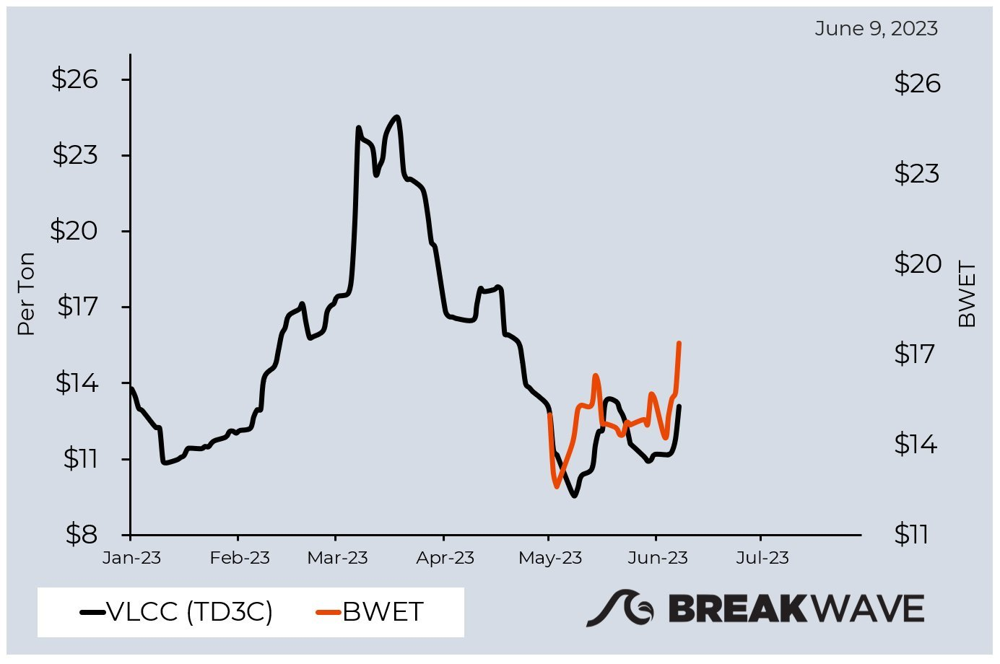

# Storm after the calm for VLCC rates?

**Date:** June 10, 2023  
**Publisher:** Breakwave Advisors | **Category:** Market Insights  
**Original URL:** [https://www.breakwaveadvisors.com/insights/2023/6/10/storm-after-the-calm-for-vlcc-rates](https://www.breakwaveadvisors.com/insights/2023/6/10/storm-after-the-calm-for-vlcc-rates)  

---

The huge drop we recently experienced on the Very Large Crude Carrier (VLCC) freight rates was only seasonal. Rising oil prices and the start of refining maintenance season in China contributed to a cutback in VLCC activity (and rates) in April and May.

According to the Norwegian Arctic Securities, latest China data sends positive signals. VLCCs appear to have bottomed out with benchmark rates marked higher in the last few days. "We believe that the increase is mainly demand driven and that imports, despite m-m volatility are on course for a double-digit gain (%) this year.**We believe that demand is fundamentally strong.**”

## The Correlation Between Oil Price and Tanker Rates

> **Figure 1: Screenshot 2023 06 10 10.23.16**  
> [Local Asset](file:///C:/Users/Dell/Github/Shipping/corpus/03-breakwave/insights/2023/assets/2023-06-10_storm-after-the-calm-for-vlcc-rates_img_screenshot2023-06-10102316_d7b49df94408.png)

The relationship between oil prices and tanker rates is not always straightforward as this Poten & Partners chart illustrates. However, sometimes there is a correlation. In March of this year, for example, a rise in tanker rates coincided with a sharp drop in oil prices. Lower oil prices lead to lower fuel costs and as such improve tanker earnings. However, this only explains a part of the increase in earnings. There was also a boost in tanker demand. The Chinese, which are price sensitive buyers, took advantage of lower prices by increasing imports in March.

As we approach the end of refinery maintenance and oil price dropped, Chinese demand is expected to make a seasonal recovery and tanker rates usually follows suit in Q3 and into the winter. “**There is always uncertainty, but we remain bullish for the second half of 2023 and into 2024**”, Poten wrote in their recent Tanker Opinion.

## Attractive Entry Point?

According to Arctic, the fundamentally strong demand coupled with the constrained supply side (the tankers fleet is expected to actually shrink in size in the foreseeable future) leads to “now, is good time to enter the tankers space”.

> **Figure 2: 241**  
> [Local Asset](file:///C:/Users/Dell/Github/Shipping/corpus/03-breakwave/insights/2023/assets/2023-06-10_storm-after-the-calm-for-vlcc-rates_img_241_e75f61082680.png)

VLCC spot rates for the Middle East Gulf to China benchmark route (TD3C) and the Breakwave Tanker Shipping ETF (BWET) were both up about 10% yesterday.

BWET has a 90% allocation in near-dated TD3C freight future contracts. Just saying…

Disclaimer: This is not an investment advice. Investing in freight futures can be volatile and is not suitable for all investors.

---

**Tags:** Tankers, Shipping, Freightrates  
