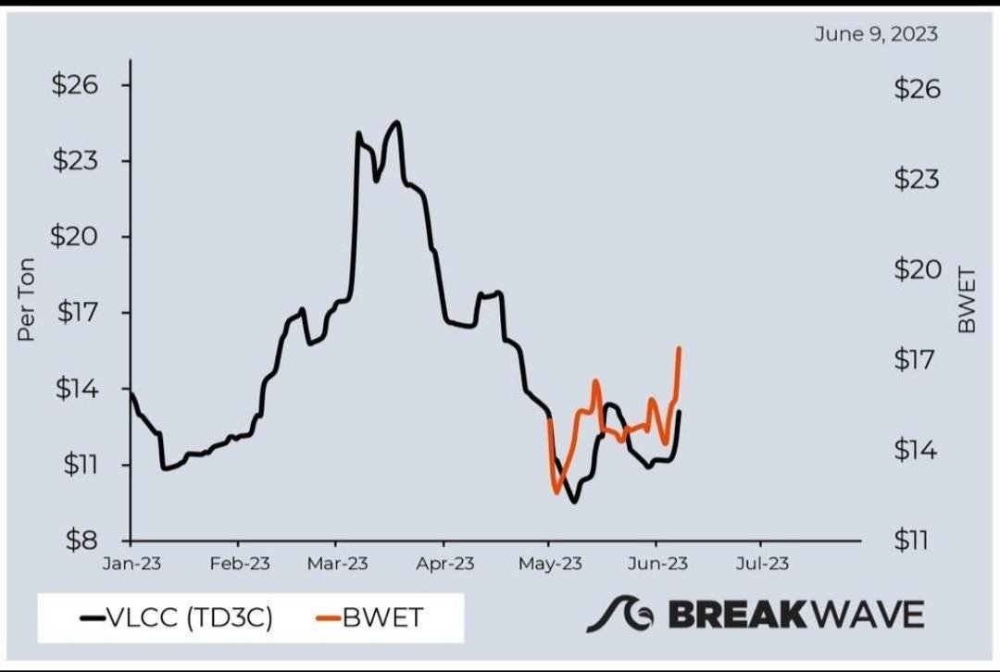
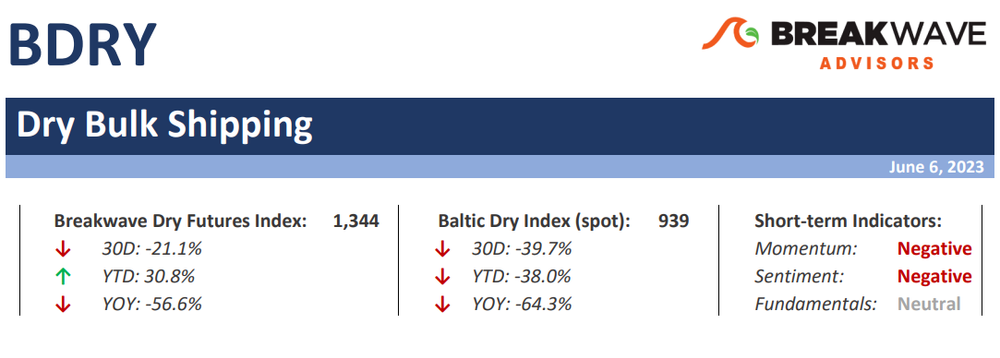

# Weekly Insights Review

**Date:** June 11, 2023  
**Publisher:** Breakwave Advisors | **Category:** Market Insights  
**Original URL:** [https://www.breakwaveadvisors.com/insights/2023/6/11/5twxjqmx8zgutp4ciy7uvq1xd93rqy](https://www.breakwaveadvisors.com/insights/2023/6/11/5twxjqmx8zgutp4ciy7uvq1xd93rqy)  

---

## Welcome to Our Weekly Insights Review

## Read Here Everything You Need to Know

> **Figure 1: 348908642 957994585352074 8202696835054169503 N**  
> **Interactive Data & Source:** [Breakwave Advisors Market Insights](https://www.breakwaveadvisors.com/insights/2023/6/10/storm-after-the-calm-for-vlcc-rates) | [Local Asset](file:///C:/Users/Dell/Github/Shipping/corpus/03-breakwave/insights/2023/assets/2023-06-11_5twxjqmx8zgutp4ciy7uvq1xd93rqy_img_348908642-957994585352074-8202696835_5b073f28f819.jpg)

## Storm After the Calm for VLCC Rates?

## Attractive Entry Point?

The huge drop we recently experienced on the Very Large Crude Carrier (VLCC) freight rates was only seasonal. Rising oil prices and the start of refining maintenance season in China contributed to a cutback in VLCC activity (and rates) in April and May.
[Read More](https://www.breakwaveadvisors.com/insights/2023/6/10/storm-after-the-calm-for-vlcc-rates)

> **Figure 2: Market Chart 2**  
> **Interactive Data & Source:** [Breakwave Advisors Market Insights](https://www.breakwaveadvisors.com/insights/2023/6/5/signal-tanker-weekly-report) | [Local Asset](file:///C:/Users/Dell/Github/Shipping/corpus/03-breakwave/insights/2023/assets/2023-06-11_5twxjqmx8zgutp4ciy7uvq1xd93rqy_img_unnamed284329_821f074a1358.jpg)

## Signal Tanker Weekly Report

## Snapshot of Crude and Product Freight Rates, Supply-Demand

As May drew to a close, the sentiment in the crude freight market for VLCC tankers continued to lag behind the heights witnessed in the first quarter of the year.
[Read More](https://www.breakwaveadvisors.com/insights/2023/6/5/signal-tanker-weekly-report)

> **Figure 3: Market Chart 3**  
> **Interactive Data & Source:** [Breakwave Advisors Market Insights](https://www.breakwaveadvisors.com/insights/2023/6/6/2023-the-year-homework-will-pay-off) | [Local Asset](file:///C:/Users/Dell/Github/Shipping/corpus/03-breakwave/insights/2023/assets/2023-06-11_5twxjqmx8zgutp4ciy7uvq1xd93rqy_img_unnamed284429_6880c080820c.jpg)

## Mazars Comment: 2023 the Year Homework Will Pay Off

## The Three Things I Would Tell My Clients This Week

The debt ceiling drama-that-wasn’t is squarely behind us. An eleventh-hour deal was signed, averting the wanton default of the biggest economy in the world, and the global risk-free asset, the US Dollar, marking the 79th straight time that the debt ceiling was successfully raised.
[Read More](https://www.breakwaveadvisors.com/insights/2023/6/6/2023-the-year-homework-will-pay-off)

## Breakwave Bi-Weekly Dry Bulk Report

– The last five years have seen dramatic changes when it comes to the spot Atlantic Capesize market.
[Read More](https://www.breakwaveadvisors.com/insights/2023/6/5/breakwave-bi-weekly-dry-bulk-report-june-6-2023)

> **Figure 4: Shifting Tides in the Atlantic Is All That Matters for Q3**  
> **Interactive Data & Source:** [Breakwave Advisors Market Insights](https://www.breakwaveadvisors.com/insights/2023/6/5/doric-weekly-market-insight) | [Local Asset](file:///C:/Users/Dell/Github/Shipping/corpus/03-breakwave/insights/2023/assets/2023-06-11_5twxjqmx8zgutp4ciy7uvq1xd93rqy_img_unnamed-2023-06-11t121900928_ab7c648db93c.png)

## Doric Weekly Market Insight

## The Mixture of Signals From the Component Indices Suggests That the Road to Trade Recovery May Be Bumpy.

Amidst a tumbling spot market and a wounded market sentiment, the World Trade Organization (WTO) published this week the latest update of the “Goods Trade Barometer”. WTO's barometer is a composite leading indicator for world trade, providing real time information on the trajectory of merchandise trade relative to recent trends.
[Read More](https://www.breakwaveadvisors.com/insights/2023/6/5/doric-weekly-market-insight)

> **Figure 5: Market Chart 5**  
> **Interactive Data & Source:** [Breakwave Advisors Market Insights](https://www.breakwaveadvisors.com/insights/2023/6/7/oil-gives-back-opec-driven-gains-amid-demand-concerns) | [Local Asset](file:///C:/Users/Dell/Github/Shipping/corpus/03-breakwave/insights/2023/assets/2023-06-11_5twxjqmx8zgutp4ciy7uvq1xd93rqy_img_unnamed284629_7506e822aa10.jpg)

> **Figure 6: Market Chart 6**  
> **Interactive Data & Source:** [Breakwave Advisors Market Insights](https://www.breakwaveadvisors.com/insights/2023/6/7/oil-gives-back-opec-driven-gains-amid-demand-concerns) | [Local Asset](file:///C:/Users/Dell/Github/Shipping/corpus/03-breakwave/insights/2023/assets/2023-06-11_5twxjqmx8zgutp4ciy7uvq1xd93rqy_img_unnamed284729_b774ef0802e5.jpg)

## Oil Gives Back OPEC Driven Gains Amid Demand Concerns

## Iron Ore Futures Extended Its Recent Rally Amid Hopes of Further Support From China

Concerns over demand continue to weigh on commodity markets. Macro headwinds were also present, with a stronger USD impacting investor appetite.
[Read More](https://www.breakwaveadvisors.com/insights/2023/6/7/oil-gives-back-opec-driven-gains-amid-demand-concerns)

> **Figure 7: Market Chart 7**  
> **Interactive Data & Source:** [Breakwave Advisors Market Insights](https://www.breakwaveadvisors.com/insights/2023/6/8/chinas-industrial-sector-continues-to-stall-ongoing-recession-in-united-states-and-other-nations) | [Local Asset](file:///C:/Users/Dell/Github/Shipping/corpus/03-breakwave/insights/2023/assets/2023-06-11_5twxjqmx8zgutp4ciy7uvq1xd93rqy_img_unnamed284829_5b39cb36915e.jpg)

## China's Industrial Sector Continues to Stall; Ongoing Recession in United States and Other Nations

## Second Straight Month of Contraction

China’s manufacturing purchasing managers' index (PMI) fell to 48.8 in May, which has marked a second straight month of contraction.
[Read More](https://www.breakwaveadvisors.com/insights/2023/6/8/chinas-industrial-sector-continues-to-stall-ongoing-recession-in-united-states-and-other-nations)

## Shipfix-Global Market Update

## Macro/geopolitics, Commodity Markets, Freight and Bunker Markets

The past week witnessed extensive volatility across the global commodities markets as traders digested contradicting signals.
[Read More](https://www.breakwaveadvisors.com/insights/2023/6/6/shipfix-global-market-update)

> **Figure 8: Market Chart 8**  
> **Interactive Data & Source:** [Breakwave Advisors Market Insights](https://www.breakwaveadvisors.com/insights/2023/6/9/significant-amount-of-coal-remains-stockpiled-in-india) | [Local Asset](file:///C:/Users/Dell/Github/Shipping/corpus/03-breakwave/insights/2023/assets/2023-06-11_5twxjqmx8zgutp4ciy7uvq1xd93rqy_img_unnamed284929_001c6688ee60.jpg)

## Significant Amount of Coal Remains Stockpiled in India

## Coal India’s Production Has Now Increased on a Year-on-Year Basis During Twenty-Four of the Last Twenty-Five Months

As we discussed in Commodore's most recent Weekly Dry Bulk Report, Coal India produced 59.9 million tons of coal last month.
[Read More](https://www.breakwaveadvisors.com/insights/2023/6/9/significant-amount-of-coal-remains-stockpiled-in-india)

> **Figure 9: Iron Ore Market Experienced a Notable Increase in Prices Due To**  
> *The iron ore market experienced a notable increase in prices due to the recent news regarding the Chinese economy stimulus package.Read More*  
> **Interactive Data & Source:** [Breakwave Advisors Market Insights](https://www.breakwaveadvisors.com/insights/2023/6/8/xbq09uocapnjex2zcrmjjhbuz587tv) | [Local Asset](file:///C:/Users/Dell/Github/Shipping/corpus/03-breakwave/insights/2023/assets/2023-06-11_5twxjqmx8zgutp4ciy7uvq1xd93rqy_img_unnamed285029_e44284b7e37e.jpg)

## Signal Dry Bulk Weekly Report

## Snapshot of Spot Freight Rates, Supply-Demand Trends, Port Congestions

> **Figure 10: Market Chart 10**  
> [Local Asset](file:///C:/Users/Dell/Github/Shipping/corpus/03-breakwave/insights/2023/assets/2023-06-11_5twxjqmx8zgutp4ciy7uvq1xd93rqy_img_unnamed285129_6a9cbe5be272.jpg)
