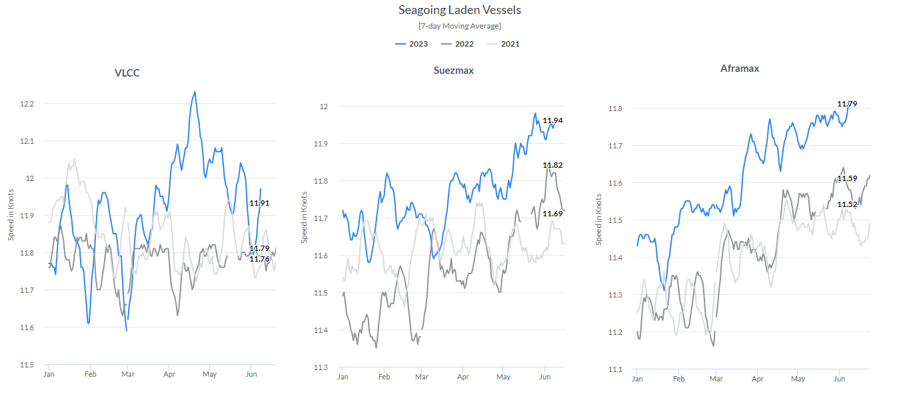
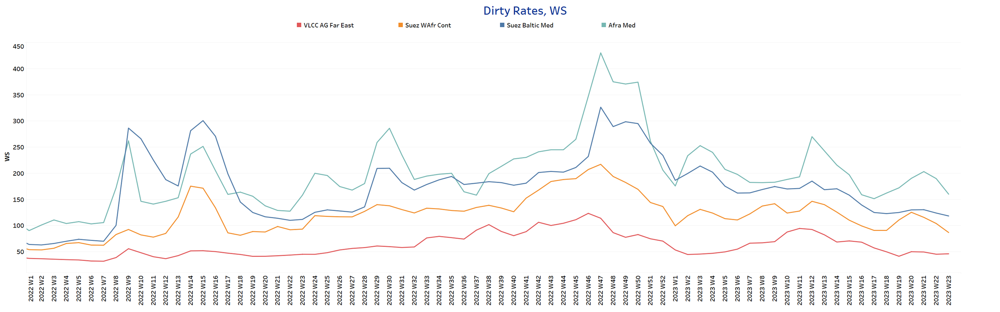
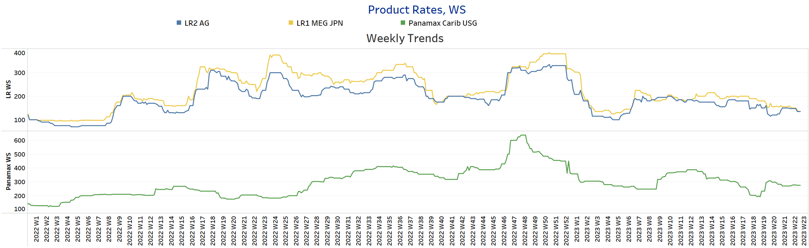
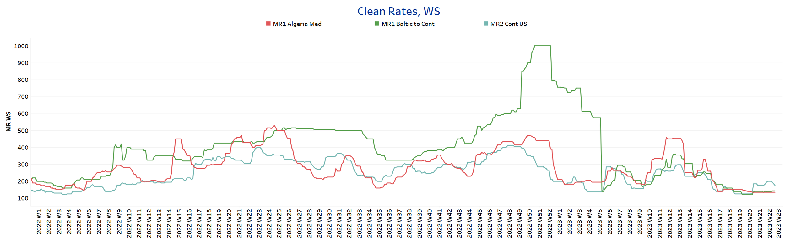
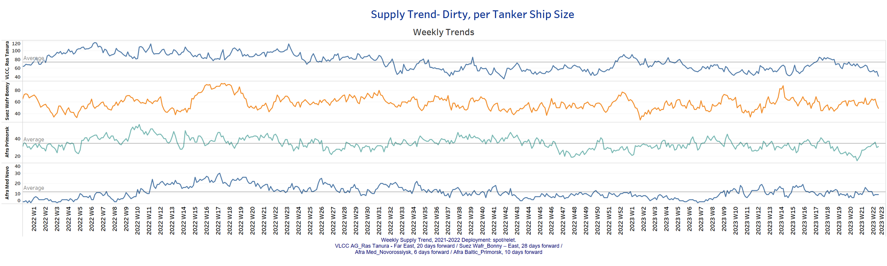
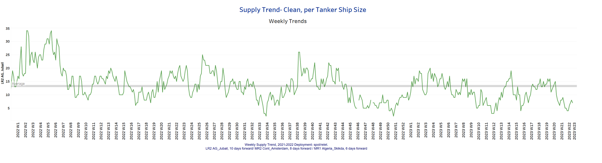
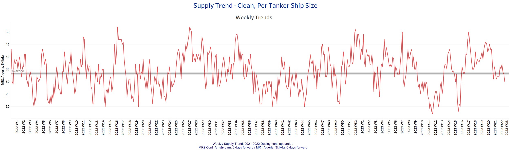
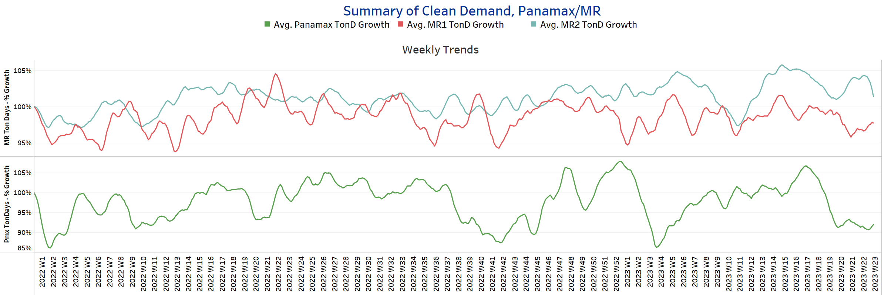

# Signal Tanker Weekly Report

**Date:** June 12, 2023  
**Publisher:** Breakwave Advisors | **Category:** Market Insights  
**Original URL:** [https://www.breakwaveadvisors.com/insights/2023/6/12/signal-tanker-weekly-report](https://www.breakwaveadvisors.com/insights/2023/6/12/signal-tanker-weekly-report)  

---

## Chart of the Week: Seagoing Laden Speed

*Seagoing Laden Speed in the Suezmax and Aframax increased to the highest levels in*

> **Figure 1: Market Chart 1**  
> **Interactive Data & Source:** [Signal Ocean Platform](https://go.signalocean.com/e/983831/tanker-reports-vesselSpeeds/2p1zfx/325063059?h=_5duIxsKNwwK3MyEfMxUtikrRYIFdcdR8OhRb9bfaUE) | [Local Asset](file:///C:/Users/Dell/Github/Shipping/corpus/03-breakwave/insights/2023/assets/2023-06-12_signal-tanker-weekly-report_img_unnamed-2023-06-12t124651881_20ee5217ffe7.png)

Data Source: The Signal Ocean Platform- Seagoing Laden Speed
[Signal Ocean Platform](https://go.signalocean.com/e/983831/tanker-reports-vesselSpeeds/2p1zfx/325063059?h=_5duIxsKNwwK3MyEfMxUtikrRYIFdcdR8OhRb9bfaUE)

June has witnessed a persistently weaker sentiment in crude freight rates. Nevertheless, a noteworthy development has been the notable increase in seagoing-laden speed. Despite the ongoing challenges in supply and demand dynamics, the first half of the year has witnessed an upward trend in the seagoing-laden speed of Suezmax and Aframax tankers. Since the beginning of the year, both vessel types have experienced a remarkable surge in their seagoing-laden speed, reaching peak levels in the month of June (refer to the accompanying image for reference).

However, it is worth noting that the VLCC segment has experienced a contrasting trend, as the seagoing-laden speed recorded a decline after reaching a peak of over 12 knots in April.
Despite the announcement of Saudi Arabia's production cut, oil prices are currently experiencing a decline. According to Oil.price, early trading on Friday shows Brent crude trading at $75.50 per barrel, while WTI remains below $71 per barrel. This downward trend in oil prices can be attributed to growing economic concerns in Europe, China, and the United States, which have generated a bearish sentiment in the market. Interestingly, this occurs despite forecasts indicating a tight supply situation in the oil market.

For more information on this week's trends, see the analysis sections below:
Freight Market, Supply and Demand

## Section 1/ Freight - Market Rates (WS)

> **Figure 2: ‘Dirty’ VLCC - Suezmax - Aframax Weaker**  
> **Interactive Data & Source:** [Signal Ocean Platform](https://www.thesignalgroup.com/signal-ocean-platform) | [Local Asset](file:///C:/Users/Dell/Github/Shipping/corpus/03-breakwave/insights/2023/assets/2023-06-12_signal-tanker-weekly-report_img_unnamed-2023-06-12t124835795_e91305ef9cc4.png)

Early June continues to witness a prevailing weaker sentiment in the crude oil freight market, particularly in the Suezmax and Aframax segments, which are experiencing a notable downward trend.

- VLCC AG-FE freight rates are now around WS46, a 60% drop from the peak observed in week 12.​​​​
- Suezmax freight rates from West Africa to continental Europe have undergone a significant decline, reaching as low as WS87. This represents a substantial decrease of 38 points compared to the peak observed in week 20.
- Aframax Med freight rates have experienced a notable drop to around WS160, marking a decrease of 40 points from the previous week. These downward trends indicate the potential continuation of a negative trajectory for the coming days in both segments.

> **Figure 3: ‘Product’ Lr Weaker**  
> **Interactive Data & Source:** [Signal Ocean Platform](https://www.thesignalgroup.com/signal-ocean-platform) | [Local Asset](file:///C:/Users/Dell/Github/Shipping/corpus/03-breakwave/insights/2023/assets/2023-06-12_signal-tanker-weekly-report_img_unnamed-2023-06-12t125713424_c06701d27e0e.png)

- During the first week of June, LR2 AG and LR1 MEG Japan freight rates experienced a notable decline, indicating a weaker outlook. Currently, both rates are approaching approximately 135 Worldscale (WS), which reflects a decrease of nearly 12 points compared to the rates observed just a week ago.

Product’ Panamax - Steady

- Over the past three weeks, Panamax Carib-to-USG rates have demonstrated stability, maintaining levels around WS275. This stability in rates signifies a positive development as it reflects an increase of approximately 40% compared to the low observed in week 19.​

> **Figure 4: ‘Clean’ MR1 Weaker | MR2 Softening**  
> **Interactive Data & Source:** [Signal Ocean Platform](https://www.thesignalgroup.com/signal-ocean-platform) | [Local Asset](file:///C:/Users/Dell/Github/Shipping/corpus/03-breakwave/insights/2023/assets/2023-06-12_signal-tanker-weekly-report_img_unnamed-2023-06-12t125804693_8a5b51365002.png)

- The MR1 rates for shipments from Algeria to the Mediterranean have remained unchanged, settling at the weak levels observed in the previous week, approximately around WS135. Conversely, there has been a slight improvement in the MR1 rates for the Baltic Continent, which have now experienced a mild increase to levels around WS143. This represents a rise of 5 points compared to the rates observed a week ago.

- In early June, the MR2 rates for shipments from the Continent to the US exhibited a softer trend compared to the persistent upward trajectory observed in the previous period. However, despite this adjustment, the rates are still higher than the lows experienced in week 20. Currently, they are hovering around the level of approximately WS175, signifying a relatively stable position in the market.

## Section 2/ Supply - (# Vessels) Decreasing'dirty' Supply Trend Lines for Key Load Areas

> **Figure 5: Market Chart 5**  
> **Interactive Data & Source:** [Signal Ocean Platform](https://www.thesignalgroup.com/signal-ocean-platform) | [Local Asset](file:///C:/Users/Dell/Github/Shipping/corpus/03-breakwave/insights/2023/assets/2023-06-12_signal-tanker-weekly-report_img_unnamed-2023-06-12t125847131_f1232a8e4ce2.png)

The first week of June ends with a downward revision in the supply of VLCC and Suezmax crude oil tankers, while Aframax Primorsk continue to show signs of increasing.

- VLCC Ras Tanura: The current vessel count stands at 42, a deviation of 30 vessels from the annual average and a significant drop of almost 50% from the peak in week 18.
- Suezmax Wafr Bonny: The current vessel count is 49, 40 vessels less than the peak in week 15.
- Aframax Primorsk: The number of ships increased rose to 31, a significant increase of 15 ships over the count of three weeks ago.
- Aframax Med Novo: The number of vessels fell to 9, 2 fewer than the average for the year, with signs of a further downward correction in the second week of June.

> **Figure 6: ‘Clean’ Supply Trend Lines for Key Load Areas |LR2| Decreasing**  
> **Interactive Data & Source:** [Signal Ocean Platform](https://www.thesignalgroup.com/signal-ocean-platform) | [Local Asset](file:///C:/Users/Dell/Github/Shipping/corpus/03-breakwave/insights/2023/assets/2023-06-12_signal-tanker-weekly-report_img_unnamed-2023-06-12t125928455_a087c147c9cb.png)

## ‘Clean’ Supply Trend Lines for Key Load Areas |MR1| Decreasing

> **Figure 7: Market Chart 7**  
> **Interactive Data & Source:** [Signal Ocean Platform](https://www.thesignalgroup.com/signal-ocean-platform) | [Local Asset](file:///C:/Users/Dell/Github/Shipping/corpus/03-breakwave/insights/2023/assets/2023-06-12_signal-tanker-weekly-report_img_unnamed-2023-06-12t130000696_727a1dd0993f.png)

- Clean LR2 AG Jubail: The significant downward trend observed in May, which saw rates fall below the annual average, has persisted into June. Currently, the number of ships stands at 7, indicating a relatively low level of activity. However, recent market trends suggest the possibility of an upward revision in the coming days, implying a potential improvement in the market conditions.

- Clean MR1 Algeria Skikda: The number of ships has seen a notable decrease, currently standing at 30. This represents a decline of 16 ships compared to the levels observed in the previous three weeks and 3 ships below the annual average. This reduction in ship count indicates a relatively lower level of activity in the market.

## Section 3 - Demand - Ton Days

> **Figure 8: ‘Dirty’ | VLCC - Suezmax - Aframax Decreasing**  
> **Interactive Data & Source:** [Signal Ocean Platform](https://www.thesignalgroup.com/signal-ocean-platform) | [Local Asset](file:///C:/Users/Dell/Github/Shipping/corpus/03-breakwave/insights/2023/assets/2023-06-12_signal-tanker-weekly-report_img_unnamed-2023-06-12t130000696_727a1dd0993f.png)

> **Figure 9: ‘Clean’ | Panamax - MR Decreasing**  
> **Interactive Data & Source:** [Signal Ocean Platform](https://www.thesignalgroup.com/signal-ocean-platform) | [Local Asset](file:///C:/Users/Dell/Github/Shipping/corpus/03-breakwave/insights/2023/assets/2023-06-12_signal-tanker-weekly-report_img_unnamed-2023-06-12t130113083_644c5405cb3f.png)

- Dirty demand ton-days: Amid indications of a stronger demand outlook in the Suezmax segment, there is a growing sense of optimism in the VLCC market. In recent days, the VLCC segment has experienced higher growth rates compared to levels observed three weeks ago. This positive development suggests a potential upturn in the VLCC market, bringing renewed optimism to industry players.

- Clean demand ton-days / Panamax demand: The Panamax freight rates have witnessed a sharp downward correction since reaching a peak in week 18. This correction has introduced a level of uncertainty regarding the future prosperity of Panamax rates.
- ​​​​​Clean MR: The growth rates for MR demand outlook have continued to follow a similar pattern observed in the previous three weeks, indicating a persistent weaker outlook. This consistency in the trend highlights ongoing challenges and uncertainties in the MR segment.

Data Source:[Signal Ocean Platform](https://www.thesignalgroup.com/signal-ocean-platform)
