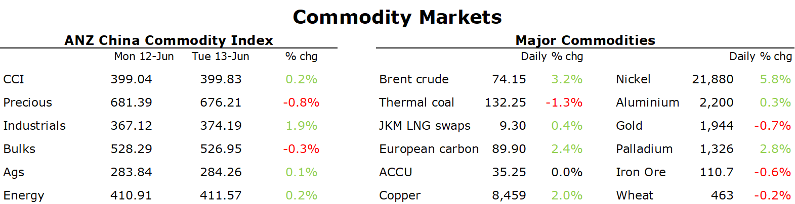

# Metals rally amid expectations of Chinese stimulus measures

**Date:** June 14, 2023  
**Publisher:** Breakwave Advisors | **Category:** Market Insights  
**Original URL:** [https://www.breakwaveadvisors.com/insights/2023/6/14/metals-rally-amid-expectations-of-chinese-stimulus-measures](https://www.breakwaveadvisors.com/insights/2023/6/14/metals-rally-amid-expectations-of-chinese-stimulus-measures)  

---

By[Daniel Hynes](https://www.linkedin.com/in/dahynes/)

Energy and metals jumped amid anticipation of Chinese stimulus. This was aided by a risk on tone across markets following a lower-than-expected inflation print in the US.

> **Figure 1: 1686694525860**  
> **Interactive Data & Source:** [Linkedin](https://www.linkedin.com/newsletters/commodities-wrap-6692196755876012032/?fbclid=IwAR3kiXJqZdxmp9ZcRwBNI7FsBySI-XSC0pfPur1qzjt7OZp7PTE59Tsl1QI) | [Local Asset](file:///C:/Users/Dell/Github/Shipping/corpus/03-breakwave/insights/2023/assets/2023-06-14_metals-rally-amid-expectations-of-chinese-stimulus-measures_img_1686694525860_c4b65dcdb836.png)

Copper led the base metals higher after China cut its short-term policy interest rate. The PBoC cuts its seven-day reverse repo rate by 10bp to 1.9%. This came after data showed credit demand weakened in May, with aggregate financing at CNY1.6tn. Beijing is also said to be considering a broad package of stimulus measures focused on supporting the real estate market. This was supported by several supply-side issues. In the copper market, European producer Boliden halted output at its biggest smelter following a fire at the plant in southern Sweden. Aluminium smelters in China are also suffering from a lack of rainfall in Yunnan, where electricity is generating via hydropower plants. Even though recent rain could see some smelters restart, risks of ongoing constraints remain high. In the meantime, aluminium inventories have plunged about 60% since March.

The prospect of further support for the property sector saw iron ore futures rally. The measures are said to be focusing on lowering costs on outstanding residential mortgages and boosting relending through the nation’s policy banks to ensure homes are delivered. The State Council may discuss the policies as soon as Friday; however, it’s unclear when they will be formally announced.

Gold gained following the fall in US inflation, which solidified bets that the Fed would pause its monetary tightening this week. However, those gains were given up amid concerns that any pause is likely to be short-lived, with the possibility the central bank remains hawkish.

Crude oil pushed higher as the traders welcomed the prospect of further support measures for the Chinese economy. Sentiment was also boosted by a broader risk-on tone across markets following a fall in US inflation. OPEC warned that the global supply shortfall in the oil market could be as high as 2.7mb/d in July. This shortfall could grow to the biggest deficit since 2021 if Saudi Arabia extends its 1mb/d cut to output for the entire quarter. OPEC also kept its demand growth forecasts unchanged. However, it did estimate that Russian crude output fell to 9.6mb/d in April. That’s down 100kb/d from March and compares with 10mb/d in February.

European gas surged higher as supply jitters spook the market. Dutch front month futures gained more than 16% after it was reported the shipments from Norway are set to remain limited until the middle of July. Work on the Nyhamna gas processing facility was halted after gas was discovered in a cooling system. The Hammerfast LNG plant also remains offline due to an unplanned outage. This comes as unusually hot weather boosts cooling needs and competition for LNG imports. That also sparked a rise in North Asian LNG futures. Low prices have also been enticing price sensitive buyers back into the spot market.

Data source:[Commodities Wrap](https://www.linkedin.com/newsletters/commodities-wrap-6692196755876012032/?fbclid=IwAR3kiXJqZdxmp9ZcRwBNI7FsBySI-XSC0pfPur1qzjt7OZp7PTE59Tsl1QI)
