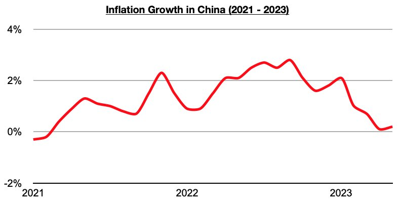

# China Continues to Diverge Away From a Consumer Collapse in the US and Various Other Nations

**Date:** June 15, 2023  
**Publisher:** Breakwave Advisors | **Category:** Market Insights  
**Original URL:** [https://www.breakwaveadvisors.com/insights/2023/6/15/china-continues-to-diverge-away-from-a-consumer-collapse-in-the-us-and-various-other-nations-1](https://www.breakwaveadvisors.com/insights/2023/6/15/china-continues-to-diverge-away-from-a-consumer-collapse-in-the-us-and-various-other-nations-1)  

---

While China’s retail sales data at the time of writing is still pending for May, of note is that inflation in May grew year-on-year by only 0.2%. This is close to April’s 0.1% growth (which marked the lowest inflation seen since February 2021), and it is all but guaranteed that China’s retail sales growth again exceeded inflation last month. Overall, it remains very significant that the last four months of 2022 all saw inflation in China exceed retail sales growth (even during the months where there were no new coronavirus surges or restrictions), and that retail sales growth this year has shifted and exceeded inflation throughout the year.

> **Figure 1: Chart**  
> [Local Asset](file:///C:/Users/Dell/Github/Shipping/corpus/03-breakwave/insights/2023/assets/2023-06-15_china-continues-to-diverge-away-from-a-consumer-collapse-in-the-us-and-various-o_img_chart_1a162a1bda77.jpg)

As we have continued to stress in our Weekly China Reports, China’s consumer sector and industrial sector have improved dramatically this year, while at the same time much of the rest of the world continues to experience great weakness in their own industrial and consumer sectors. China’s industrial recovery has certainly stalled in recent months (the recovery in China's consumer sector has continued) — but China is a major buyer of commodities, and its industries (and overall inflation) have greatly benefited from this year’s large decline in commodity prices. The decline in global commodities benefits China much more than it benefits many other nations including the United States.

Also remaining significant is that China remains in the midst of an easing cycle, while much of the rest of the world remains in a tightening cycle. It remains quite positive in China that its consumers are actually buying more goods than they did a year ago and that financial conditions are also easing. It remains concerning that consumers in many other nations, including in the United States, are buying less goods than they did a year ago, and that a tightening cycle also remains in effect in these nations. As we have been stressing in our Weekly China Reports, inflation in the US has remained higher than retail sales growth since November.
