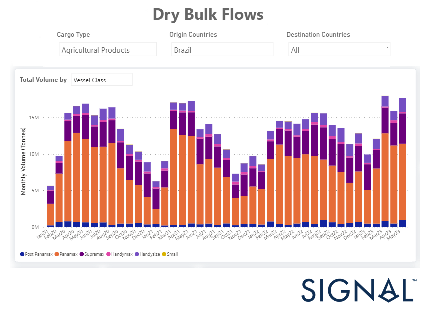
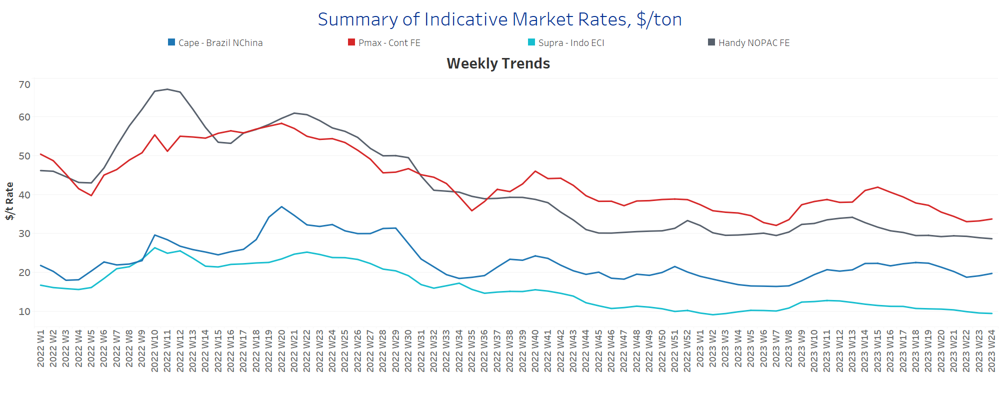
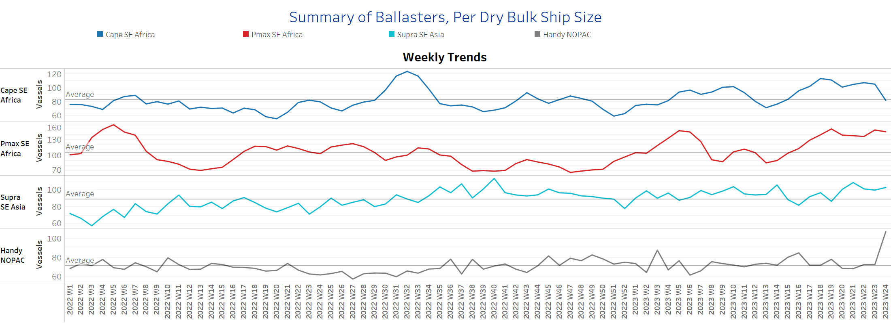
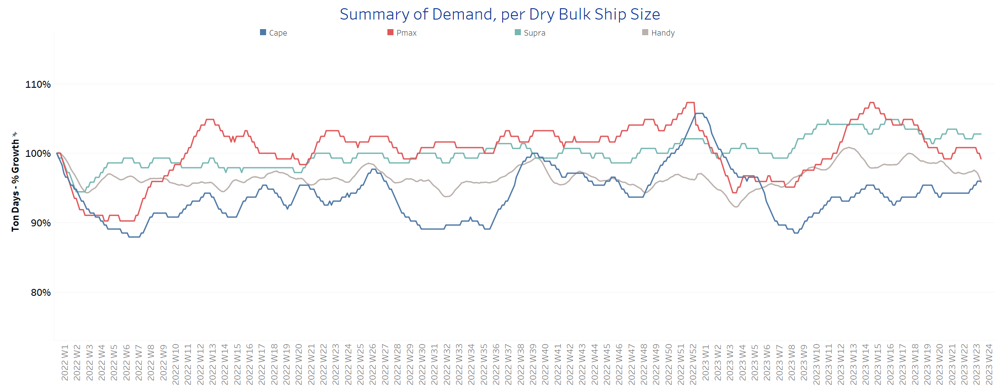
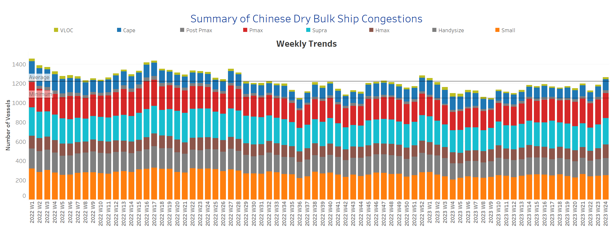

# Signal Dry Bulk Weekly Report

**Date:** June 15, 2023  
**Publisher:** Breakwave Advisors | **Category:** Market Insights  
**Original URL:** [https://www.breakwaveadvisors.com/insights/2023/6/15/signal-dry-bulk-weekly-report](https://www.breakwaveadvisors.com/insights/2023/6/15/signal-dry-bulk-weekly-report)  

---

## Chart of the Week: Agricultural Flows From Brazil

*Jan-May ‘23: 80% increase in the monthly volume of Brazilian agricultural exports to all destinations*

> **Figure 1: Market Chart 1**  
> **Interactive Data & Source:** [Signal Ocean Platform](https://go.signalocean.com/e/983831/amic-drybulkflows-downloadable/2p2gvc/326428723?h=6QyN_LLR3qfIJcgNfmvH9PcjgayothwKpwgCTHaoY0c) | [Local Asset](file:///C:/Users/Dell/Github/Shipping/corpus/03-breakwave/insights/2023/assets/2023-06-15_signal-dry-bulk-weekly-report_img_unnamed-2023-06-15t130824965_475e35a73f0b.png)

The Capesize and Panamax freight rates are showing signs of a revival, suggesting a positive turnaround in the shipping industry. Furthermore, the number of Capesize vessels ballasting in SE Africa has experienced a significant downward trend after maintaining persistently high levels above the annual average for several weeks. This decline in ballasters can potentially reinforce the recent recovery in the sector.
Despite the fragile nature of the Panamax freight market recovery, there has been a substantial surge in the monthly volume of seaborne agricultural products being shipped from Brazil to multiple destinations. Particularly noteworthy is the growing market share of Panamax vessels in the trading business, as illustrated in the provided image.

In the iron ore market, after a sustained period of growth, the iron ore price faced a setback, registering its first decline in nine consecutive sessions. The retreat was accompanied by a cautionary note from Goldman Sachs Group, which emphasized the potential long-term ramifications of China's property weakness on its economy. According to data from Fastmarkets MB, the benchmark price for 62% Fe fines, frequently imported into Northern China, was recorded at $111.72 per tonne on Monday morning, denoting a 3.76% decrease.

For more information on this week's trends, see the analysis sections below:

Freight Market, Supply, Demand and Port Congestion

## Section 1/ Freight‘the Big Picture’ - Capesize and Panamax Bulkers and Smaller Ship Sizes

> **Figure 2: Market Rates ($/T) Firmer**  
> **Interactive Data & Source:** [Signal Ocean Platform](https://www.thesignalgroup.com/signal-ocean-platform) | [Local Asset](file:///C:/Users/Dell/Github/Shipping/corpus/03-breakwave/insights/2023/assets/2023-06-15_signal-dry-bulk-weekly-report_img_unnamed-2023-06-15t131422119_be9cc027f8be.png)

The dry freight market began to strengthen, with the Capesize and Panamax segments leading the revival, while weaker momentum was seen in the smaller vessel categories.

- Capesize vessel freight rates rose to $19.7/tonne, up nearly $ 1/tonne from two weeks ago, but it remains to be seen if the upward sentiment will continue.
- Panamax vessel freight rates from the Continent to the Far East are now close to $34/tonne, but still $7/tonne below the week 15 peak.
- Supramax freight rates for the Indo-ECI route remain below $10/tonne, and have shown signs of a downward correction for more than ten consecutive weeks.
- Handysize freight rates for the NOPAC Far East route held levels remained below $27/tonne, down $2/tonne from the previous week, and there are no signs yet of a firm upturn.

## Section 2/ Supplysupply Trend Lines for Key Load Areasballasters (# Vessels) Increasing

> **Figure 3: Market Chart 3**  
> **Interactive Data & Source:** [Signal Ocean Platform](https://www.thesignalgroup.com/signal-ocean-platform) | [Local Asset](file:///C:/Users/Dell/Github/Shipping/corpus/03-breakwave/insights/2023/assets/2023-06-15_signal-dry-bulk-weekly-report_img_unnamed-2023-06-15t133002264_0dfbb2e3c5c5.png)

The number of ballast ships is still on an upward trend, but there are signs of a downward correction in Capesize ships after more than ten weeks of steady increases and a strong upward movement in Handysize.

- Capesize SE Africa: The current number of ships has now dropped to the annual average of 82, 23 fewer than the previous week.
- Panamax SE Africa: The number of vessels is still at a similar high as the previous week, over 145, which is 70% more than eleven weeks ago, and there is no immediate tendency for a downward correction.
- Supramax SE Asia: The number of vessels remains above 100 for the last four weeks, while it seems that the most recent week has not reached further highs, given the peak recorded in week 21.
- Handysize NOPAC: The number of vessels now stands at 107, which is 34 more than the previous week. It remains to be seen if this accelerated movement will continue in the second half of June.

> **Figure 4: Section 3/ Demandsummary of Dry Bulk Demand, per Ship Size**  
> **Interactive Data & Source:** [Signal Ocean Platform](https://www.thesignalgroup.com/signal-ocean-platform) | [Local Asset](file:///C:/Users/Dell/Github/Shipping/corpus/03-breakwave/insights/2023/assets/2023-06-15_signal-dry-bulk-weekly-report_img_unnamed-2023-06-15t133148856_390b39ab168e.png)

The first half of June saw a downward trend in demand for Panamax and Handysize tonnage days, while Capesize vessels gradually regained momentum after bottoming out in week 8.

- Capesize: Demand growth appears to be one of the strongest points feeding optimism for late June and for a recovery in freight rates.
- Panamax: There are still no signs of stronger growth rates, and the latest levels are still the weakest compared to ten weeks ago.
- Supramax: The last four weeks have seen strong volatility with ups and downs, with mixed signals for market recovery.
- Handysize: The outlook has continued to deteriorate compared to the previous June days, although the latest growth rate is well above the low recorded in week 2.

> **Figure 5: Section 4/ Port Congestiondry Bulk Ships Congested at Chinese Ports**  
> **Interactive Data & Source:** [Signal Ocean Platform](https://www.thesignalgroup.com/signal-ocean-platform) | [Local Asset](file:///C:/Users/Dell/Github/Shipping/corpus/03-breakwave/insights/2023/assets/2023-06-15_signal-dry-bulk-weekly-report_img_unnamed-2023-06-15t133306866_42d6372e4ebd.png)

The first half of June ends with a a sustained upward trend in the number of vessel congestions in the Handysize and Supramax segments.

- Capesize: The number of vessels is still at a level of almost over 100, with an increase of 20 ships compared to three weeks ago.
- ​​​​​​Panamax: The number of vessels remained at about 258, and is still above 250 over the last four weeks.
- Supramax: The current number of ships is now 273, 27 more than a week ago.
- Handysize: The number of congested vessels has risen to 179, up 10 from the previous week, and surpassing the last peak of week 19.

Data Source:[Signal Ocean Platform](https://www.thesignalgroup.com/signal-ocean-platform)
