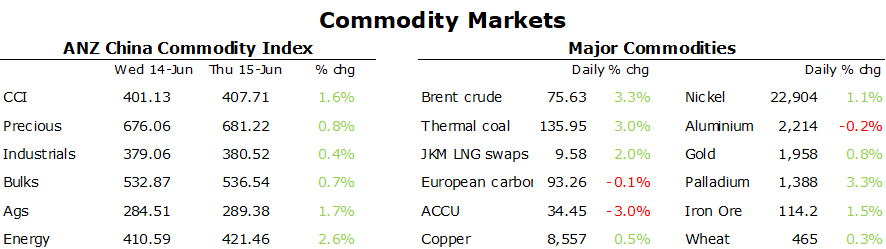

# Sentiment supported by China stimulus talk

**Date:** June 16, 2023  
**Publisher:** Breakwave Advisors | **Category:** Market Insights  
**Original URL:** [https://www.breakwaveadvisors.com/insights/2023/6/16/sentiment-supported-by-china-stimulus-talk](https://www.breakwaveadvisors.com/insights/2023/6/16/sentiment-supported-by-china-stimulus-talk)  

---

*By*[*Daniel Hynes*](https://www.linkedin.com/in/dahynes/)

A risk-on tone helped boost sentiment across commodity markets, aided by supply side issues.

> **Figure 1: 1686866433654**  
> [Local Asset](file:///C:/Users/Dell/Github/Shipping/corpus/03-breakwave/insights/2023/assets/2023-06-16_sentiment-supported-by-china-stimulus-talk_img_1686866433654_70469a7d726a.png)

Crude oil rallied amid prospects of stronger demand in China. The issue of larger than normal crude oil import quotas for domestic refiners boosted sentiment. Using data from China Customs and NBS, implied demand in May rose by 17.1% y/y to 14.58mb/d. This was supported by the prospect of further stimulus measures, which helped offset concerns that further rate hikes in the US would hurt demand. For the moment, higher interest rates don’t appear to be impacting US drivers. US gasoline demand climbed to 9.24mb/d last week, its highest level since December 2021. Significantly lower pump prices compared with a year ago have stoked demand in the US.

European gas spiked by more than 30% during the session amid further supply side issues. The Dutch government is set to permanently close the Groningen gas field in October. The field is said to have led to hundreds of earthquakes since its first production in 1963. An official decision will be made later this month. This comes amid other disruptions to Norwegian gas supply. It raised concerns of energy security, just as heatwaves push demand higher than normal. Gains in Europe helped push North Asian LNG prices higher. However, recent gains have seen Chinese traders step back from the spot market.

Supply issues were also prevalent in the base metals sector. Tin futures rallied after Chinese tin producers Yinman Mining and Guangxi China Tin Group announced maintenance outages in recent days. This follows ongoing issues in Myanmar, where mining operations have been forced to halt on orders from an economic planning committee in the northern area of the country. The re-emergence of power shortages in China is raising the risk of further disruptions to aluminium output. A drought in Yunnan, the country’s fourth biggest producing region, could keep hydro power generation remain well below normal. As such, we see[China’s aluminium output remaining stagnant this year](../pdfs/2023-06-16_sentiment-supported-by-china-stimulus-talk_commodity-call-light-duties_9b23a158f649.pdf). Earlier this week, the CEO of Chilean state-owned company, Codelco, resigned, following poor operational performance, with copper output currently running at its lowest level in more than 25 years. However, the gains across the base metal sector were limited by another set of weak economic data. Growth in industrial output in May slowed to 3.5% y/y from 5.6% in April. Retail sales increased less than expected, while homes prices expanded at the slowest pace in four months.

Gold rebounded after the ECB hinted at further rate hikes. It lifted rates by another 25bp overnight. This comes following a pause by the US Fed, which led to some selling in the USD and lower Treasury yields, which ultimately boosted investor appetite for gold. The gains were tempered by the stronger than expected economic data in the US, with retail sales unexpectedly rising.

Data source:[Commodities Wrap](https://www.linkedin.com/newsletters/commodities-wrap-6692196755876012032/?fbclid=IwAR3kiXJqZdxmp9ZcRwBNI7FsBySI-XSC0pfPur1qzjt7OZp7PTE59Tsl1QI)
