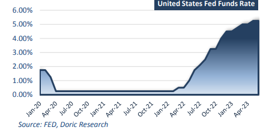
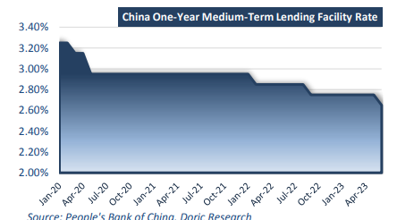
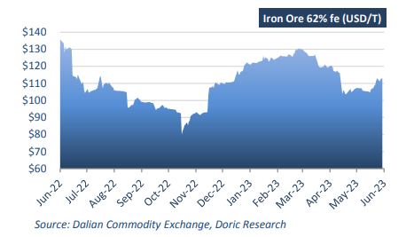

# Doric Weekly Market Insight

**Date:** June 19, 2023  
**Publisher:** Breakwave Advisors | **Category:** Market Insights  
**Original URL:** [https://www.breakwaveadvisors.com/insights/2023/6/19/vpieyyzt4jd966m2iimphb94q15lan](https://www.breakwaveadvisors.com/insights/2023/6/19/vpieyyzt4jd966m2iimphb94q15lan)  

---

## “The People’s Bank of China Trimmed Its Medium-Term Lending Facility Rate, Amid Widespread Expectations That Beijing Would Be Forced to Take Further Action to Support the World’s Second Largest Economy.”

*By*[*Michalis Voutsinas*](https://www.linkedin.com/in/michalis-voutsinas-587544163/)

Following ten consecutive hikes that lifted borrowing costs to the highest level since September 2007, Fed opted to hold their benchmark rate unchanged this week at between 5 and 5.25 percent. Policymakers stressed that holding the target range steady allows them to assess additional information as well as the implications of monetary policy so far. However, they are prepared to adjust it if risks emerge that could impede the attainment of their goals. Officials also signalled that two more hikes in 2023 might be on the table. In determining the extent of additional policy firming that may be appropriate to return inflation to 2 percent over time, the Committee will take into account the cumulative tightening of monetary policy, the lags with which monetary policy affects economic activity and inflation, and economic and financial developments. Additionally, as economic data showed signs of labour market softening and consumer spending moderating, the S&P 500 and Nasdaq surged on Thursday to close at their highest in 14 months. Investors welcomed economic data that suggest that the US Federal Reserve is nearing the end of its aggressive interest-rate hike campaign.

> **Figure 1: 1 (6)**  
> **Interactive Data & Source:** [Doric](https://www.doric.gr/) | [Local Asset](file:///C:/Users/Dell/Github/Shipping/corpus/03-breakwave/insights/2023/assets/2023-06-19_vpieyyzt4jd966m2iimphb94q15lan_img_128629_78b46dd50a0d.png)

Across the pond, inflation in Europe has been coming down but is projected to remain too high for too long. Therefore, ECB's Governing Council decided this week to raise the three key interest rates by 25 basis points and signaled another hike for next month. The ECB has now hiked rates at eight consecutive meetings, taking the benchmark rate in the euro area to 3.5 percent, the highest since May 2001. European markets closed slightly lower on Thursday as investors digested the latest monetary policy decision from the European Central Bank. Meanwhile, the International Monetary Fund has called for the ECB to further tighten its policy a day after the latest rate increase. The fund said a more restrictive monetary policy would be in order over a "sustained period" as it warned against "persistently high" inflation.

Whilst Fed’s and ECB’s decisions were widely anticipated, China made a surprise rate cut to boost banking liquidity and the overall economy. For the first time in 10 months, the People's Bank of China cut its seven-day reverse repo rate by 10 basis points to 1.90 percent, when it injected 2 billion yuan ($279.97 million) through the shortterm bond instrument.

> **Figure 2: 1 (8)**  
> **Interactive Data & Source:** [Doric](https://www.doric.gr/) | [Local Asset](file:///C:/Users/Dell/Github/Shipping/corpus/03-breakwave/insights/2023/assets/2023-06-19_vpieyyzt4jd966m2iimphb94q15lan_img_128829_40e7c79ab8cd.png)

The world’s second largest economy sustained the good momentum of late during the previous months, as the economic and social activities have fully resumed. According to the latest data from China’s National Bureau of Statistics, retail sales of consumer goods remain the bright spot, reporting strong gains. In May, the total retail sales of consumer goods reached 3,780.3 billion yuan, up by 12.7 percent year-on-year. Additionally, services sector is strong, with the index of Services Production increasing by 11.7 percent year-on-year. Specifically, the sub-indices of accommodation and catering, leasing and business services, wholesales and retails and information transmission, software and information technology services grew by 39.5 percent, 14.0 percent, 13.2 percent and 12.9 percent year-onyear respectively. However, factory activity remained weak and construction has been constrained by the property market downturn. China’s real estate investment decreased sharply by 16.2 percent year-on-year in April, even steeper than the 7.2 percent drop recorded in March. Following a 19.2 percent drop in the first three months of the year, new construction by floor area decreased by 21.2 percent year-on-year in the January-April period. Industrial output grew 3.5 percent in May from a year earlier, the National Bureau of Statistics said on Wednesday, slowing from the 5.6 percent gain in April.

> **Figure 3: 1 (7)**  
> **Interactive Data & Source:** [Doric](https://www.doric.gr/) | [Local Asset](file:///C:/Users/Dell/Github/Shipping/corpus/03-breakwave/insights/2023/assets/2023-06-19_vpieyyzt4jd966m2iimphb94q15lan_img_128729_fc8c4264ffd1.png)

Against this backdrop, the recent timid reduction, and expectations of further cuts to other lending rates, injected moderate optimism in the market. Iron ore futures posted weekly gains for a third week in a row, fuelled by expectations of more stimulus to be deployed to support the bumpy post-Covid economic recovery. The most-traded September iron ore on the Dalian Commodity Exchange ended daytime trading at 815 yuan ($114.48) a metric tonne, posting a weekly gain of 2.4 percent. On the other hand, the capricious Capesizes trended sideways during the twenty-fourth trading week, looking for firm indications rather than promising expectations.

Data source:[Doric](https://www.doric.gr/)
