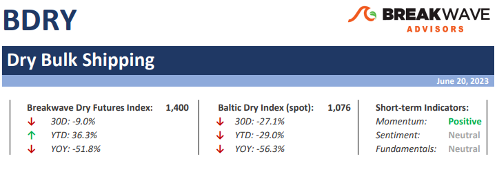
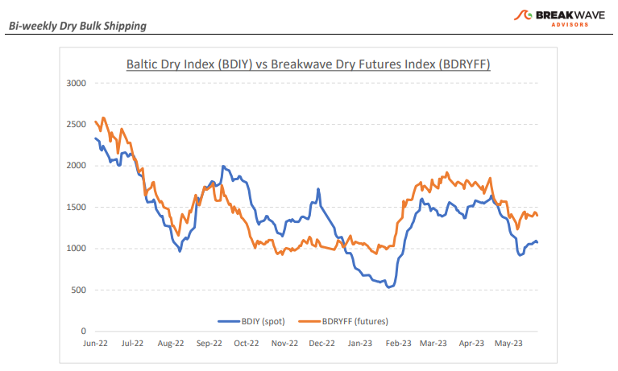
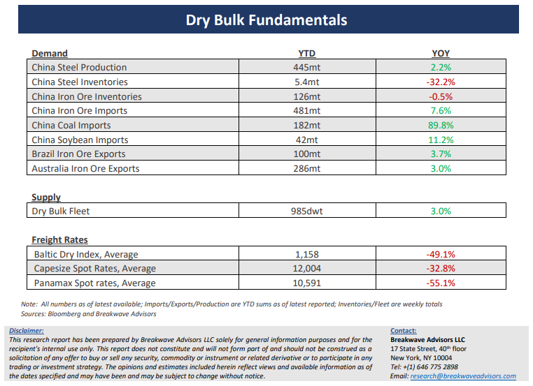

# Breakwave Bi-Weekly Dry Bulk Report - June 20, 2023

**Date:** June 20, 2023  
**Publisher:** Breakwave Advisors | **Category:** Market Insights  
**Original URL:** [https://www.breakwaveadvisors.com/insights/2023/6/19/breakwave-bi-weekly-dry-bulk-report-june-20-2023](https://www.breakwaveadvisors.com/insights/2023/6/19/breakwave-bi-weekly-dry-bulk-report-june-20-2023)  

---

> **Figure 1: Dbreporttop**  
> **Interactive Data & Source:** [Breakwave Advisors Market Insights](https://www.breakwaveadvisors.com/publications) | [Local Asset](file:///C:/Users/Dell/Github/Shipping/corpus/03-breakwave/insights/2023/assets/2023-06-20_breakwave-bi-weekly-dry-bulk-report-june-20-2023_img_dbreporttop_74ce9f3db921.png)

**• Futures curve continues to adjust to an uninspiring macro outlook**– With the summer months upon us, dry bulk markets are faced with softening economic activity out of China, which remains the main demand driver for the sector. So far China has failed to excite, and although the year-over-year comps look impressive, one should always keep in mind the considerable base effects on such comparisons. On more normalized levels, iron ore imports into China have now been relatively steady on a 3-year basis, averaging a bit above 90 mt/month, and if it was not for the significant growth of the bauxite trade from West Africa, Capesize rates might have been even weaker than they have already been. On the positive side, the seasonality in dry bulk is rapidly shifting, and fourth quarter utilization is pointing higher, as both iron ore and bauxite activity once again is expected to pick up. The potential for a soft patch over the next couple of months is making traders nervous, which in turn, means that the flattening of the futures curve might continue till some tightness causes rates to materially shift. The Atlantic market looks the most likely area for such a development, and given the relatively low pricing of that route (~40% discount to index), a potential increase in the Capesize spot Index could very well take place rather soon. The sub-Cape sectors also look inactive, and the summer doldrums might also keep those markets in check until economic activity in the East improves. Overall, the near-term outlook feels dull, and although in shipping the element of surprise is the norm, any change might need to be confirmed by a respective transformation of the macroeconomic outlook.

**• China’s high stimulus hopes that never materialized**– The constant market narrative of an impending stimulus out of China has driven hopes to such a high level, that any announcement (absent a “bazooka” type of move) will most likely disappoint market participants that for months now have been betting on meaningful action from the Chinese government to support the weakening economy. We expect no significant change in policy out of China that involves anything more than small, calculated adjustments for the property sector. After all, for years now China has been communicating their willingness to support high-quality growth and not a repeat of the sizable cash injections and increasing leverage that in the past propped up the property market through speculation. Unfortunately for the commodity markets, such small adjustments mean that prices might need to correct to more normalized levels and while we continue to expect higher economic growth out of China this year, the 5% GDP threshold now seems more vulnerable than ever.

**• Dry bulk focus shifts back to fundamentals**– Following a period of high uncertainty and significant disruptions across the commodity spectrum, the gradual normalization of trade is shifting the market’s attention back to the traditional demand and supply dynamics that have shaped dry bulk profitability for decades. As effective fleet supply growth for the next few years looks marginal, demand will be the main determinant of spot freight rates with China returning back to the driver’s seat as the dominant force of bulk imports and thus shipping demand.

[Subscribe: Bi-Weekly Dry Bulk Report](https://www.breakwaveadvisors.com/publications)

> **Figure 2: Dbreportchart**  
> [Local Asset](file:///C:/Users/Dell/Github/Shipping/corpus/03-breakwave/insights/2023/assets/2023-06-20_breakwave-bi-weekly-dry-bulk-report-june-20-2023_img_dbreportchart_7d7eb9bee61f.png)

> **Figure 3: Dbreportbottom**  
> [Local Asset](file:///C:/Users/Dell/Github/Shipping/corpus/03-breakwave/insights/2023/assets/2023-06-20_breakwave-bi-weekly-dry-bulk-report-june-20-2023_img_dbreportbottom_46c7719abe47.png)
