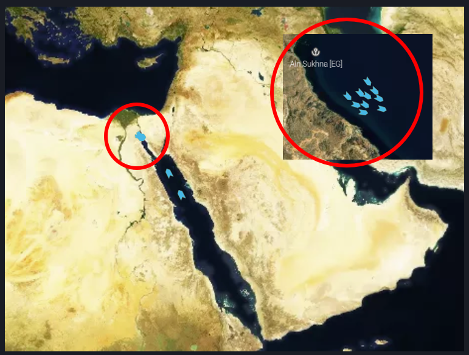
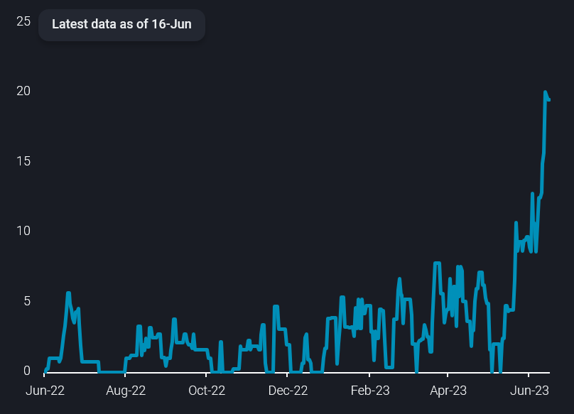

# Saudi crude accumulating off Red Sea

**Date:** June 20, 2023  
**Publisher:** Breakwave Advisors | **Category:** Market Insights  
**Original URL:** [https://www.breakwaveadvisors.com/insights/2023/6/20/saudi-crude-accumulating-off-red-sea](https://www.breakwaveadvisors.com/insights/2023/6/20/saudi-crude-accumulating-off-red-sea)  

---

## “Saudi Arabian Crude Oil Is Accumulating Off Egypt’s Red Sea Coast – An Unusual Market Development and One to Watch Closely As the Country Seeks to Implement Steep Production Cuts.”

*By*[*Jay Maroo*](https://www.linkedin.com/search/results/all/?fetchDeterministicClustersOnly=true&heroEntityKey=urn%3Ali%3Afsd_profile%3AACoAAAcYBVoBsiAtPctbbvTfJKNiNRkvVy4ywuM&keywords=jay&origin=RICH_QUERY_SUGGESTION&position=0&searchId=76253f83-345d-4325-b768-60f5aad59374&sid=%2AQL)

Vortexa data as of 16 June shows around 20mb across 10 VLCCs floating off Egypt’s Ain Sukhna with another two VLCCs currently heading to the same location. All 10 VLCCs currently floating have been stationary for seven days or more and most of these cargoes loaded during or after the second half of May.

> **Figure 1: Since Then**  
> *Since then, other smaller spikes in Saudi crude floating storage took place during November last year, for delayed intra-Saudi flows, and in October-November 2021, when discharges were delayed into China.*  
> **Interactive Data & Source:** [Analytics Vortexa](https://analytics.vortexa.com/?filtersEnabled=%5B%22s%22%2C%22v%22%2C%22l_c%22%2C%22o%22%2C%22d%22%2C%22l%22%2C%22v_cg_st%22%2C%22sts_o%22%2C%22v_r%22%5D&page=Map&tabId=2d40a18a-c1bc-40b1-9970-300a5b94ad9b&v=2&vessels=%5B%22ddcaa2c8269bc1cd04599420ae2cf6368a7351af5860dd1be3a8c6093cb392d3%22%2C%22deb040d2aa0b9e89c0f7b94f9fcda5bb61e6ef7437fb0d52c0e60d1892f396f8%22%2C%225ead06204180eccd5056e590874020fb305382671f21cfa4deca24962406f9b8%22%2C%22b04ceae3d2abb89b4c15261f4e42d20213a82b7b29624121991750a1919e8cf3%22%2C%226084862cb20b6a2e248e885419eade2bee347febfb059b3b3df38c0a2c6812f4%22%2C%224288657bdf9fe2a47b892837efb15b69b5d683d7d2ee699cf9e78f4e0589aca6%22%2C%22322421f39168f986476f9450082a83badbf44a5844677addce7bdd9f506c3d67%22%2C%22aeb82a5f23b22f14783eaabb2adcc5f8c0ebc0518fa0f2eda655b26c59401394%22%2C%229c06681e1edb94d57848241eb49b5e62a6d1fa628630826d4067a892351fcef6%22%2C%22a04063aa2d1af17ddd0a405fff3268e64d953df21b6721f08f05a28b4f35618a%22%2C%229d1366207d6b4c796b38edf5fe2ad67ffef5adaba88e2523b1f9e99e018fa0cc%22%2C%2207d998d94195711c70ac86833119a3754bd9c3ff903a9ea64e4af991312369da%22%5D) | [Local Asset](file:///C:/Users/Dell/Github/Shipping/corpus/03-breakwave/insights/2023/assets/2023-06-20_saudi-crude-accumulating-off-red-sea_img_saudi-crude-off-ain-sukhna_640a3188d7b6.png)

It is hard to pinpoint the exact reason for this build-up of cargoes as there are no recent instances of Saudi crude accumulating in such volumes off Egypt’s coastline. The last time Saudi crude floating storage volumes were above current levels was in Q2 2020 when levels hit 30mbd, but that was amid a wider rise in floating storage volumes and a strong contango structure supporting the activity.

> **Figure 2: Saudi Crude Off Ain Sukhna Chart**  
> **Interactive Data & Source:** [Analytics Vortexa](https://analytics.vortexa.com/?filtersEnabled=%5B%22p%22%2C%22v%22%2C%22intra%22%2C%22sts%22%2C%22w%22%2C%22sts_o%22%2C%22o%22%2C%22d%22%5D&page=Storage&products=%5B%226f11b0724c9a4e85ffa7f1445bc768f054af755a090118dcf99f14745c261653%22%2C%22d053227a2df2f4d6eacca61341cd6c08e49ba6970cc18a276b898b4bb67eeee4%22%5D&selectedRegion=%5B%223eac69e760d9ec571e57ed806a244168f12b4374af47f53d983d71ca6d01b61b%22%5D&storageLocations=%5B%223eac69e760d9ec571e57ed806a244168f12b4374af47f53d983d71ca6d01b61b%22%5D&tabId=5372e9c0-fd58-4100-8fe5-e0d29f8b31f3&v=2) | [Local Asset](file:///C:/Users/Dell/Github/Shipping/corpus/03-breakwave/insights/2023/assets/2023-06-20_saudi-crude-accumulating-off-red-sea_img_saudi-crude-off-ain-sukhna-chart_47f994ad0699.png)

One possible explanation for the build-up in tankers off Ain Sukhna is for greater subsequent deliveries into Europe via the SUMED pipeline – which runs from Ain Sukhna to the Mediterranean Egyptian port of Sidi Kerir.

Loadings from Sidi Kerir, are actually[up by more than 200kbd](https://analytics.vortexa.com/?dateRange=2020-01-01T00%3A00%3A00.000Z__2023-06-15T23%3A59%3A59.999Z&filtersEnabled=%5B%22p%22%2C%22o%22%2C%22d%22%2C%22d_r%22%2C%22v%22%2C%22intra%22%2C%22sts_o%22%2C%22c_o%22%2C%22sts%22%5D&from=%5B%224818c8f53a8dd12df8c22288dd654e7d29e21d10e294f4eeaed7e144124523c0%22%5D&geoBreakdownOriginGlobal=terminal&metric=bpd&page=Flows&products=%5B%2254af755a090118dcf9b0724c9a4e9f14745c26165385ffa7f1445bc768f06f11%22%5D&tabId=8317f592-5f60-44c9-9f03-c9360d98c670&timeSeriesProperty=destination_shipping_region&timeSeriesSeasonalToggle=0&v=2)so far this month suggesting stronger demand from European customers for Saudi (among other Middle East crude) grades.

Vortexa’s latest arrivals data does not suggest any difficulty in discharging cargo at Ain Sukhna – arrivals volumes for the port, at[around 1mbd](https://analytics.vortexa.com/?dateRange=2020-01-01T00%3A00%3A00.000Z__2023-06-15T23%3A59%3A59.999Z&filtersEnabled=%5B%22p%22%2C%22o%22%2C%22d%22%2C%22d_r%22%2C%22v%22%2C%22intra%22%2C%22sts_o%22%2C%22c_o%22%2C%22sts%22%5D&metric=bpd&movementEvent=unloading_start&page=Flows&tabId=8317f592-5f60-44c9-9f03-c9360d98c670&to=%5B%229ab4381aab3268d41c92fe179c819cb9e01e5b4fc6c22b231124c2a83e59ff98%22%5D&v=2)so far in June (1-15), are virtually unchanged from May levels. Meanwhile, Vortexa onshore inventory data shows volumes across SUMED terminals to be rangebound, which reduces the possibility of any infrastructure difficulties causing higher Saudi crude floating storage.

Data Source:[Vortexa](https://www.vortexa.com//oil-gas-data-traders-analysts-data-scientists?gclid=Cj0KCQjw8_qRBhCXARIsAE2AtRZKOvMnbilZ_6_91d7huSFFy71pWLrnPwGwOHVzXsmsG-1a1mZnQw8aAt89EALw_wcB&hsa_acc=1782073842&hsa_ad=548425387665&hsa_cam=14746637662&hsa_grp=125038601902&hsa_kw=&hsa_mt=&hsa_net=adwords&hsa_src=g&hsa_tgt=dsa-1431852288425&hsa_ver=3&utm_campaign=%5BCD%5D%20-%20DSA%20-%20EMEA&utm_medium=cpc&utm_medium=ppc&utm_source=google&utm_source=adwords&utm_term=)
