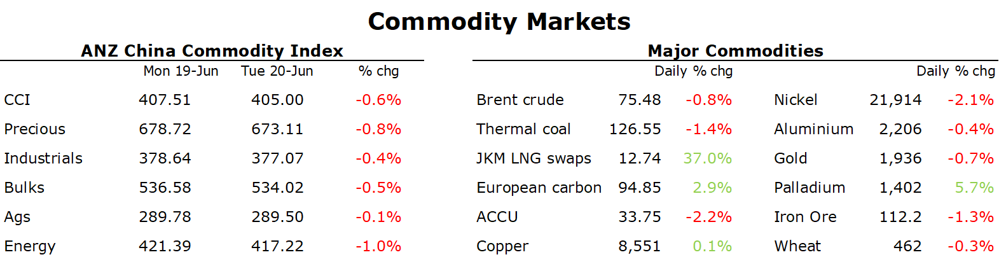

# Sentiment weak as Chinese rate cuts fall below expectations

**Date:** June 21, 2023  
**Publisher:** Breakwave Advisors | **Category:** Market Insights  
**Original URL:** [https://www.breakwaveadvisors.com/insights/2023/6/21/sentiment-weak-as-chinese-rate-cuts-fall-below-expectations](https://www.breakwaveadvisors.com/insights/2023/6/21/sentiment-weak-as-chinese-rate-cuts-fall-below-expectations)  

---

*By*[*Daniel Hynes*](https://www.linkedin.com/in/dahynes/)

Disappointment over Chinese stimulus measures continued to hover over markets. A stronger USD also weighed on investor appetite.

> **Figure 1: Data Source:commodities Wrap**  
> *Data source:Commodities Wrap*  
> **Interactive Data & Source:** [Linkedin](https://www.linkedin.com/newsletters/commodities-wrap-6692196755876012032/?fbclid=IwAR3kiXJqZdxmp9ZcRwBNI7FsBySI-XSC0pfPur1qzjt7OZp7PTE59Tsl1QI) | [Local Asset](file:///C:/Users/Dell/Github/Shipping/corpus/03-breakwave/insights/2023/assets/2023-06-21_sentiment-weak-as-chinese-rate-cuts-fall-below-expectations_img_1687299519524_b3e9acef991f.png)

Crude oil fell amid a broader risk-off tone across markets. Investors remained impatient with China’s efforts to boost economic growth. Chinese banks reduced their benchmark lending rates, with a one-year prime loan falling by 10bp and the five-year rate cut by the same magnitude. However, Beijing’s slow stimulus rollout is adding concerns about the weakening economy. This is despite signs of a tighter physical market in Asia in recent days. There has been an uptick in oil purchases by Chinese refiners as spot prices for some lighter Abu Dhabi grades rising. In addition, the premium of Oman futures to Dubai swaps hit a three-week high. Outside of Asia, the much-anticipated rebound in air travel is spluttering. Europe’s return to the skies is being hampered by a shortage of pilots and air traffic controllers. In the US, jet fuel use remains below pre-pandemic levels.

European gas jumped more than 10% as weather and supply risk keep the market volatile. Prolonged outages at major projects in Norway in recent weeks have kept traders on edge. Earlier this week it was announced that Norway’s Kollsnes gas processing plant would suffer additional capacity cuts. In addition, maintenance has started at Norway’s Troll field. This comes as hot weather raises the risk of increased demand for cooling. Temperatures in Germany pushed above 30oc although they are scheduled to return to normal next week. Supply anxiety pushed North Asian LNG prices higher. Still extremely high coal inventories at utilities in China are keeping a lid on gas demand.

Copper was steady as traders assessed the impact of lending rate cuts in China. However, the market was unimpressed with the State Council announcement that provided only a few lines of high-level measures. Supply-side risks were back in focus after Indonesia announced it would ban exports of copper ore and concentrate exports. President Joko Widodo said the policy would be put in place once Freeport and Amman Mineral International finished building their smelters next year. However, supply risks are easing in the aluminium market, with Yunnan set to ease power curbs and boost aluminium smelting capacity later this month.

Iron ore futures edged lower after the cut to Chinese loan rates disappointed traders. Consensus had called for a bigger reduction of 15bp for one- and five-year rates. This may struggle to lift the subdued investment in the property sector.

Gold fell on anticipation of further tightening by the US Federal Reserve. The market is pricing one more hike this year. This follows more positive economic data; The US home builder confidence index rose to 55 in June from 50 in May. US housing starts rose to a 1.63m annual pace in May from 1.34m in April.
