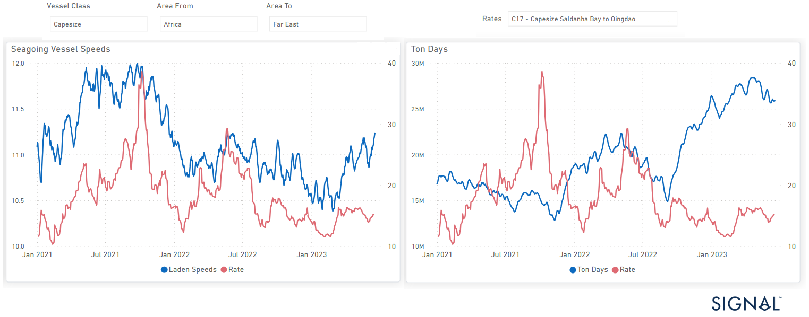
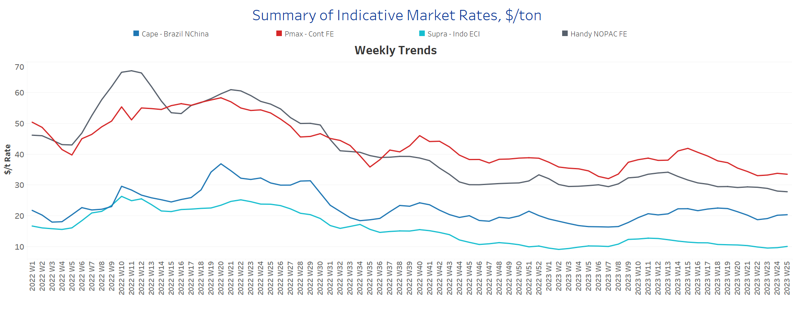
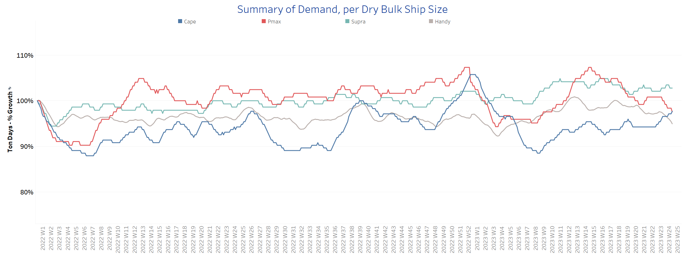
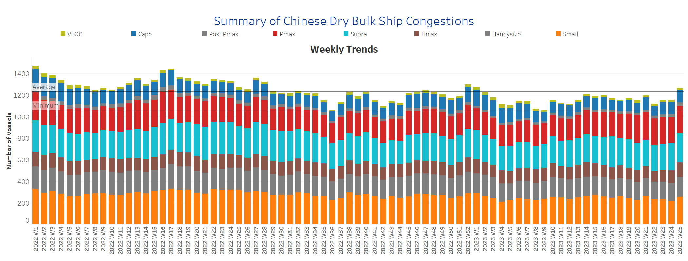

# Signal Dry Bulk Weekly Report

**Date:** June 21, 2023  
**Publisher:** Breakwave Advisors | **Category:** Market Insights  
**Original URL:** [https://www.breakwaveadvisors.com/insights/2023/6/21/signal-dry-bulk-weekly-report](https://www.breakwaveadvisors.com/insights/2023/6/21/signal-dry-bulk-weekly-report)  

---

## Chart of the Week: Capesize Ton Days and Laden Speed West Africa to China

A remarkable turnaround in ton days for Capesize West Africa to China has increased rates and laden speed in the Q2

> **Figure 1: Market Chart 1**  
> **Interactive Data & Source:** [Signal Ocean Platform](https://go.signalocean.com/e/983831/amic-drybulkflows-downloadable/2p37c2/327695386?h=bwkkjIFpZSE-pMfz3BYSnUG9XZaOd6CL4yNFWVFp1f0) | [Local Asset](file:///C:/Users/Dell/Github/Shipping/corpus/03-breakwave/insights/2023/assets/2023-06-21_signal-dry-bulk-weekly-report_img_unnamed-2023-06-21t132242533_9aa4f6fc70ba.png)

There has been a remarkable turnaround in ton days for Capesize shipments from West Africa to China, as illustrated in the provided image, leading to increased rates and improved laden speed during the second quarter. This positive shift signifies improved performance in terms of cargo volume and transportation efficiency in this specific trade route. The higher rates and faster laden speed highlight favorable market conditions and potentially enhanced operational capabilities within the Capesize segment for this particular route.

The third week of June started on a positive note with firmness observed in the Capesize segment. Additionally, there was a notable reduction in the number of ballast vessels for the SE Africa trade route. However, the smaller vessel size segment faced challenges in maintaining rates, leading to discussions about potential downward revisions.
Despite this, the increased congestion at Chinese ports for smaller ships played a role in preventing a collapse of freight rates. Meanwhile, uncertainties surround the extension of the Black Sea Grain Initiative into July, adding an element of unpredictability to the market. These various factors contribute to the dynamic and evolving nature of the shipping industry, necessitating careful monitoring and assessment of market conditions.

For more information on this week's trends, see the analysis sections below:

Freight Market, Supply, Demand and Port Congestion

## Section 1/ Freight​​​

**‘The Big Picture’ - Capesize and Panamax Bulkers and Smaller Ship Sizes
Market Rates ($/t) Softer**

> **Figure 2: Market Chart 2**  
> **Interactive Data & Source:** [Signal Ocean Platform](https://www.thesignalgroup.com/signal-ocean-platform) | [Local Asset](file:///C:/Users/Dell/Github/Shipping/corpus/03-breakwave/insights/2023/assets/2023-06-21_signal-dry-bulk-weekly-report_img_unnamed-2023-06-21t132353970_75cbc026e01f.png)

During the third week of June, the dry freight market displayed a varied performance. The Capesize segment exhibited strength, indicating positive market conditions. However, a softer outlook was observed for the Panamax segment, suggesting a slightly less favorable market environment. Meanwhile, Handysize rates continued their downward correction trend, indicating ongoing price adjustments in that particular segment.

- **Capesize**vessel freight rates experienced a notable increase, reaching $20.4 per tonne, which reflects a rise of approximately $2.5 per tonne compared to three weeks ago. This upward trend in rates has been observed throughout the month of June.
- **Panamax**vessel freight rates from the Continent to the Far East have recently declined, dropping below $33 per tonne. This marks the lowest point since the peak in week 15 when rates were close to $42 per tonne.
- **Supramax**freight rates for the Indo-ECI route have reached $10 per tonne, marking the first time since the end of week 21. However, it is uncertain whether rates will continue to rise beyond $10 per tonne.
- ​**Handysize**freight rates for the NOPAC Far East route have continued to linger at lower levels, with rates hovering around $27 per tonne. This reflects a decline of $7 per tonne from the peak observed in week 13. The market for this route is currently characterized by sustained lower rates compared to previous weeks.

## Section 2/ Supply ​​​

**Supply Trend Lines for Key Load Areas
Ballasters (# vessels) Decreasing**

> **Figure 3: Market Chart 3**  
> **Interactive Data & Source:** [Signal Ocean Platform](https://www.thesignalgroup.com/signal-ocean-platform) | [Local Asset](file:///C:/Users/Dell/Github/Shipping/corpus/03-breakwave/insights/2023/assets/2023-06-21_signal-dry-bulk-weekly-report_img_unnamed-2023-06-21t132605327_e56d7e81b342.png)

**Despite an overall downward trend in the growth of ton days, there has been a persistent recovery observed in the Capesize segments over the past five consecutive weeks.**

- **Capesize**: Demand growth has continued to remain robust, reaching one of the highest levels recorded since the market bottomed out in week 9. This sustained strength in demand has contributed to a gradual firming of freight rates throughout the month of June.
- **Panamax**: Since the conclusion of weeks 15 and 16, there has been a noticeable downward trend in the market, and as of now, there are no clear signs of an immediate reversal. The prevailing conditions suggest that a prompt turnaround may still be some time away.
- **Supramax**: The market continues to experience significant volatility, characterized by fluctuations and mixed signals that make it challenging to predict a consistent recovery. Ups and downs persist, adding to the uncertainty surrounding the overall market conditions.
- **Handysize**: The growth of ton days has experienced a notable downward revision, displaying a stronger decline compared to previous weeks. The current situation raises uncertainty regarding the future trajectory of this weakness and how it will evolve in the coming days.

## Section 4/ Port Congestion ​​​​​

> **Figure 4: Dry Bulk Ships Congested at Chinese Portsno of Vessels Increasing**  
> **Interactive Data & Source:** [Signal Ocean Platform](https://www.thesignalgroup.com/signal-ocean-platform) | [Local Asset](file:///C:/Users/Dell/Github/Shipping/corpus/03-breakwave/insights/2023/assets/2023-06-21_signal-dry-bulk-weekly-report_img_unnamed-2023-06-21t132827767_9a515bf38823.png)

**The third week of June solidifies the ongoing upward trend observed in the preceding days, particularly notable in the Handysize and Supramax segments.**

- **Capesize**: The number of vessels has surged to 119, marking a substantial increase of 30% compared to the count recorded three weeks ago.
- **Panamax**: The number of vessels has remained at elevated levels, reaching 249, which is 7 more than the count in the previous week and consistent with the levels observed two weeks ago.
- **Supramax**: The current number of ships has exceeded the threshold of 270, reaching the second highest level since the peak recorded in week 17, which saw approximately 287 vessels.
- **Handysize**: The number of congested vessels has experienced a significant increase, reaching 187, which is 20 more than the count in the previous week. This surpasses the previous peak observed in week 19, where congestion levels were around 170 vessels.

Data Source:[Signal Ocean Platform](https://www.thesignalgroup.com/signal-ocean-platform)
