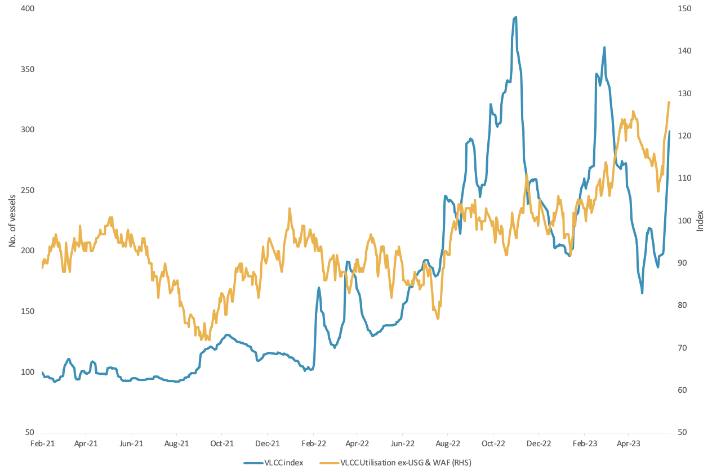
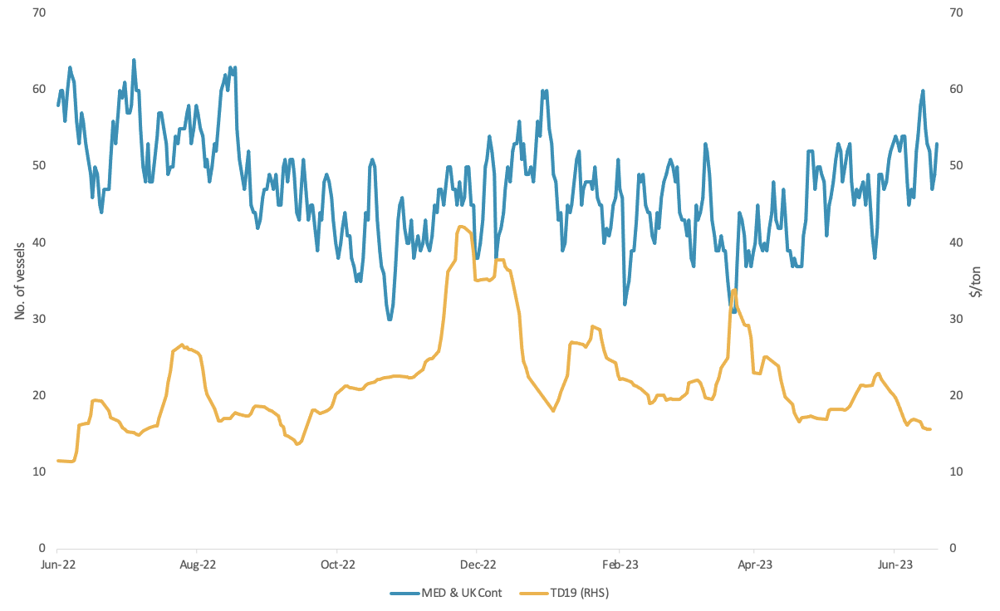

# Vortexa Freight Weekly

**Date:** June 22, 2023  
**Publisher:** Breakwave Advisors | **Category:** Market Insights  
**Original URL:** [https://www.breakwaveadvisors.com/insights/2023/6/22/vortexa-freight-weekly](https://www.breakwaveadvisors.com/insights/2023/6/22/vortexa-freight-weekly)  

---

*By*[*Dylan Simpson*](https://www.linkedin.com/search/results/all/?fetchDeterministicClustersOnly=false&heroEntityKey=urn%3Ali%3Afsd_profile%3AACoAACDtdn0BzHNR8syu_G8WxL-JXL-9PRT5AP4&keywords=dylan%20simpson&origin=RICH_QUERY_SUGGESTION&position=0&searchId=55ecee69-a408-47b2-8686-68f172e21af1&sid=mVl)

ANALYSIS / EAST OF SUEZ / DIRTY

## VLCC Rates Pick Up, Is a Rally on the Cards?

> **Figure 1: VLCC Tanker Rate Index (Lhs) Vs**  
> *VLCC tanker rate index (LHS) vs. VLCC utilisation ex-West Africa and US Gulf (RHS)*  
> **Interactive Data & Source:** [Marketingmail Vortexa](https://marketingmail.vortexa.com/ODM3LU1aRS01NzgAAAGMfbMF4JHUEi9-6d_L4eUPppjjVLSLvgWCMRwXxq0fsV8cycqogy5Ua-P4Oc8v0TLDK0Oy0EU=) | [Local Asset](file:///C:/Users/Dell/Github/Shipping/corpus/03-breakwave/insights/2023/assets/2023-06-22_vortexa-freight-weekly_img_unnamed-2023-06-22t155509528_5140419f6328.png)

- Global VLCC[utilisation](https://marketingmail.vortexa.com/ODM3LU1aRS01NzgAAAGMfbMF4JHUEi9-6d_L4eUPppjjVLSLvgWCMRwXxq0fsV8cycqogy5Ua-P4Oc8v0TLDK0Oy0EU=)has picked up by over 5% in June. This is mostly driven by tanker demand out of the[Atlantic basin](https://marketingmail.vortexa.com/ODM3LU1aRS01NzgAAAGMfbMF6Pg7jAe9UKpdr67Dzi-U6-tdxhp0NAdPkIJlwMx8f8nD6aPM7lNzAfjcwnCasvJ2MY4=)(US Gulf and West Africa) which has risen almost 20% in the same period. Most of these flows are headed to China and South Korea, which is in line with a similar pick up in VLCC freight rates towards East Asia.
- On the tanker supply side, VLCC[laden](https://marketingmail.vortexa.com/ODM3LU1aRS01NzgAAAGMfbMF4t2jsk0tQKSWmhvCsZm9GnwvDffpqtmE4dhqwmqH7lDxeviYra79DvkcZmvegO9QFnM=)numbers are once again higher than ballast numbers in the tier 1 market. Additionally,[availability](https://marketingmail.vortexa.com/ODM3LU1aRS01NzgAAAGMfbMF4ZTbH1S84rc3XXpaxow8JcbfmRwvGLvj6erqGtORMX69rOXHmUY4aIB7MzoksWsVUoY=)of VLCCs in West Africa remains low, painting a tight tanker supply picture and adding further support for freight rates.
- With global seaborne oil trade having reached a seasonal peak, as well as building[crude inventories](https://marketingmail.vortexa.com/ODM3LU1aRS01NzgAAAGMfbMF4Nt6UHHLP86a5HEi_W92sZBYEKj-hixub0d_bKTLw8Rv8lF5tXbLph5yfQdwB7yidBk=)in China, loadings in the summer months could drop off. This could limit the upside for VLCC rates in the summer.

ANALYSIS / WEST OF SUEZ / DIRTY

## Aframaxes and Suezmaxes Heading Towards the Mediterranean, But Excess Tonnage Curbs Freight Rate Elevation

> **Figure 2: No - Of Aframax & Suezmax Ballasting to Europe (Excl**  
> *No. of Aframax & Suezmax ballasting to Europe (excl. Russian vessels) vs. TD19 Cross-Mediterranean rates ($/t)*  
> **Interactive Data & Source:** [Marketingmail Vortexa](https://marketingmail.vortexa.com/ODM3LU1aRS01NzgAAAGMfbMF4dnHccmnhOm8oynvVMiP20gVU4nPDtL-9pg_wEOLGYk2vtLkcfzPXQ9Es8tFthDHV8c=) | [Local Asset](file:///C:/Users/Dell/Github/Shipping/corpus/03-breakwave/insights/2023/assets/2023-06-22_vortexa-freight-weekly_img_unnamed-2023-06-22t160025661_c3e3dd8b1bf6.png)

- ·Aframax and Suezmax tanker owners are opting to[head towards Europe](https://marketingmail.vortexa.com/ODM3LU1aRS01NzgAAAGMfbMF4dnHccmnhOm8oynvVMiP20gVU4nPDtL-9pg_wEOLGYk2vtLkcfzPXQ9Es8tFthDHV8c=)after discharging their cargo. This is in line with the elevated[Libyan m-o-m exports](https://marketingmail.vortexa.com/ODM3LU1aRS01NzgAAAGMfbMF4NKWIRBRf-bPPIHowOmfx7hVdiK0jWlAmLI4kLa1evWKm9jBqxzRm56poGaodMrF-IY=), according to preliminary June figures.
- ·Exports might remain at these levels or grow higher as the BTC pipeline has not come online at full operational levels. The accumulation of tonnage in the region has left[Cross-Mediterranean Aframax freight rates](https://marketingmail.vortexa.com/ODM3LU1aRS01NzgAAAGMfbMF4s71Vt4gT-xsn880gqpKQHu4gCmF2BcDaTCu2QJ6HEihvitMato0nS6GsN5baIerUHA=)suppressed, hovering around 1-year lows.
- The prospective discharge of the VLCCs in Ain Shukhna and the transportation via the SUMED pipeline could create further enquiries for Aframax and Suezmax tankers in Sidi Kerir, thus further supporting demand in the Mediterranean.

Data Source:[Vortexa](https://www.vortexa.com//oil-gas-data-traders-analysts-data-scientists?gclid=Cj0KCQjw8_qRBhCXARIsAE2AtRZKOvMnbilZ_6_91d7huSFFy71pWLrnPwGwOHVzXsmsG-1a1mZnQw8aAt89EALw_wcB&hsa_acc=1782073842&hsa_ad=548425387665&hsa_cam=14746637662&hsa_grp=125038601902&hsa_kw=&hsa_mt=&hsa_net=adwords&hsa_src=g&hsa_tgt=dsa-1431852288425&hsa_ver=3&utm_campaign=%5BCD%5D%20-%20DSA%20-%20EMEA&utm_medium=cpc&utm_medium=ppc&utm_source=google&utm_source=adwords&utm_term=)
