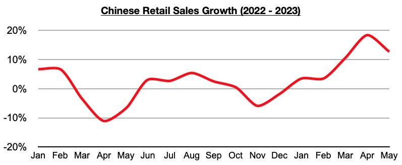

# In Reality, China's Consumer Market Remains Envy of Much of the World

**Date:** June 23, 2023  
**Publisher:** Breakwave Advisors | **Category:** Market Insights  
**Original URL:** [https://www.breakwaveadvisors.com/insights/2023/6/23/in-reality-chinas-consumer-market-remains-envy-of-much-of-the-world](https://www.breakwaveadvisors.com/insights/2023/6/23/in-reality-chinas-consumer-market-remains-envy-of-much-of-the-world)  

---

*By*[*Jeffrey Landsberg*](https://www.linkedin.com/in/jeffrey-landsberg-70ab957/)

As we discussed in Commodore's most recent Weekly China Report, China’s retail sales in May grew year-on-year by 12.7%. This has come in lower than many expectations and has been disappointing to various pundits, but nevertheless this is strong growth. As a point of reference, retail sales in the United States last month grew year-on-year by 1.6% (which was far below the 4% inflation seen in the United States last month).

> **Figure 1: Chart (1)**  
> [Local Asset](file:///C:/Users/Dell/Github/Shipping/corpus/03-breakwave/insights/2023/assets/2023-06-23_in-reality-chinas-consumer-market-remains-envy-of-much-of-the-world_img_chart28129_bd853d7d0b4b.jpg)

We continue to see the United States and other western economies receiving far too positive coverage, and China’s economy receiving far too negative coverage. 12.7% growth is very good and well above the 0.2% inflation seen last month. In the United States, though, 1.6% retail sales growth is obviously quite low and well below the 4% inflation seen last month. In fact, it has matched April’s growth, which was the lowest seen in the States since April 2020 (which is back when US coronavirus restrictions were in effect). Overall, retail sales growth in the United States has now come in less than inflation during six of the last seven months. Previously, the last time that such an utterly weak development occurred in the United States was back in 2009.

Also remaining significant is that China remains in the midst of an easing cycle, while much of the rest of the world (including the United States) remains in a tightening cycle. It remains quite positive in China that its consumers are actually buying more goods than they did a year ago and that financial conditions are also easing. It remains concerning that consumers in many other nations, including in the United States, are buying less goods than they did a year ago, and that a tightening cycle also remains in effect in these nations. As we have been stressing in our Weekly China Reports, inflation in the US has remained higher than retail sales growth since November.
