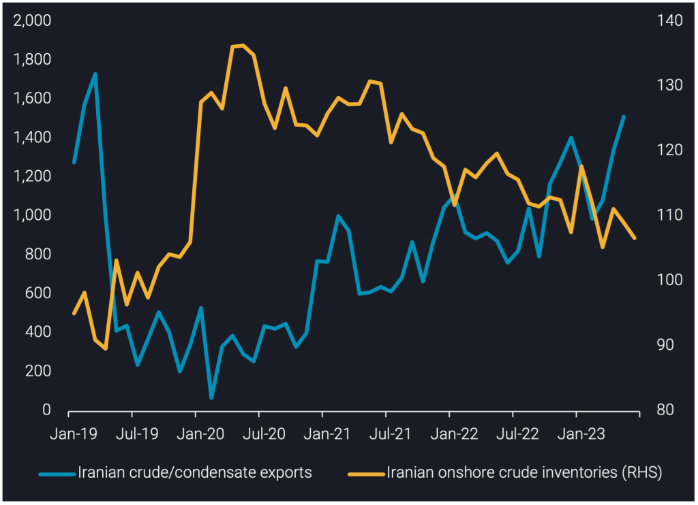
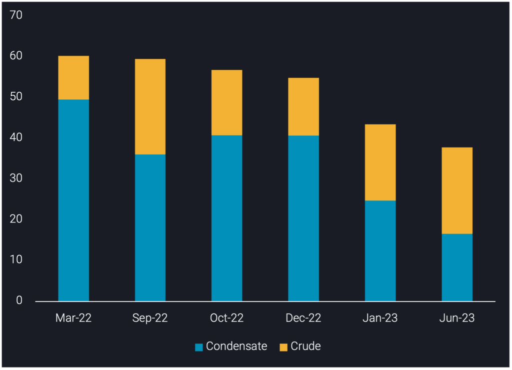
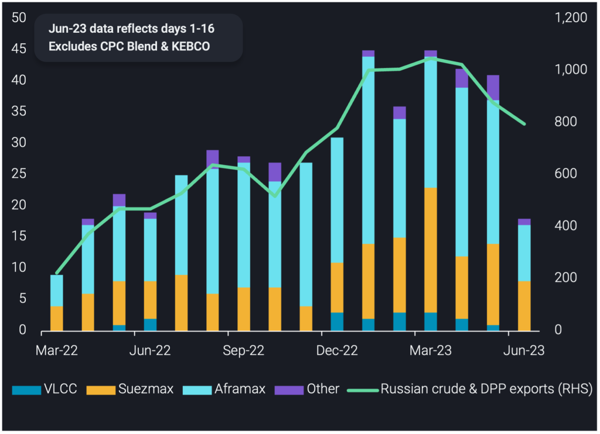

# Iran’s crude/condensate exports reach record-high under sanctions

**Date:** June 23, 2023  
**Publisher:** Breakwave Advisors | **Category:** Market Insights  
**Original URL:** [https://www.breakwaveadvisors.com/insights/2023/6/23/irans-crudecondensate-exports-reach-record-high-under-sanctions](https://www.breakwaveadvisors.com/insights/2023/6/23/irans-crudecondensate-exports-reach-record-high-under-sanctions)  

---

## This Insight Explores Iran’s Record-High Crude/condensate Exports Under Sanctions, Changes to Floating Storage and Russia’s Impact on Iranian Fleet Activity.

*By*[*Armen Azizian*](https://www.linkedin.com/search/results/all/?fetchDeterministicClustersOnly=true&heroEntityKey=urn%3Ali%3Afsd_profile%3AACoAABcR8rABbq0IzC6LkmXkEIICI-LUmZ3s9SU&keywords=armen%20azizian&origin=RICH_QUERY_SUGGESTION&position=0&searchId=3980b3c3-6fb1-478c-965a-83ea57079d1f&sid=kSI)

Ιran exported over 1.5mbd of crude/condensate in May, a 200kbd increase m-o-m and 400kbd above the 12-month average. This marks May as Iran’s highest monthly crude/condensate exports total since sanctions were imposed in November 2018. The previous peak of 1.4mbd in December 2022 was shortlived as exports then moved lower, averaging 1.1mbd in Q1-2023, as Chinese buyers benefited from increased competition between Iranian and discounted Russian crude.

This rebound to record-high Iranian crude/condensate exports in May is driven by three key factors. Firstly, China’s demand for Iranian crude/condensate has risen, as we observed China’s Iranian crude/condensate imports increase to a year-to-date high in May. This is coupled with the new batch of crude quotas released as of mid-June, so record-high May loadings should further support higher June & July arrivals into China.

Secondly, Iran has seen 20 tankers newly join its trade this year; 13 of which are VLCCs. This supported Iran’s ability to facilitate higher exports and continue STS operations to ensure cargoes reach their final destination. These new joiners have helped Iran boost exports, as they faced competition with Russia for tanker supply amid tankers switching from one trade to another.

Finally, Iran’s onshore crude/condensate inventories declined to 107mb in May, a 140kbd stock draw since April. Vortexa onshore inventories data suggests stock draws have contributed to Iran’s ability to increase exports given the heightened competition with Russia – production has only marginally increased (2.6mbd according to OPEC).

> **Figure 1: Iranian Crude/condensate Exports (Kbd**  
> *Iranian crude/condensate exports (kbd, LHS)vsIranian onshore crude inventories (mb, RHS)*  
> **Interactive Data & Source:** [Analytics Vortexa](https://analytics.vortexa.com/?dateRange=2020-01-01T00%3A00%3A00.000Z__2023-05-31T23%3A59%3A59.999Z&filtersEnabled=%5B%22p%22%2C%22o%22%2C%22d%22%2C%22d_r%22%2C%22v%22%2C%22intra%22%2C%22sts_o%22%2C%22c_o%22%2C%22v_f%22%5D&from=%5B%22d308ddc557e774187ad6c7da81b39db990def9a39e6c88e79cb163b6bdd6e8e5%22%5D&geoBreakdownOriginGlobal=port&metric=bpd&page=Flows&products=%5B%2254af755a090118dcf9b0724c9a4e9f14745c26165385ffa7f1445bc768f06f11%22%5D&tabId=9a01eac8-17c2-4878-9ad1-6cdfcccca2e7&v=2) | [Local Asset](file:///C:/Users/Dell/Github/Shipping/corpus/03-breakwave/insights/2023/assets/2023-06-23_irans-crudecondensate-exports-reach-record-high-under-sanctions_img_chart-1-8-1024x742_be91eb2250f0.png)

## Iranian Crude/condensate in Floating Storage Slides Below 40mb

As of 19 June, Iranian crude/condensate in floating storage is assessed at 37.8mb, a mix of 45% condensate and 55% crude.

Iranian floating storage is 5.7mb lower than in January, reflecting the record volumes of exports and China’s imports of Iranian crude/condensate. South Pars Condensate in floating storage is assessed at 16.6mb in June, an 8.2mb decline from January.

Vortexa data suggests 17 National Iranian Tanker Company (NITC) tankers loaded in May-June for export; one-third of the total NITC fleet. Furthermore, 14 were VLCCs, which supports the decline of South Pars Condensate in floating storage, as NITC VLCCs are largely used for condensate storage in the Persian Gulf.

Iranian crude in floating storage is assessed at 21.2mb in June – a 2.5mb increase from January. The increase is reflective of non-NITC tankers awaiting entry to China’s ports amid port inspections.

The 37.8mb floating storage equals 26 tankers currently in floating storage – 25 VLCCs and 1 Suezmax. Floating storage is derived from NITC tankers in Persian Gulf along with non-NITC tankers floating offshore Malaysia (awaiting buyers) and offshore China (awaiting inspection).

> **Figure 2: Iranian Crude/condensate in Floating Storage (Mb)**  
> *Iranian crude/condensate in floating storage (mb)*  
> **Interactive Data & Source:** [Vortexa](https://www.vortexa.com/insights/crude/new-locations-arise-for-russian-urals-sts-activity/) | [Local Asset](file:///C:/Users/Dell/Github/Shipping/corpus/03-breakwave/insights/2023/assets/2023-06-23_irans-crudecondensate-exports-reach-record-high-under-sanctions_img_chart-4-for-insight-1024x742_67d2d48197ca.png)

## 135 Tankers Previously Carrying Iranian/venezuelan Crude Switch to Russian Trade

As of 19 June, we track 135 unique tankers which have loaded Russian crude (excluding CPC Blend & KEBCO) & DPP since March 2022, having previously carried Iranian/Venezuelan crude.

Russian crude oil/DPP exports on carriers involved in sanctioned trade declined from a 1.1mbd record in March to 880kbd in May. This recent decline in activity was driven by lower Suezmax activity, coupled with tankers moving back to the Iranian trade, supporting record-high Iranian crude exports. Of the 135 tankers previously involved in sanctioned trade, 73 were involved in Iranian trade and 15% of these tankers switched back to the Iran trade during April-June, according to Vortexa data.

There has also been a decline in STS activity of Russian Urals on VLCCs for China delivery, which largely involves tankers previously involved in Iranian/Venezuelan trade. However, this STS activity recently re-started at[**new locations**](https://www.vortexa.com/insights/crude/new-locations-arise-for-russian-urals-sts-activity/), so we could see a resurgence in activity on these carriers in the near-term.

> **Figure 3: Count of Tankers Carrying Russian Crude/dpp That Previously**  
> *Count of tankers carrying Russian crude/DPP that previously carried sanctioned crude, by class (LHS) vs Russian crude/DPP exports on these carriers (kbd, RHS)*  
> **Interactive Data & Source:** [Vortexa](https://www.vortexa.com//oil-gas-data-traders-analysts-data-scientists?gclid=Cj0KCQjw8_qRBhCXARIsAE2AtRZKOvMnbilZ_6_91d7huSFFy71pWLrnPwGwOHVzXsmsG-1a1mZnQw8aAt89EALw_wcB&hsa_acc=1782073842&hsa_ad=548425387665&hsa_cam=14746637662&hsa_grp=125038601902&hsa_kw=&hsa_mt=&hsa_net=adwords&hsa_src=g&hsa_tgt=dsa-1431852288425&hsa_ver=3&utm_campaign=%5BCD%5D%20-%20DSA%20-%20EMEA&utm_medium=cpc&utm_medium=ppc&utm_source=google&utm_source=adwords&utm_term=) | [Local Asset](file:///C:/Users/Dell/Github/Shipping/corpus/03-breakwave/insights/2023/assets/2023-06-23_irans-crudecondensate-exports-reach-record-high-under-sanctions_img_chart-4-1024x742_33e04a784730.png)

## Outlook

Looking ahead, we do not expect Iranian crude/condensate exports to sustain the record highs observed in May. This is largely due to tanker supply constraints, where a continuation of new tankers joining the Iranian trade is unlikely due to ongoing Russian trade and reportedly increased Venezuelan crude production. We expect Iranian floating storage to increase in the near term as a result of record-high exports and ongoing Chinese port inspections on top of the lengthy journey to China as tankers STS and await buyers offshore Malaysia.

Data Source:[Vortexa](https://www.vortexa.com//oil-gas-data-traders-analysts-data-scientists?gclid=Cj0KCQjw8_qRBhCXARIsAE2AtRZKOvMnbilZ_6_91d7huSFFy71pWLrnPwGwOHVzXsmsG-1a1mZnQw8aAt89EALw_wcB&hsa_acc=1782073842&hsa_ad=548425387665&hsa_cam=14746637662&hsa_grp=125038601902&hsa_kw=&hsa_mt=&hsa_net=adwords&hsa_src=g&hsa_tgt=dsa-1431852288425&hsa_ver=3&utm_campaign=%5BCD%5D%20-%20DSA%20-%20EMEA&utm_medium=cpc&utm_medium=ppc&utm_source=google&utm_source=adwords&utm_term=)
