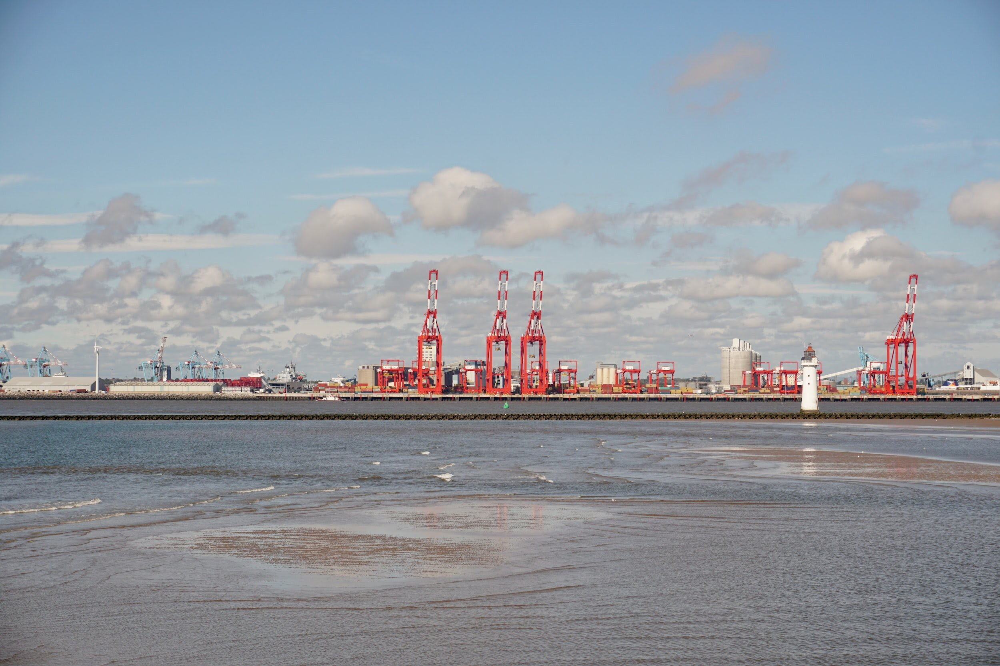

# Weekly Insights Review

**Date:** June 26, 2023  
**Publisher:** Breakwave Advisors | **Category:** Market Insights  
**Original URL:** [https://www.breakwaveadvisors.com/insights/2023/6/26/26cds8aif383nco690ka2jkmw1i7fe](https://www.breakwaveadvisors.com/insights/2023/6/26/26cds8aif383nco690ka2jkmw1i7fe)  

---

## Welcome to Our Weekly Insights Review

## Read Here Everything You Need to Know

> **Figure 1: Market Chart 1**  
> **Interactive Data & Source:** [Breakwave Advisors Market Insights](https://www.breakwaveadvisors.com/insights/2023/6/19/mazars-comment-know-when-to-take-risks-and-when-not-to) | [Local Asset](file:///C:/Users/Dell/Github/Shipping/corpus/03-breakwave/insights/2023/assets/2023-06-26_26cds8aif383nco690ka2jkmw1i7fe_img_unnamed283429_8b249e22854b.jpg)

## Mazars Comment : Know When to Take Risks, and When Not To

## The Three Things I Would Tell My Clients This Week

‘Providence protect idiots’ Otto Von Bismarck once exclaimed. I’m never quite sure what the direct intentions of the Almighty are. Bismarck, a Prussian Prince and one of the great leaders of the 19th century, might have had a more direct line of communication with the powers that be than I do.
[Read More](https://www.breakwaveadvisors.com/insights/2023/6/19/mazars-comment-know-when-to-take-risks-and-when-not-to)

## Doric Weekly Market Insight

## Iron Ore Futures Posted Weekly Gains for a Third Week in a Row

Following ten consecutive hikes that lifted borrowing costs to the highest level since September 2007, Fed opted to hold their benchmark rate unchanged this week at between 5 and 5.25 percent.
[Read More](https://www.breakwaveadvisors.com/insights/2023/6/19/vpieyyzt4jd966m2iimphb94q15lan)

> **Figure 2: Market Chart 2**  
> **Interactive Data & Source:** [Breakwave Advisors Market Insights](https://www.breakwaveadvisors.com/insights/2023/6/20/saudi-crude-accumulating-off-red-sea) | [Local Asset](file:///C:/Users/Dell/Github/Shipping/corpus/03-breakwave/insights/2023/assets/2023-06-26_26cds8aif383nco690ka2jkmw1i7fe_img_unnamed283529_4d8352c9f6ae.jpg)

> **Figure 3: Market Chart 3**  
> **Interactive Data & Source:** [Breakwave Advisors Market Insights](https://www.breakwaveadvisors.com/insights/2023/6/20/saudi-crude-accumulating-off-red-sea) | [Local Asset](file:///C:/Users/Dell/Github/Shipping/corpus/03-breakwave/insights/2023/assets/2023-06-26_26cds8aif383nco690ka2jkmw1i7fe_img_unnamed283629_7f4582f73e96.jpg)

## Saudi Crude Accumulating Off Red Sea

## Saudi Arabian Crude Oil Is Accumulating Off Egypt’s Red Sea Coast – An Unusual Market Development and One to Watch Closely As the Country Seeks to Implement Steep Production Cuts.”

This was aided by a risk on tone across markets following a lower-than-expected inflation print in the US.
[Read More](https://www.breakwaveadvisors.com/insights/2023/6/20/saudi-crude-accumulating-off-red-sea)

> **Figure 4: Market Chart 4**  
> **Interactive Data & Source:** [Breakwave Advisors Market Insights](https://www.breakwaveadvisors.com/insights/2023/6/21/sentiment-weak-as-chinese-rate-cuts-fall-below-expectations) | [Local Asset](file:///C:/Users/Dell/Github/Shipping/corpus/03-breakwave/insights/2023/assets/2023-06-26_26cds8aif383nco690ka2jkmw1i7fe_img_unnamed283729_185525b5996e.jpg)

## Sentiment Weak As Chinese Rate Cuts Fall Below Expectations

## Disappointment Over Chinese Stimulus Measures Continued to Hover Over Markets

A stronger USD also weighed on investor appetite.

## Shipfix-Global Market Update

## Macro/geopolitics, Commodity Markets, Freight and Bunker Markets

Interest rates dominated the past week’s news flow. After bringing the interest rate to the highest level since 2007, the Federal Reserve paused its current hiking cycle as US inflation showed signs of slowing.
[Read More](https://www.breakwaveadvisors.com/insights/2023/6/20/shipfix-global-market-update)

> **Figure 5: Market Chart 5**  
> **Interactive Data & Source:** [Breakwave Advisors Market Insights](https://www.breakwaveadvisors.com/insights/2023/6/15/china-continues-to-diverge-away-from-a-consumer-collapse-in-the-us-and-various-other-nations-1) | [Local Asset](file:///C:/Users/Dell/Github/Shipping/corpus/03-breakwave/insights/2023/assets/2023-06-26_26cds8aif383nco690ka2jkmw1i7fe_img_unnamed283829_8a5b8ac4d115.jpg)

## Vortexa Freight Weekly

## VLCC Rates Up || Afra/suezmaxes Reposition in Med

> **Figure 6: VLCC Rates Pick Up, Is a Rally on the Cards?read More**  
> **Interactive Data & Source:** [Breakwave Advisors Market Insights](https://www.breakwaveadvisors.com/insights/2023/6/23/irans-crudecondensate-exports-reach-record-high-under-sanctions) | [Local Asset](file:///C:/Users/Dell/Github/Shipping/corpus/03-breakwave/insights/2023/assets/2023-06-26_26cds8aif383nco690ka2jkmw1i7fe_img_unnamed283929_e2d4a4900dbd.jpg)

> **Figure 7: Market Chart 7**  
> **Interactive Data & Source:** [Breakwave Advisors Market Insights](https://www.breakwaveadvisors.com/insights/2023/6/23/irans-crudecondensate-exports-reach-record-high-under-sanctions) | [Local Asset](file:///C:/Users/Dell/Github/Shipping/corpus/03-breakwave/insights/2023/assets/2023-06-26_26cds8aif383nco690ka2jkmw1i7fe_img_unnamed284029_a00a1285d65c.jpg)

## Iran’s Crude/condensate Exports Reach Record-High Under Sanctions

## This Marks May As Iran’s Highest Monthly Crude/condensate Exports Total Since Sanctions Were Imposed in November 2018

Ιran exported over 1.5mbd of crude/condensate in May, a 200kbd increase m-o-m and 400kbd above the 12-month average.
[Read More](https://www.breakwaveadvisors.com/insights/2023/6/23/irans-crudecondensate-exports-reach-record-high-under-sanctions)

> **Figure 8: Market Chart 8**  
> **Interactive Data & Source:** [Breakwave Advisors Market Insights](https://www.breakwaveadvisors.com/insights/2023/6/23/in-reality-chinas-consumer-market-remains-envy-of-much-of-the-world) | [Local Asset](file:///C:/Users/Dell/Github/Shipping/corpus/03-breakwave/insights/2023/assets/2023-06-26_26cds8aif383nco690ka2jkmw1i7fe_img_unnamed284129_af5271387cd1.jpg)

## In Reality, China's Consumer Market Remains Envy of Much of the World

## China’s Retail Sales in May Grew Year-on-Year

As we discussed in Commodore's most recent Weekly China Report, China’s retail sales in May grew year-on-year by 12.7%. This has come in lower than many expectations and has been disappointing to various pundits, but nevertheless this is strong growth.
[Read More](https://www.breakwaveadvisors.com/insights/2023/6/23/in-reality-chinas-consumer-market-remains-envy-of-much-of-the-world)

## Signal Dry Bulk Weekly Report

## Snapshot of Spot Freight Rates, Supply-Demand Trends, Port Congestions

There has been a remarkable turnaround in ton days for Capesize shipments from West Africa to China, as illustrated in the provided image, leading to increased rates and improved laden speed during the second quarter.
[Read More](https://www.breakwaveadvisors.com/insights/2023/6/21/signal-dry-bulk-weekly-report)

> **Figure 9: Market Chart 9**  
> [Local Asset](file:///C:/Users/Dell/Github/Shipping/corpus/03-breakwave/insights/2023/assets/2023-06-26_26cds8aif383nco690ka2jkmw1i7fe_img_unnamed284229_3866483f47b9.jpg)
