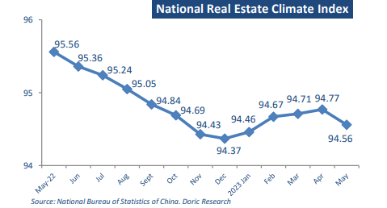
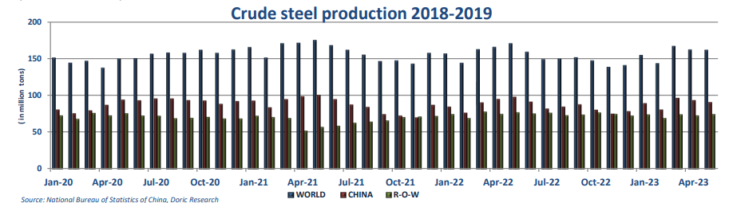

# Doric Weekly Market Insight

**Date:** June 26, 2023  
**Publisher:** Breakwave Advisors | **Category:** Market Insights  
**Original URL:** [https://www.breakwaveadvisors.com/insights/2023/6/26/ob4d1fbja62l66yhamd2r2xv5ttewg](https://www.breakwaveadvisors.com/insights/2023/6/26/ob4d1fbja62l66yhamd2r2xv5ttewg)  

---

## “Dry Bulk Market and Commodities Had a Mixed Reaction to the Latest Stimulus Measures.”

*By*[*Michalis Voutsinas*](https://www.linkedin.com/in/michalis-voutsinas-587544163/)

One week before the second quarter’s curtain fall, Baltic Dry Index concluded today in the green at 1240 points, reporting three-digitpoint weekly gains. By de-composing the general index though, a slightly different picture becomes apparent. It was solely the leading Capesize segment that push the main gauge of activity in the dry bulk spectrum higher. At the same time, all other segments drifted lower, with Panamax losing the most. In particular, reporting double-digit gains week-on-week, the Baltic Capesize index balanced at onemonth highs of $17,252 daily on this Friday’s closing. Drifting emphatically towards the opposite direction, the Panamax 82 TCA index ended the week in the red, laying just a few dollars above the four-digit territory. On the geared segment front, the Baltic Supramax index trended sideways to $8,178 daily, being trapped in this lowearning environment during the last three weeks. In a similar vein, Handies ended the week at $8,197 daily, circa $16,000 below last year’s this day closing.

On the macro front, cables arriving from various sources seem to be more in accord with the sub-Capesize segments rather than the trend-setting capricious largest bulkers. In fact, one of the closest relatives of dry bulk market sent some worrisome signals this week. After a fertile first quarter, world crude steel production for the 63 countries reporting to the World Steel Association was 161.6 million tonnes in May 2023, a steep 5.1 percent decrease compared to May 2022. As far as the specific regions go, Africa, Russia, and Middle East saw their steel output increasing, whilst the rest of the world reported significant downward corrections. In particular, the main Asia and Oceania region produced 119.5 Mt, down some 6.0 percent year-on-year. Within this group, China’s steel production took a 7.3- percent dive, currently balancing at 90.1 Mt. Average daily output in May stood at 2.91 million tonnes, down by 5.7 percent from a reading of 3.09 million tonnes during the previous month. In tandem, Japan furnaced 7.6 Mt, down 5.2 percent year-on-year. Not being sufficient enough to counterbalance the aforementioned reductions, India’s and Russia’s output increased year-on-year during May, hovering at 11.2 Mt and 6.8 Mt respectively.

Following China’s steel production down, China’s real estate investment marked its steepest slump over two decades in May, slowing by 21.5 percent year-on-year. Property sales by floor area grew by 11.8 percent year-on-year in May, marking a sharp slowdown from a 24.8 percent in the previous month. From January to May, investment in real estate development was 4,570.1 billion yuan, a year-on-year decrease of 7.2 percent. Among them, the investment in residential buildings was 3,480.9 billion yuan, down 6.4 percent. From January to May, the funds for investment for real estate development enterprises were 5,595.8 billion yuan, a year-onyear decrease of 6.6 percent.

Among them, domestic loans were 717.5 billion yuan, down 10.5 percent; the utilized foreign investment was 1.3 billion yuan, down 73.5 percent; self-raised funds reached 1,626.7 billion yuan, down 21.6 percent; deposits and advance receipts were 1,987.8 billion yuan, up 4.4 percent; individual mortgage reached 1,035.4 billion yuan, up 6.5 percent. Against this backdrop, China’s national real estate climate index balanced at 94.56 points, very close to the recent two-year minima.

> **Figure 1: 1 (2)**  
> **Interactive Data & Source:** [Doric](https://www.doric.gr/) | [Local Asset](file:///C:/Users/Dell/Github/Shipping/corpus/03-breakwave/insights/2023/assets/2023-06-26_ob4d1fbja62l66yhamd2r2xv5ttewg_img_128229_8c3a9268b24a.png)

In an effort to boost flagging economic growth and support China’s vast real estate sector, the People’s Bank of China cut two more key lending rates this week for the first time in 10 months. The Chinese central bank cut the one-year loan prime rate by 10 basis points from 3.65 percent to 3.55 percent, and trimmed the five-year loan prime rate from 4.3 percent to 4.2 percent – for the first time since August. The latest rate cut came on the heels of two monetary easing moves last week. Last Thursday, the PBOC cut its one-year medium-term loan facility for the first time in 10 months, and lowered its seven-day reverse repurchase rate.

Dry bulk market and commodities had a mixed reaction to the latest stimulus measures. On the one hand, copper, crude oil and Capesizes posted gains following China’s central bank intervention. On the other hand, iron ore, coking coal and the rest of the dry bulk segments remained unimpressed. Even though some lagging does exist between a shift in monetary policy and its effect on the economy, some additional generous doses of monetary support seem to be needed for the rest of the pack to follow along.

> **Figure 2: 1 (3)**  
> **Interactive Data & Source:** [Doric](https://www.doric.gr/) | [Local Asset](file:///C:/Users/Dell/Github/Shipping/corpus/03-breakwave/insights/2023/assets/2023-06-26_ob4d1fbja62l66yhamd2r2xv5ttewg_img_128329_f9de5b06047e.png)

Data source:[Doric](https://www.doric.gr/)
