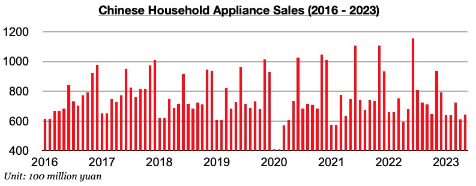
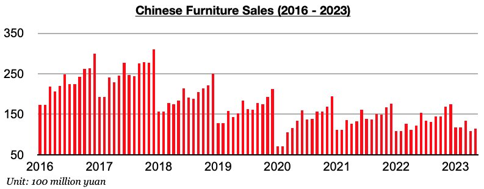
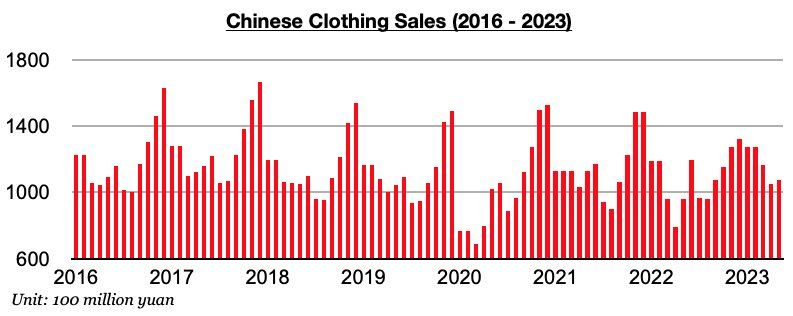

# Ongoing Growth in Clothing Sales in China

**Date:** June 26, 2023  
**Publisher:** Breakwave Advisors | **Category:** Market Insights  
**Original URL:** [https://www.breakwaveadvisors.com/insights/2023/6/26/ongoing-growth-in-clothing-sales-in-china](https://www.breakwaveadvisors.com/insights/2023/6/26/ongoing-growth-in-clothing-sales-in-china)  

---

*By*[*Jeffrey Landsberg*](https://www.linkedin.com/in/jeffrey-landsberg-70ab957/)

As we discussed in Commodore's most recent Weekly China Report, China’s clothing sales grew last month while consumer electronics / appliance and furniture sales both contracted. Consumer electronics / appliance sales in China fell on a year-on-year basis last month by 5%. Sales have now contracted during eight of the last nine months.

> **Figure 1: Chart 1 (74)**  
> [Local Asset](file:///C:/Users/Dell/Github/Shipping/corpus/03-breakwave/insights/2023/assets/2023-06-26_ongoing-growth-in-clothing-sales-in-china_img_chart1287429_e62c7205839a.jpg)

Furniture sales in China fell year-on-year by 6% last month. Sales have now contracted on a year-on-year basis for two straight months. Prior to these last two months, furniture sales had grown on a year-on-year basis for three straight months.

> **Figure 2: Chart 2 (63)**  
> [Local Asset](file:///C:/Users/Dell/Github/Shipping/corpus/03-breakwave/insights/2023/assets/2023-06-26_ongoing-growth-in-clothing-sales-in-china_img_chart2286329_0785650af89b.jpg)

Clothing sales in China (which includes garments, footwear, hats, and knitwear) grew year-on-year by 12%. Clothing sales have now grown on a year-on-year basis for five straight months. Prior to these last five months, clothing sales had contracted on a year-on-year basis for three straight months.

> **Figure 3: Chart 3 (45)**  
> [Local Asset](file:///C:/Users/Dell/Github/Shipping/corpus/03-breakwave/insights/2023/assets/2023-06-26_ongoing-growth-in-clothing-sales-in-china_img_chart3284529_5a3d6a470b06.jpg)
