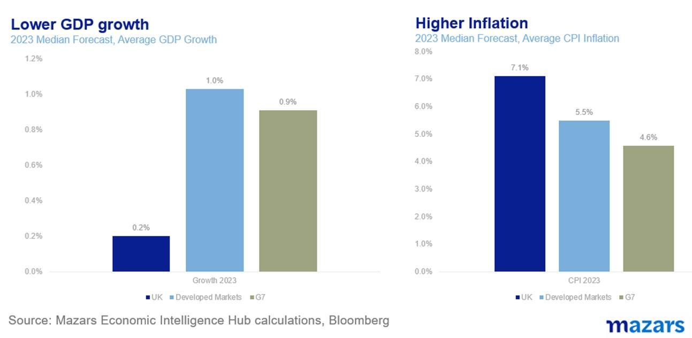
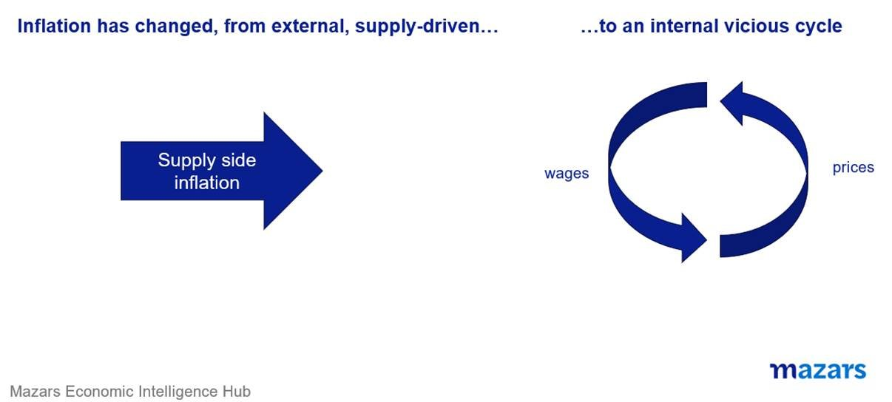
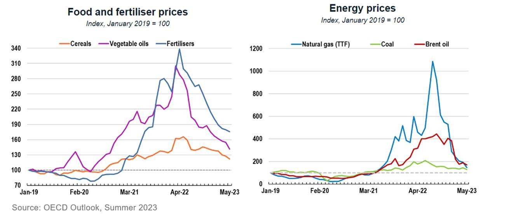

# Mazars Comment: The Bank of England should be worried about Russia

**Date:** June 27, 2023  
**Publisher:** Breakwave Advisors | **Category:** Market Insights  
**Original URL:** [https://www.breakwaveadvisors.com/insights/2023/6/27/mazars-comment-the-bank-of-england-should-be-worried-about-russia](https://www.breakwaveadvisors.com/insights/2023/6/27/mazars-comment-the-bank-of-england-should-be-worried-about-russia)  

---

## The Bank of England Should Be Worried About Russia

*By*[*George Lagarias*](https://www.linkedin.com/in/george-lagarias-mba-3baa769/)

*The three things I would tell my clients this week*

1. *Inflation in the UK remains too high, compelling the central bank to tighten more aggressively. It is now reaching the point where policymakers might have to force a recession to break the inflation cycle.*
2. *Potential instability from Russia comes at an inopportune moment. Inflation had passed from the supply-side stage to the much more difficult demand-side stage. Fresh geopolitical instability could trigger a supply-side inflation loop again.*
3. *Countries where inflation is already too high, could be hit harder*.

I consider myself a fairly open-minded person when it comes to investments. For the better part of two decades, I only had one absolute rule: “Don’t take active bets in Japan, it will just make you look bad”. As of yesterday, I added a second axiom: “Never write your weekly early when Russia is involved”.

I spent an hour and a half, on a Saturday no less, writing a deep geopolitical/economic thesis about the impact of Prigozhin’s mutiny, which was turned into digital confetti by the afternoon when the warlord yielded. Starting a ‘march’ on the Kremlin with less than 25,000 soldiers seems like madness from the outside. Maybe it was, or maybe it wasn’t. We have no real way of analysing what actually happened. After some introspection, I came to the conclusion that Russia is a big country, with a lot of resources, but also a very tightly controlled information network. We will always know very little about it, so speculating is a waste of time. We will classify it as a ‘known unknown’ and never probably have a big strategic investment position in it, at least for the foreseeable future.

But that doesn’t mean it shouldn’t concern us.

Last week, British consumers were faced with a shock from the Bank of England, which hiked rates twice. According to the[FT](https://www.ft.com/content/9940b3b2-1988-4658-95cb-fa312bd23185?shareType=nongift), if rates go up to 6% by the end of the year (which is what markets expect), the average mortgage would go up by £2900 per annum. We posted an[op-ed on FT Adviser](https://www.ftadviser.com/mortgages/2023/06/23/the-inflation-cycle-won-t-break-itself/)about inflation in the UK being too high and that policymakers could trigger a recession to break it.

> **Figure 1: Market Chart 1**  
> **Interactive Data & Source:** [Youtube](https://www.youtube.com/watch?v=fgm14D1jHUw) | [Local Asset](file:///C:/Users/Dell/Github/Shipping/corpus/03-breakwave/insights/2023/assets/2023-06-27_mazars-comment-the-bank-of-england-should-be-worried-about-russia_img_image00428629_b0be3c087774.jpg)

As if the UK central bank didn’t have enough to worry about, now it needs to fret about Russia.

Whether we like it or not, however, Russia is very important for the global supply chain, due to its status as a major energy supplier and commodities exporter. And the question is not how we will think about things long-term, but how will commodity traders and corporates react over the shorter term. Will they try to hoard commodities and energy, fearing fresh instability out of Russia?

A running theme since the beginning of the year for us was increased uncertainty and unpredictability, in a world that shows no signs of returning to its pre-pandemic balance. While we don’t know what happened, we should not be surprised if we see upheaval in the commodities market, as investors fear further destabilisation. As a reminder, global inflation was ‘transitory’ and probably under control, until the war in Ukraine pushed commodity and energy prices beyond the threshold consumers could tolerate before they went to their bosses and asked for a raise. Russia’s war arguably catalysed the transformation of inflation from supply-driven to demand-driven, a much more difficult form to deal with.

> **Figure 2: Market Chart 2**  
> **Interactive Data & Source:** [Youtube](https://www.youtube.com/watch?v=fgm14D1jHUw) | [Local Asset](file:///C:/Users/Dell/Github/Shipping/corpus/03-breakwave/insights/2023/assets/2023-06-27_mazars-comment-the-bank-of-england-should-be-worried-about-russia_img_image00528929_6d66d5fe32e4.jpg)

Further instability could, in theory, add to inflationary pressures, at a time when we at least thought that supply chain issues were behind us.

This would come at a very unfortunate moment. Inflation has become entrenched in many countries, and mostly in the UK. It has moved from a supply-side to a demand-side vicious circle of higher prices and wages. Central banks are in an all-out war against price rises. The Bank of England hiked twice last week, a move that will surely add to consumer woes and possibly push the economy into a recession. The ECB is hiking and removing liquidity, imperilling EU peripheral banks. The Fed, while ahead of the cycle, may have plans for one or two more hikes before it stops.

At least external pressures had subsided.

> **Figure 3: Market Chart 3**  
> **Interactive Data & Source:** [Youtube](https://www.youtube.com/watch?v=fgm14D1jHUw) | [Local Asset](file:///C:/Users/Dell/Github/Shipping/corpus/03-breakwave/insights/2023/assets/2023-06-27_mazars-comment-the-bank-of-england-should-be-worried-about-russia_img_image006281229_96e9dbb2be8b.jpg)

Fresh instability could trigger supply-side inflation again. With prices rising double the central bank’s desired rate in the US, triple in the EU and more than four times in the UK, this externality, if it persists, could lead into more monetary tightening, and a worse blow for global consumers.

Even though he prevailed, Vladimir Putin seems injured. The war has stalemated. The mercenaries revolted. Markets may start to worry that he could, potentially, harden his stance on Ukraine.

Russian politics is all about the relentless projection of strength. Any Russian leader who backed down quickly fell from power. Czar Nicolas was defeated in WWI which cost him his throne and his life. Khrushchev backed down in the Cuban Missile Crisis in 1962 and was swiftly deposed BY 1964. He spent his last years in depression. Gorbachev pulled out from Afghanistan in 1987, and by 1989 the Berlin Wall had fallen. By 1997 the last Soviet Premier was[advertising](https://www.youtube.com/watch?v=fgm14D1jHUw)Pizza Hut. Those lessons will likely not be wasted on Vladimir Putin. According to[Stratfor](https://worldview.stratfor.com/article/putin-uses-prigozhins-betrayal-strengthen-his-grip-russia), a geopolitical analysis think tank, he will be strongly incentivised to up the ante. He might seek a quick win, even challenging the West and risking his alliance with Beijing, both of whom have warned against the use of tactical nuclear weapons.

This could result in fresh sanctions, and possibly even a stoppage of trade with more countries, putting fresh pressure on commodities prices.

Sticky inflation is probably the key risk for 2023. The biggest economic and financial concern from further Russian instability is that supply chain breakdowns could lead to a fresh inflationary cycle, at a time when we are not nearly done fighting the previous one.
