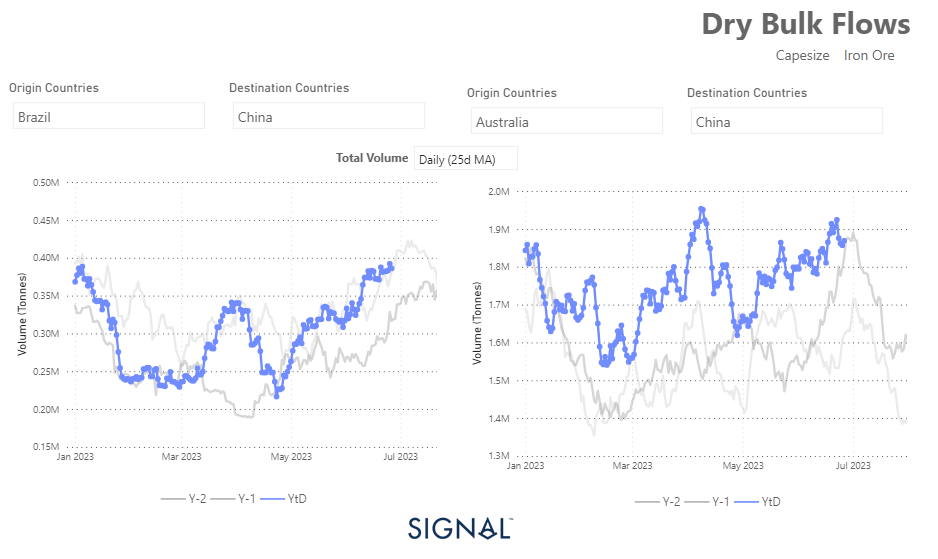
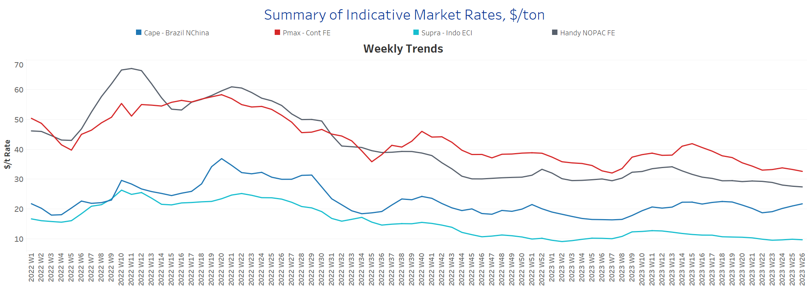
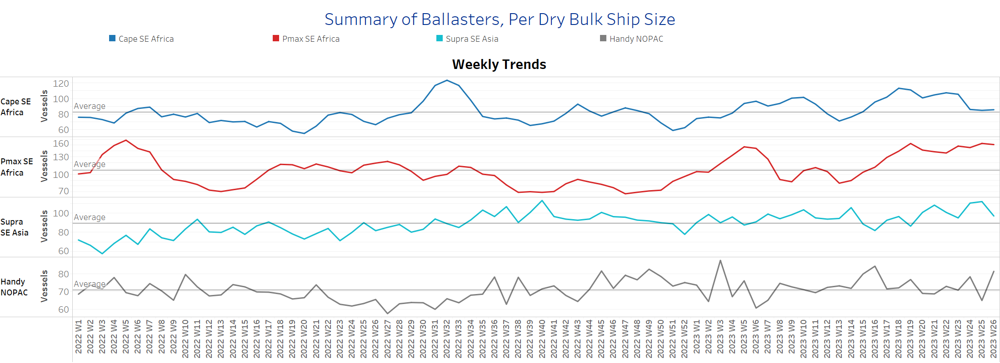
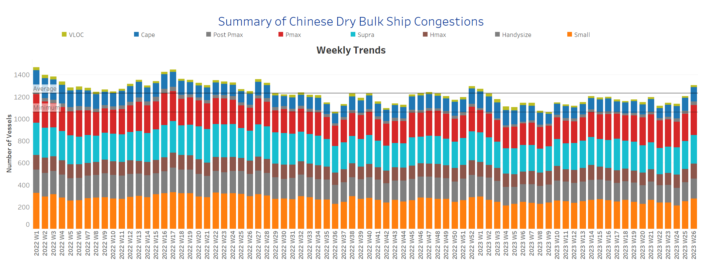

# Signal Dry Bulk Weekly Report

**Date:** June 28, 2023  
**Publisher:** Breakwave Advisors | **Category:** Market Insights  
**Original URL:** [https://www.breakwaveadvisors.com/insights/2023/6/28/6phjt8ej59eirdv4e0gpn78782i4hd](https://www.breakwaveadvisors.com/insights/2023/6/28/6phjt8ej59eirdv4e0gpn78782i4hd)  

---

## Chart of the Week: Capesize Iron Ore Flows to China

Iron ore flows to China have experienced a substantial increase, particularly following the end of the first quarter

> **Figure 1: Market Chart 1**  
> **Interactive Data & Source:** [Signal Ocean Platform](https://go.signalocean.com/e/983831/amic-drybulkflows-downloadable/2p3xfr/329656696?h=fIVv1hfU9h5WsCEMxUOhVKdma8Fy1Ie0-N2cx50RGNg) | [Local Asset](file:///C:/Users/Dell/Github/Shipping/corpus/03-breakwave/insights/2023/assets/2023-06-28_6phjt8ej59eirdv4e0gpn78782i4hd_img_unnamed-2023-06-28t141953660_cc008d8caec7.png)

As we are nearing the end of June, the freight market sentiment remained robust for the Capesize segment, while the softening trend is still there for the other smaller vessel size categories. The market remains challenging from the number of ballasters, where there is an increasing trend throughout June, with the Capesize segment recording significant downward revisions. There seems to be a healthier outlook for the larger vessel size categories, as we have already entered the manufacturing season in China, and the volume of iron ore shipments from Brazil and Australia increases.
There is now a remarkable firmness in the total volume of iron ore flows from Australia to China, where the 25d moving average is surpassing the levels witnessed in the previous two years (see image above).
The current month is trending to surpass the highest level seen at the end of June last year, which comes against mixed worries for the solid economic performance of China and its demand for steel and iron ore. It is worth noting that market conditions can evolve rapidly, and it is important to monitor the dynamics of the freight market and iron ore industry closely. Nonetheless, the current market signals indicate a robust freight market sentiment for Capesize vessels, while smaller vessel sizes face softening rates.

For more information on this week's trends, see the analysis sections below:

Freight Market, Supply, Demand and Port Congestion

## Section 1/ Freight​​​

**‘The Big Picture’ - Capesize and Panamax Bulkers and Smaller Ship Sizes
Market Rates ($/t) Softening**

> **Figure 2: Market Chart 2**  
> **Interactive Data & Source:** [Signal Ocean Platform](https://www.thesignalgroup.com/signal-ocean-platform) | [Local Asset](file:///C:/Users/Dell/Github/Shipping/corpus/03-breakwave/insights/2023/assets/2023-06-28_6phjt8ej59eirdv4e0gpn78782i4hd_img_unnamed-2023-06-28t142050661_687a74917ab7.png)

The Capesize segment has shown resilience and maintained a strong position, while a softening trend persists for other vessel sizes as we approach the end of the first half of this year.

- Capesize vessel freight rates have experienced a significant increase, reaching $22 per tonne, which is a notable $4 per tonne higher than the previous low recorded at the end of week 22.
- Panamax vessel freight rates from the Continent to the Far East have continued their decline, falling below $33 per tonne since the previous week. This downward trend has persisted for three consecutive weeks, indicating a sustained decline in rates.
- Supramax freight rates for the Indo-ECI route have now dipped below $10 per tonne, indicating a significant decrease. The market sentiment appears to be relatively flat, with no clear indications of an immediate upward trend in the short term.
- Handysize freight rates for the NOPAC Far East route have been hovering around $27 per tonne over the past two weeks. It appears that the downward spiral has reached a bottom, suggesting a stabilization in rates without any immediate indication of a sharp downward revision.

## Section 2/ Supply ​​​

**Supply Trend Lines for Key Load Areas
Ballasters (# vessels) Decreasing**

> **Figure 3: Market Chart 3**  
> **Interactive Data & Source:** [Signal Ocean Platform](https://www.thesignalgroup.com/signal-ocean-platform) | [Local Asset](file:///C:/Users/Dell/Github/Shipping/corpus/03-breakwave/insights/2023/assets/2023-06-28_6phjt8ej59eirdv4e0gpn78782i4hd_img_unnamed-2023-06-28t142203913_dcb3a6d610a9.png)

In the Capesize segment, the number of ballast ships remains significantly lower than the peak levels observed three weeks ago, indicating a sustained decrease in availability. Conversely, the Supramax segment has begun to experience a downward trend, but it is yet to be confirmed if this will lead to further declines. Notably, in the handysize segment, the final days of June have witnessed an instant spike in number of vessels, which follows a drop during the previous week.

- Capesize SE Africa: The current ship count has reached 86, slightly exceeding the annual average of 82. However, it is important to note that the current ship count is still relatively low, representing one of the lowest points since the bottom recorded in week 13. This indicates a period of reduced ship availability, potentially contributing to a tighter market and influencing freight rates accordingly.
- Panamax SE Africa: The number of vessels currently stands at approximately 150, reflecting a relatively stable trend over the past two weeks. However, there is anticipation as to whether there will be a new wave of increased supply in the coming days, especially as we approach the end of the month. The market sentiment remains uncertain, with stakeholders eagerly observing whether there will be any notable changes in vessel availability and its impact on market dynamics.​​​​​​
- Supramax SE Asia: The number of vessels has dropped below 100, almost 25 vessels lower than the previous week. This recent downward revision comes following almost three weeks of volatility.​​​​​​
- Handysize NOPAC: The current vessel count stands at 82, representing an increase of 17 compared to the previous week.​​​​

## Section 3/ Demand

> **Figure 4: Summary of Dry Bulk Demand, per Ship Sizetondays Decreasing**  
> **Interactive Data & Source:** [Signal Ocean Platform](https://www.thesignalgroup.com/signal-ocean-platform) | [Local Asset](file:///C:/Users/Dell/Github/Shipping/corpus/03-breakwave/insights/2023/assets/2023-06-28_6phjt8ej59eirdv4e0gpn78782i4hd_img_unnamed-2023-06-28t141953660_cc008d8caec7.png)

Throughout the month of June, there has been a consistent pattern of progress, with each week exhibiting a similar trend. Notably, the Capesize segment has experienced a continuous upward recovery, indicating positive growth and improving conditions in this particular vessel size category. This steady recovery in the Capesize segment suggests a positive trajectory for the larger vessel sizes, potentially reflecting a rebound in global trade and increased demand for bulk commodities.

- Capesize: Demand growth has now reached a new high, similar to the peak last recorded in week 4.
- Panamax: The recent trend still points to a downtrend, but it does not look like there will be another dip in the coming days.
- Supramax: Sentiment appears to be flat overall, and the percentage increases in tonne days are at similar levels on a weekly basis.
- Handysize: The growth of ton days continues to exhibit a downward trend, with the most recent peak occurring during the 17th week.]

## Section 4/ Port Congestion ​​​​​

> **Figure 5: Dry Bulk Ships Congested at Chinese Portsno of Vessels Increasing**  
> **Interactive Data & Source:** [Signal Ocean Platform](https://www.thesignalgroup.com/signal-ocean-platform) | [Local Asset](file:///C:/Users/Dell/Github/Shipping/corpus/03-breakwave/insights/2023/assets/2023-06-28_6phjt8ej59eirdv4e0gpn78782i4hd_img_unnamed-2023-06-28t142406031_c49a19fe4a84.png)

As we enter the final week of June, there has been a notable increase in ship congestion compared to the previous week across all main size categories. This escalation in congestion levels is significant, indicating a growing number of vessels experiencing delays and extended waiting times.

- Capesize: The number of vessels has witnessed a remarkable surge, reaching 130, which represents an impressive nearly 50% increase compared to the count recorded just a week ago.
- Panamax: The number of vessels has surged to 270, marking a notable increase of 20 compared to the count recorded in the previous week. This upward trend has been consistent over the last two weeks.
- Supramax: The current ship count has reached 260, reflecting an increase of 10 compared to two weeks ago. This current count represents one of the highest points observed during the May-June period.
- Handysize: The number of congested vessels has surpassed 180 since the previous week, marking an increase of 20 compared to two weeks ago. This upward trend of significant increases has been observed consistently throughout the month of June.

Data Source:[Signal Ocean Platform](https://www.thesignalgroup.com/signal-ocean-platform)
