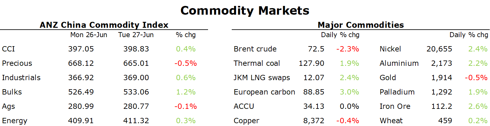

# Prospect of Chinese stimulus measures pushes metals higher

**Date:** June 28, 2023  
**Publisher:** Breakwave Advisors | **Category:** Market Insights  
**Original URL:** [https://www.breakwaveadvisors.com/insights/2023/6/28/prospect-of-chinese-stimulus-measures-pushes-metals-higher](https://www.breakwaveadvisors.com/insights/2023/6/28/prospect-of-chinese-stimulus-measures-pushes-metals-higher)  

---

*By*[*Daniel Hynes*](https://www.linkedin.com/in/dahynes/)

Positive economic data and prospects of stimulus measures in China boosted sentiment across commodity markets. That was mitigated somewhat by concerns of further monetary tightening.

> **Figure 1: 1687903047861**  
> **Interactive Data & Source:** [Linkedin](https://www.linkedin.com/newsletters/commodities-wrap-6692196755876012032/?fbclid=IwAR3kiXJqZdxmp9ZcRwBNI7FsBySI-XSC0pfPur1qzjt7OZp7PTE59Tsl1QI) | [Local Asset](file:///C:/Users/Dell/Github/Shipping/corpus/03-breakwave/insights/2023/assets/2023-06-28_prospect-of-chinese-stimulus-measures-pushes-metals-higher_img_1687903047861_6ea6eacca286.png)

Base metal rallied amid an improving outlook for demand in China. China’s Premier, Li Qiang said that growth has picked up this quarter. Nevertheless, they will roll out more practical, effective measures to expand domestic demand. The market has been waiting for further details on stimulus measures following recent comments by various state departments. While his comments lacked specifics, it’s the strongest sign yet that additional support will be provided. Most major LME contracts rallied more than 2% after steep losses last week. This comes at a time when inventories at commodity exchanges remain at relatively low levels. This leaves markets exposed to sudden tightening should demand pick up strongly. Copper gave up most of the gains late in the session after reports that Codelco had begun resuming operations at its Andina copper mine after closing due to rainstorms.

The prospect of further stimulus measures also boosted sentiment in the iron ore market. Futures gained nearly 4% as prospects of stronger demand from the housing sector rose. This follows weak data from the property sector. China’s new home prices in 70 cities grew at their slowest pace in four months in May. This has led to a slowdown in growth of steel output. The weakness prompted BHP CEO Mike Henry to urge the Chinese government to provide more help for the housing market.

Strong economic data in the US failed to support crude oil prices, with the market remaining concerned that higher interest rates will weigh on global growth. The market took the view that the better than expected hew home sales and durable goods orders is likely to push the Fed to raise rates further at upcoming FOMC meetings. ECB President Christine Lagarde said the central bank probably won’t be able to declare an end to its historic cycle of interest rate increases anytime soon. Supply side issues had little impact on sentiment. Russian crude oil exports slumped by almost 1mb/d last week due to maintenance work. However, refined fuel flows remained high. Oil well data in Russia also painted a mixed picture, with increases at larger producers but smaller explorers pulling back activity. The prospect of further weakness in oil prices comes as Saudi Arabia cuts its output by a further 1mb/d. Any lack of tightness in July would see the OPEC+ alliance forced to provide additional output cuts.

European gas gained as hotter than normal temperature stokes stronger demand. Weather models are showing the prospect of above-normal temperatures in the northwest regions over the coming weeks. This comes amid ongoing supply disruptions. Prolonged maintenance is being undertaken at several operations in Norway. The threat of further disruptions to Russian pipeline gas has also risen. Gains in Europe helped push North Asian LNG prices higher.

Data source:[Commodities Wrap](https://www.linkedin.com/newsletters/commodities-wrap-6692196755876012032/?fbclid=IwAR3kiXJqZdxmp9ZcRwBNI7FsBySI-XSC0pfPur1qzjt7OZp7PTE59Tsl1QI)
