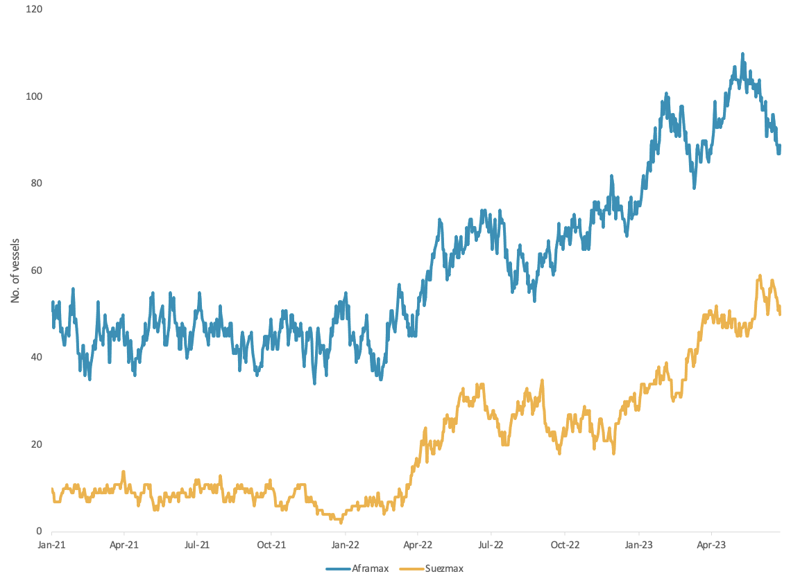
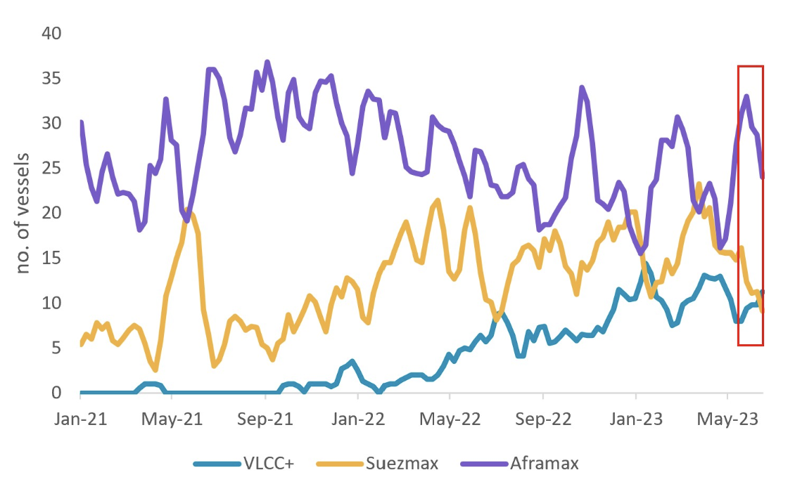

# Vortexa Freight Weekly

**Date:** June 29, 2023  
**Publisher:** Breakwave Advisors | **Category:** Market Insights  
**Original URL:** [https://www.breakwaveadvisors.com/insights/2023/6/29/13s2kwa4isr51e418plw93b9u2es7s](https://www.breakwaveadvisors.com/insights/2023/6/29/13s2kwa4isr51e418plw93b9u2es7s)  

---

*By*[*Dylan Simpson*](https://www.linkedin.com/search/results/all/?fetchDeterministicClustersOnly=false&heroEntityKey=urn%3Ali%3Afsd_profile%3AACoAACDtdn0BzHNR8syu_G8WxL-JXL-9PRT5AP4&keywords=dylan%20simpson&origin=RICH_QUERY_SUGGESTION&position=0&searchId=55ecee69-a408-47b2-8686-68f172e21af1&sid=mVl)

## Analysis / East of Suez / Dirty

### Flexibility and Diversity Keeping Suezmaxes Afloat

> **Figure 1: Aframax and Suezmax Utilisation for Russian Crude**  
> *Aframax and Suezmax utilisation for Russian crude*  
> **Interactive Data & Source:** [Marketingmail Vortexa](https://marketingmail.vortexa.com/ODM3LU1aRS01NzgAAAGMoc12gdjWuuydM_C_H6soeOMzzhwFZAEekB8BIgnGlbs9WG2H1KTROmPBLNijdWucz4MvMh4=) | [Local Asset](file:///C:/Users/Dell/Github/Shipping/corpus/03-breakwave/insights/2023/assets/2023-06-29_13s2kwa4isr51e418plw93b9u2es7s_img_unnamed-2023-06-29t124656294_79de09669d27.png)

- In the last few weeks,[Suezmax utilisation](https://marketingmail.vortexa.com/ODM3LU1aRS01NzgAAAGMoc12gdjWuuydM_C_H6soeOMzzhwFZAEekB8BIgnGlbs9WG2H1KTROmPBLNijdWucz4MvMh4=)for Russian crude has stagnated but remains high. In contrast,[Aframax utilisation](https://marketingmail.vortexa.com/ODM3LU1aRS01NzgAAAGMoc12gWoNvhznqvnn57hUdrnX2HuaPvQQksmjYpizU40_vMPksDJtFKtOnt-AaEPIyl1dy-o=)for Russian crude has declined almost 20% in the same period. This is currently driven by lower tonne-miles into East Asia for both tanker classes.
- However, Suezmaxes tend to operate out of a variety of Russian regions, whereas Aframaxes carrying Russian crude tend to operate mainly out of the Baltic. This diversity of origins has likely helped to keep Suezmax demand from falling thus far.
- Additionally, Aframaxes in Russian crude trade tend to show much less flexibility to enter other markets, with most ballasters heading back to Russian ports. On the other hand, Suezmaxes display flexibility and optimisation by entering into other trades such as the Middle East to Mediterranean trade. This indicates that the Aframax tanker segment is more vulnerable to changes in Russian crude demand than Suezmaxes.

## Analysis / West of Suez / Dirty

> **Figure 2: Vlccs Set to Find Support USG-to-Europe**  
> **Interactive Data & Source:** [Marketingmail Vortexa](https://marketingmail.vortexa.com/ODM3LU1aRS01NzgAAAGMoc12gaQ3ZfEEalLwoo8Wx8z-PRFFYXeilFZS-4MIasY4nKcbQh25mt4khTInmHz3IFLGZCw=) | [Local Asset](file:///C:/Users/Dell/Github/Shipping/corpus/03-breakwave/insights/2023/assets/2023-06-29_13s2kwa4isr51e418plw93b9u2es7s_img_unnamed-2023-06-29t124947810_6e7580210914.png)

Weekly crude tanker utilisation USG-to-Europe by vessel class

- Transatlantic crude tanker demand has been high as a result of Europe’s multi-year high[US crude imports](https://marketingmail.vortexa.com/ODM3LU1aRS01NzgAAAGMoc12gaQ3ZfEEalLwoo8Wx8z-PRFFYXeilFZS-4MIasY4nKcbQh25mt4khTInmHz3IFLGZCw=).[Aframax tonne-mile](https://marketingmail.vortexa.com/ODM3LU1aRS01NzgAAAGMoc12gUdXjEKw17idiFeoAwpU9wpayUdqsKDp6ZAMBtZ8HHWpih4Wjtr6Jrm1_a5xfGrBQDk=)demand was especially high at the end of May on the back of the inclusion of WTI in the Brent pricing assessment. However, Aframax utilisation has recently cooled, and Suezmax utilisation has remained low.
- At the same time VLCCs[utilisation](https://marketingmail.vortexa.com/ODM3LU1aRS01NzgAAAGMoc12gXQyiB9fKOqie8BiogmLqBbMk_yCiGTuEOZg4XYJGBJNIli3JqHYB_ndHyUqx264DXQ=)on this route remains robust as[utilisation towards East Asia declines](https://marketingmail.vortexa.com/ODM3LU1aRS01NzgAAAGMoc12gZBsZRKszv2nAhrdJ8K9jdDNFW527rnHJyQ9t4iYpCT2cdwfioYpclS0xw1lCavnD-M=), signalled by the recent softening in[VLCC rates](https://marketingmail.vortexa.com/ODM3LU1aRS01NzgAAAGMoc12gcskQS4T2Um5A6B0FEvEOc4mhb6532CmGyj8fevn48Ds1ghJLuJLNbbavvtoTe2YapQ=).
- Current range bound rates for Aframaxes and Suezmaxes suggest limited support for smaller vessel classes. If these flows to Europe continue at high levels going forward, VLCC demand will likely continue to find support. However, increased buying from China on the back of crude import quotas could create competition for VLCCs out of the region.

Data Source:[Vortexa](https://www.vortexa.com//oil-gas-data-traders-analysts-data-scientists?gclid=Cj0KCQjw8_qRBhCXARIsAE2AtRZKOvMnbilZ_6_91d7huSFFy71pWLrnPwGwOHVzXsmsG-1a1mZnQw8aAt89EALw_wcB&hsa_acc=1782073842&hsa_ad=548425387665&hsa_cam=14746637662&hsa_grp=125038601902&hsa_kw=&hsa_mt=&hsa_net=adwords&hsa_src=g&hsa_tgt=dsa-1431852288425&hsa_ver=3&utm_campaign=%5BCD%5D%20-%20DSA%20-%20EMEA&utm_medium=cpc&utm_medium=ppc&utm_source=google&utm_source=adwords&utm_term=)
