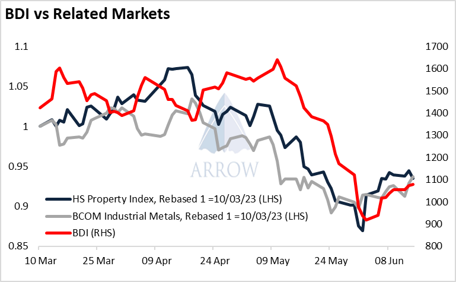
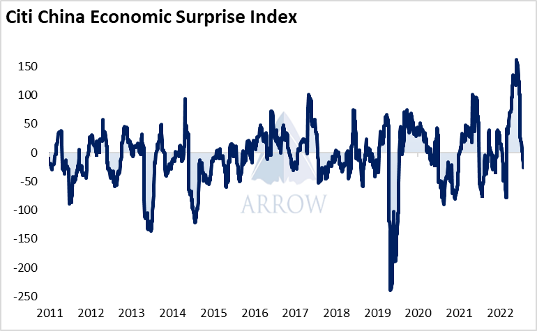
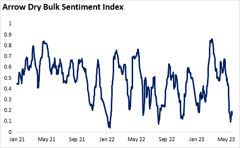
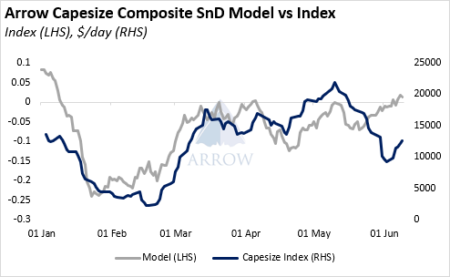

# Macro Fallout Echoes In The Spot Market

**Date:** June 30, 2023  
**Publisher:** Breakwave Advisors | **Category:** Market Insights  
**Original URL:** [https://www.breakwaveadvisors.com/insights/2023/6/30/arrow-to-the-point](https://www.breakwaveadvisors.com/insights/2023/6/30/arrow-to-the-point)  

---

## Macro Fallout Echoes in the Spot Market

Over the past few weeks, the souring economic outlook from China appears to have very quickly fed into the spot market in a way we would have not normally expected.

The Hang Seng Property Index and the Bloomberg Industrial Metal Subindex have both lead the BDI recently, a hint that perhaps the BDI has been taking its cues from the China story.

> **Figure 1: Market Chart 1**  
> [Local Asset](file:///C:/Users/Dell/Github/Shipping/corpus/03-breakwave/insights/2023/assets/2023-06-30_arrow-to-the-point_img_image00328129_50c0e7ede2a6.png)

Over the past decade, the correlation between the Hang Seng Property Index and BDI has been around 0, however over the past 30 days, it is 0.82*. There’s only been a handful of occasions when the 30-day correlation is this high.

Additionally, the Citi China Economic Surprise index, which tracks whether economic data coming out of China is either exceeding or missing economists’ forecasts is now negative. We can see how the reopening boom meant China was exceeding expectations by a record margin, however this has quickly fizzled out. Now, economic data releases are missing expectations and positive sentiment is waning.

> **Figure 2: Market Chart 2**  
> [Local Asset](file:///C:/Users/Dell/Github/Shipping/corpus/03-breakwave/insights/2023/assets/2023-06-30_arrow-to-the-point_img_image00428229_304b9c212c71.png)

In theory the spot chartering market should be a function of the supply of ships versus the demand of cargoes, whilst the macro environment is an FFA consideration. However as FFAs are being sold down on weakening macro sentiment, the physical market is seemingly reacting too. We see this as a clear example of the tail (paper) wagging the dog (physical). The sentiment and selling pressure is flowing from the macro environment into the chartering market via the FFA market. This is not a new phenomenon, however this mechanism is increasingly apparent.

Furthermore, this poor sentiment in the chartering market is evident in our Dry Bulk Sentiment Index, which is around the lowest level we’ve seen on record. This index is built using daily chartering reports, analysing the positivity/negativity of the language used.

> **Figure 3: Market Chart 3**  
> [Local Asset](file:///C:/Users/Dell/Github/Shipping/corpus/03-breakwave/insights/2023/assets/2023-06-30_arrow-to-the-point_img_image010_7df5d44c414e.png)

What about the fundamentals? Well our composite supply-demand indicator is signalling that the fundamentals have improved as this recent sell off has occurred – a divergence has appeared.

> **Figure 4: Market Chart 4**  
> [Local Asset](file:///C:/Users/Dell/Github/Shipping/corpus/03-breakwave/insights/2023/assets/2023-06-30_arrow-to-the-point_img_image011_078e47b14aeb.png)

Although there have been plenty of times where our models do not correlate with the market, this recent divergence taken into consideration with the other factors highlighted above suggest to us that the chartering market has been notably pressured by factors outside of pure supply and demand.

Much has been discussed over recent years of the rise of algorithmic trading within the FFA market, and we see certain FFA movements largely down to algo fund flow. Perhaps their activity partially explains why this recent downtrend was so well timed with other macro trades, and the momentum was so strong, however it’s hard to draw decisive conclusions.

Weakening China-related commodities, property stocks selling off, economic data disappointing all combined to generate poor sentiment, whilst FFA market activity perhaps accelerated this trend. The spot market moved much faster than we expected, and in a way we struggled to explain conventionally.

Typically, we have expected macro stories to only impact the spot market via an increase or decrease in cargoes. However now, we are curiously watching whether selling/buying pressure is trickling down into the spot market via the FFA market.

Data Source:[Arrowship](mailto:research@arrowship.com)[.com](https://arrowship.com)
