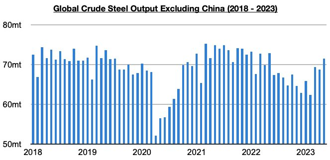
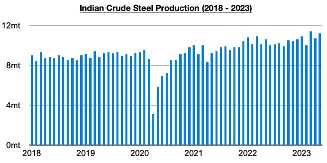

# India Remains a Rare Bright Spot

**Date:** June 30, 2023  
**Publisher:** Breakwave Advisors | **Category:** Market Insights  
**Original URL:** [https://www.breakwaveadvisors.com/insights/2023/6/30/india-remains-a-rare-bright-spot](https://www.breakwaveadvisors.com/insights/2023/6/30/india-remains-a-rare-bright-spot)  

---

*By*[*Jeffrey Landsberg*](https://www.linkedin.com/in/jeffrey-landsberg-70ab957/)

Global crude steel production outside of China totaled 71.5 million tons in May. This is up month-on-month by 2.7 million tons (4%) but is 1.4 million tons (-2%) less than was reported last year for May 2022’s production. Crude steel production outside of China has now contracted on a year-on-year basis for fifteen straight months. In comparison, China’s crude steel output contracted on a year-on-year basis for two straight months, but it recently has returned to experiencing growth again.

> **Figure 1: Chart 1 (75)**  
> [Local Asset](file:///C:/Users/Dell/Github/Shipping/corpus/03-breakwave/insights/2023/assets/2023-06-30_india-remains-a-rare-bright-spot_img_chart1287529_4aa26efdbc64.jpg)

While it remains concerning that the contraction outside of China has continued to stretch on for well over a year, May's most recent 2% year-on-year contraction has again marked the smallest contraction seen during this period (April also experienced a 2% contraction). It remains very clear, though, that much of the world outside of China continues to undergo significant economic distress, and that great problems remain on both the retail and industrial sides. India remains a rare bright spot, however, as we have also continued to stress in Commodore's Weekly Dry Bulk Reports.

India produced a record 11.2 million tons of crude steel in May. This is 500,000 tons (5%) more than was produced in April and is 600,000 tons (6%) more than was reported last year for May 2022’s production. As we have been stressing in Commodore's Weekly Dry Bulk Reports, the Indian economy remains one rare bright spot in the global economy. India’s steel production has set records during two of the last three months.

> **Figure 2: Chart 2 (64)**  
> [Local Asset](file:///C:/Users/Dell/Github/Shipping/corpus/03-breakwave/insights/2023/assets/2023-06-30_india-remains-a-rare-bright-spot_img_chart2286429_ec8fbbaa207e.jpg)
