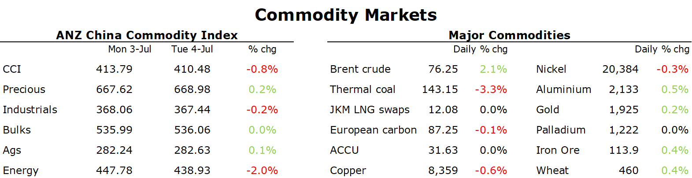

# Crude oil gains after Saudi cuts output further

**Date:** July 05, 2023  
**Publisher:** Breakwave Advisors | **Category:** Market Insights  
**Original URL:** [https://www.breakwaveadvisors.com/insights/2023/7/5/crude-oil-gains-after-saudi-cuts-output-further](https://www.breakwaveadvisors.com/insights/2023/7/5/crude-oil-gains-after-saudi-cuts-output-further)  

---

*By*[*Daniel Hynes*](https://www.linkedin.com/in/dahynes/)

The weak economic backdrop continues to weigh on sentiment across the commodity complex. However, this was mitigated by further supply side issues. Liquidity was low with US markets closed.

> **Figure 1: Data Source:commodities Wrap**  
> *Data source:Commodities Wrap*  
> **Interactive Data & Source:** [Linkedin](https://www.linkedin.com/newsletters/commodities-wrap-6692196755876012032/?fbclid=IwAR3kiXJqZdxmp9ZcRwBNI7FsBySI-XSC0pfPur1qzjt7OZp7PTE59Tsl1QI) | [Local Asset](file:///C:/Users/Dell/Github/Shipping/corpus/03-breakwave/insights/2023/assets/2023-07-05_crude-oil-gains-after-saudi-cuts-output-further_img_1688507268453_66699458ed8f.png)

Oil extended gains as traders contemplated further curbs in supply. At the OPEC International Seminar, Saudi Arabia announced it will extend its unilateral 1mb/d production into August. It also left open the possibility it will be extended further if fundamentals warrant it. The de facto leader of OPEC was joined by Russia, who agreed to cut its own output by an additional 500kb/d. Traders remain circumspect on Russia’s move. Production and export data hasn’t been absent since its invasion of Ukraine. However, ship tracking data suggests volumes have remained strong despite it agreeing to cut output by 500kb/d in April as part of the OPEC+ supply agreement. The muted reaction could be due to the flurry of announcements coming as US markets closed for the 4 July holiday. Moreover, the market was likely expecting the Saudis to extend its July cut. Traders in Asia are said to be already looking elsewhere ahead of the cuts. Their oil refiners have suggested there is plentiful supply from non-OPEC producers if the regions does bear the brunt of the latest cuts.

European gas reversed Monday’s losses as traders weigh up sluggish demand against production issues. Unplanned outages in Norway have pushed flows below seasonal norms. The outlook doesn’t look any better, with maintenance expected to extend into August. This is being mitigated by low gas usage. June saw Europe’s consumption at 15% lower than the 2017-2021 average. However, the region needs to sustain this level of reduction to avoid further energy shortages over the upcoming heating season. Interest in cargoes for delivery just before the upcoming heating season saw North Asian LNG prices in Q3 edge higher. More extreme weather is also expected to push electricity demand higher in China, which also weighed on sentiment.

Copper struggled to hold onto Monday’s gains amid the weak economic backdrop. Sentiment wasn’t helped after data showed that US factory activity fell to its lowest level in more than three years. Europe is suffering similar weakness, as the manufacturing sector struggles to regain its footing after the recent energy crisis. Traders are waiting for further data on the health of China’s economic following its own manufacturing index showed slowing growth.

Iron ore futures edged lower on signs of rising supply. Export volumes in June from Brazil topped 34mt, the second highest level for that month. Weaker demand is also on the cards after Beijing ordered steel mills in Tangshan to curb output for all of July to help combat worsening air quality. The industry is waiting for further details on a stimulus package that will try and revive construction activity.

The weak economic data helped push gold prices higher. Slowing growth could lead the Fed to pause its rate hikes, which would be a positive for the non-interest-bearing asset.
