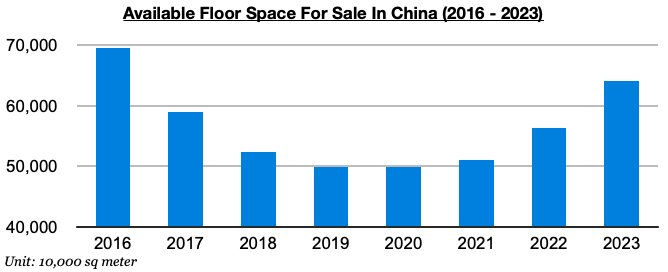
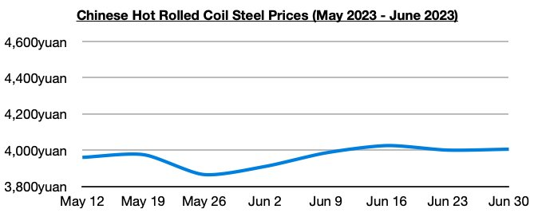
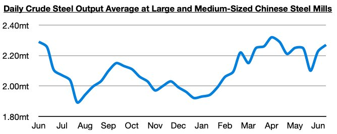

# China's Housing Market Remains Weak But Steel Output Is At Least Improving

**Date:** July 06, 2023  
**Publisher:** Breakwave Advisors | **Category:** Market Insights  
**Original URL:** [https://www.breakwaveadvisors.com/insights/2023/7/6/chinas-housing-market-remains-weak-but-steel-output-is-at-least-improving](https://www.breakwaveadvisors.com/insights/2023/7/6/chinas-housing-market-remains-weak-but-steel-output-is-at-least-improving)  

---

*By*[*Jeffrey Landsberg*](https://www.linkedin.com/in/jeffrey-landsberg-70ab957/)

As we have been stressing in Commodore's Weekly Dry Bulk Reports, China’s consumer recovery remains underway and we expect that its industrial recovery will resume this quarter. The housing market is set to remain a significant problem however. China’s housing supply has continued to decline by a small amount — but compared to the end of the last several years, current floor space still marks the largest amount available since 2016.

> **Figure 1: Chart 1 (80)**  
> [Local Asset](file:///C:/Users/Dell/Github/Shipping/corpus/03-breakwave/insights/2023/assets/2023-07-06_chinas-housing-market-remains-weak-but-steel-output-is-at-least-improving_img_chart1288029_2314b2d997e7.jpg)

China's steel production has continued to improve at least. Recently released data showed that daily crude steel production at large and medium-sized mills in China averaged 2.27 million tons during Jun 11 - 20. This has marked a 2% increase from the previous ten days and is up year-on-year by 0.5%. This also marked the first time since mid-April that China’s steel production has been up on a year-on-year basis.

> **Figure 2: Chart 2 (68)**  
> [Local Asset](file:///C:/Users/Dell/Github/Shipping/corpus/03-breakwave/insights/2023/assets/2023-07-06_chinas-housing-market-remains-weak-but-steel-output-is-at-least-improving_img_chart2286829_575055e91342.jpg)

Also noteworthy and bullish in the Chinese steel market is that steel prices have been climbing in recent weeks. The average price of hot rolled coil in China ended last week at 4,005 yuan/ton ($551), which is 5 yuan more than a week ago. Prices have now increased during four of the last five weeks. On a year-on-year basis, though, prices are down by 505 yuan (-11%).

> **Figure 3: Chart 3 (48)**  
> [Local Asset](file:///C:/Users/Dell/Github/Shipping/corpus/03-breakwave/insights/2023/assets/2023-07-06_chinas-housing-market-remains-weak-but-steel-output-is-at-least-improving_img_chart3284829_f17f9927d6dd.jpg)
