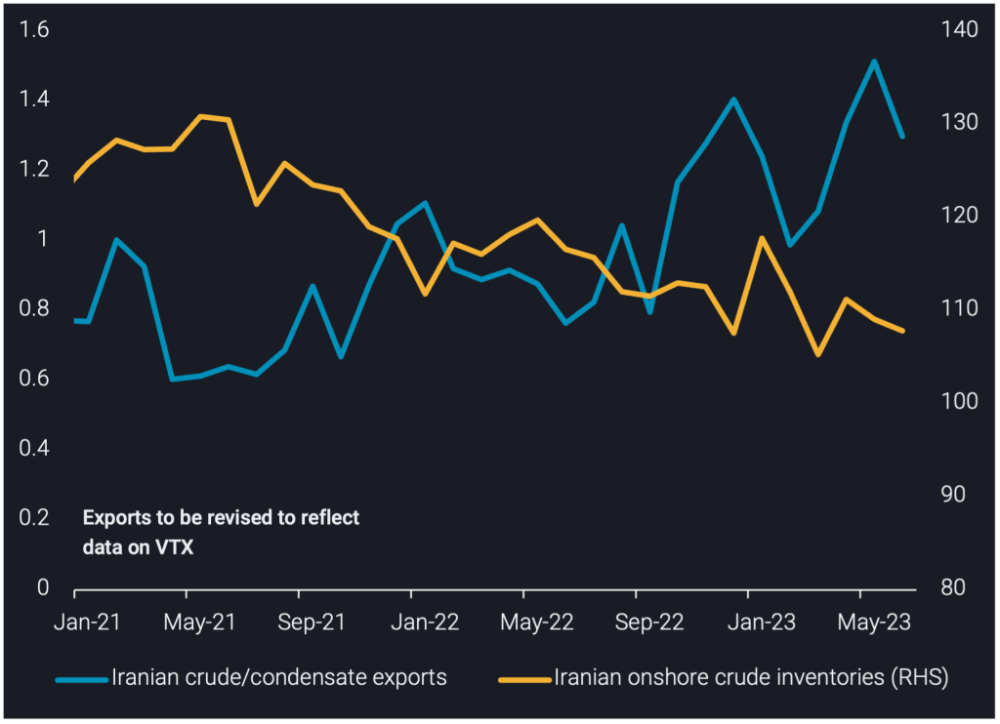
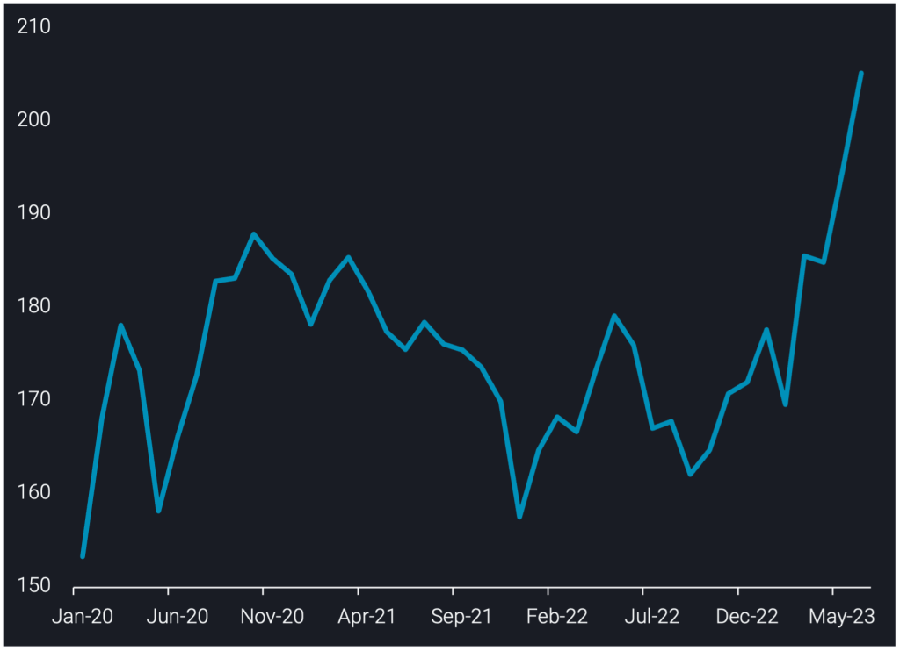
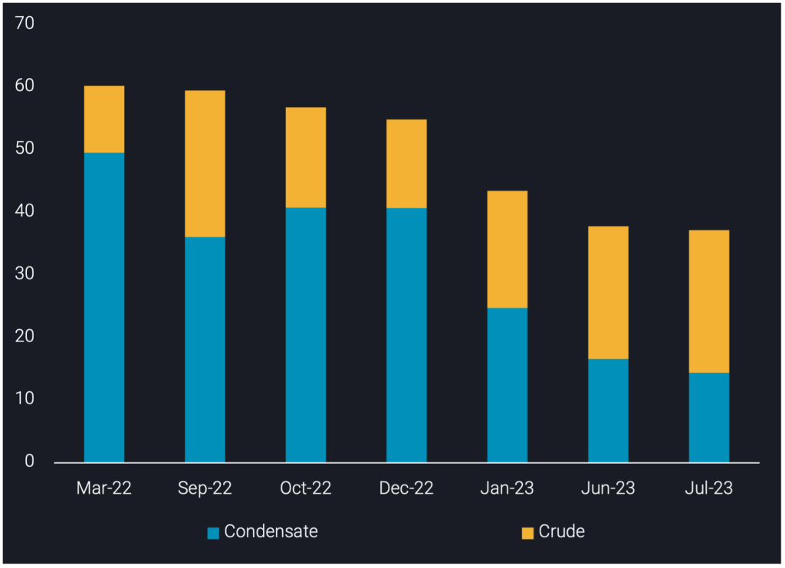

# Iran’s June crude/condensate exports show decline from record-high

**Date:** July 06, 2023  
**Publisher:** Breakwave Advisors | **Category:** Market Insights  
**Original URL:** [https://www.breakwaveadvisors.com/insights/2023/7/6/irans-june-crudecondensate-exports-show-decline-from-record-high](https://www.breakwaveadvisors.com/insights/2023/7/6/irans-june-crudecondensate-exports-show-decline-from-record-high)  

---

## This Insight Explores Why Iran’s Crude/condensate Export Levels Observed in May Were Not Sustained, Iran’s Onshore Inventories Showed Stock Draws Whilst Shandong Inventories Built Stocks and Iranian Floating Storage Declined.

*By*[*Armen Azizian*](https://www.linkedin.com/search/results/all/?fetchDeterministicClustersOnly=true&heroEntityKey=urn%3Ali%3Afsd_profile%3AACoAABcR8rABbq0IzC6LkmXkEIICI-LUmZ3s9SU&keywords=armen%20azizian&origin=RICH_QUERY_SUGGESTION&position=0&searchId=e5b0ae89-f89b-4138-826d-016fe1a94aba&sid=js9)

Iran’s crude/condensate exports reached 1.3mbd in June, a 200kbd decline from May’s record high. This marked Q2 exports at 1.35mbd, a 300kbd increase q-o-q and 350kbd higher than the 2022 average, a record-quarter of Iran’s crude/condensate exports since sanctions were imposed in November 2018.

Iran’s onshore crude/condensate inventories declined to 108mb in June, a 3mb stock draw since April. Iran’s record-high exports in Q2 led to a draw in its onshore inventories amidst its flat production levels, as confirmed by data reported by OPEC***.***

> **Figure 1: Iranian Crude/condensate Exports (Mbd**  
> *Iranian crude/condensate exports (mbd, LHS)vsIranian onshore crude inventories (mb, RHS)*  
> **Interactive Data & Source:** [Analytics Vortexa](https://analytics.vortexa.com/?dateRange=2021-01-01T00%3A00%3A00.000Z__2023-06-30T23%3A59%3A59.999Z&filtersEnabled=%5B%22p%22%2C%22o%22%2C%22d%22%2C%22d_r%22%2C%22v%22%2C%22intra%22%2C%22sts_o%22%5D&from=%5B%22d308ddc557e774187ad6c7da81b39db990def9a39e6c88e79cb163b6bdd6e8e5%22%5D&geoBreakdownOriginGlobal=port&gradeAnalysisClassification=api&metric=bpd&page=Flows&products=%5B%2254af755a090118dcf9b0724c9a4e9f14745c26165385ffa7f1445bc768f06f11%22%5D&tabId=14d44ae5-49d1-4a8b-ba21-9bed374439de&timeSeriesHiddenSeries=%5B%22b68cbb746f8b9098c50e2ba36bcad83001a53bd362e9031fb49085d02c36659c%22%2C%225de0b00094e0fd7542c10f9f8a71b4008d55750f21dc905cda9b0f7f5f76bc08%22%2C%229b0f7f5de0b111910f9f8a71b4008d4e0fd7542c55750f21dc905cda5f76bc08%22%5D&v=2&vesselClassChartView=count) | [Local Asset](file:///C:/Users/Dell/Github/Shipping/corpus/03-breakwave/insights/2023/assets/2023-07-06_irans-june-crudecondensate-exports-show-decline-from-record-high_img_iran-image-1-1-1024x742_bb3ff3791e63.png)

## Shandong Province Stock Build Suggests Lesser Need for Iranian Crude

China’s Shandong independent refiners, the main importers of sanctioned crude/condensate, saw a 10.5mb build in its onshore crude/condensate inventories to 205mb in June, the highest on record. The strong inventory build was a result of two key factors. First, several independent refiners had difficulties drawing their feedstock as diluted bitumen from port storages in the last two months due to inspections. Second, seasonal refinery maintenance led to lower refinery crude consumption in June. With the elevated inventory levels, Shandong is unlikely to import Iranian crude at the record-levels observed in December 2022.

In addition, inspections on old tankers are ongoing, with five tankers storing 8mb of Iranian crude/condensate in floating storage offshore China as of 4 July. Inspections on tankers carrying diluted bitumen have however come to an end, normalising Venezuelan crude imports. Venezuela has reportedly seen crude production increase to a 3-year high in May (OPEC), and as a large number of Venezuelan refineries remain offline, most of these volumes will be available for export, creating competition for Iran with its largest buyer, China.

> **Figure 2: Iran Insight Image 3 1024x742**  
> **Interactive Data & Source:** [Analytics Vortexa](https://analytics.vortexa.com/?dateRange=2020-01-30T00%3A00%3A00.000Z__2023-07-02T23%3A59%3A59.999Z&frequency=month&hiddenSeries=%5B%222cfd6f285665585c60351b6d59508896a8d5672da60eba9c8e3191591c5ec400%22%2C%22dd80e5e493cdd218a037721239189244c84d318d3df877544e9cc717efd89b21%22%2C%22b36c45f9370868b3030ac6567a4e344d69932d843b2125a41901a295e48a2d32%22%2C%22d1357097959bb46ccb3d9adc96640cb8d86782639e7f5b13e745db9fc08ed475%22%2C%2239f1baa602b24621eaa84786e298661bdf966e04ab05646cd1942d798712cedf%22%2C%22other%22%5D&multiSelect=1&onshoreInventoriesLocations=%5B%220fddbfd0d90bad306a92fcb483a19276f101a5f7f0783363f9f2a9d40c10558d%22%5D&page=OnShoreCrudeInventories&selectedRegion=%5B%220fddbfd0d90bad306a92fcb483a19276f101a5f7f0783363f9f2a9d40c10558d%22%5D&tabId=5bba9d4b-b30a-4ff3-89ba-f13d871acba1&tankCrude=%5B%22confirmed%22%2C%22probable%22%5D) | [Local Asset](file:///C:/Users/Dell/Github/Shipping/corpus/03-breakwave/insights/2023/assets/2023-07-06_irans-june-crudecondensate-exports-show-decline-from-record-high_img_iran-insight-image-3-1024x742_25076648ecc8.png)

## Iranian Floating Storage Continues to Decline Amid Tanker Supply Constraints

As of 4 July, Iranian crude/condensate in floating storage is assessed at 37.2mb, comprising 40% condensate and 60% crude.

Iranian floating storage in July is only 0.6mb lower than June, but the growing divergence between crude and condensate reflects the tanker supply constraints the country is facing. South Pars Condensate in floating storage is assessed at 14.4mb in July, a 2.4mb decline from June and the lowest assessed volume on record. Iranian crude in floating storage is assessed at 22.8mb in July, a 1.6mb increase from June. The increase is reflective of non-NITC tankers awaiting entry to China’s ports amid port inspections coupled with tankers awaiting STS transfers. The increase in Iranian crude in floating storage is an early indication of May’s record-high exports building floating storage.

South Pars Condensate is largely stored on National Iranian Tanker Company (NITC) tankers in domestic (Iranian) waters, but the decline below 15mb in July suggests Iran is using its NITC tankers for flows as opposed to storing condensate. The NITC fleet is now being increasingly utilised, with 12 NITC VLCCs in floating storage as of 4 July; this is compared to the 23 NITC VLCCs in floating storage in September 2022. This is despite tankers continuing to newly join its trade; H1 2023 has seen 22 tankers join.

The 37.2mb of Iranian crude/condensate floating storage is split between 35% domestic and 65% outside Iran, with the latter located offshore Malaysia (awaiting buyers) and offshore China (awaiting inspection).

> **Figure 3: Iranian Crude/condensate in Floating Storage (Mb)**  
> *Iranian crude/condensate in floating storage (mb)*  
> **Interactive Data & Source:** [Vortexa](https://www.vortexa.com/insights/crude/irans-crude-condensate-exports-reach-record-high-under-sanctions/) | [Local Asset](file:///C:/Users/Dell/Github/Shipping/corpus/03-breakwave/insights/2023/assets/2023-07-06_irans-june-crudecondensate-exports-show-decline-from-record-high_img_iran-image-2-1024x74228129_22209530eff9.png)

## Will Iran’s Crude/condensate Exports Return to May Levels?

In a[**previous insight**](https://www.vortexa.com/insights/crude/irans-crude-condensate-exports-reach-record-high-under-sanctions/), we stated that “we do not expect Iranian crude/condensate exports to sustain the record highs observed in May” and we believe this is still the case looking ahead. Tanker supply constraints coupled with marginal crude production suggests Iran could have difficulties exporting similar volumes to May.

The potential increased competition from Venezuela and the existing competition from Russia suggests we could see Iranian floating storage increase since Iranian exports of crude/condensate often have to await final buyers offshore Malaysia in addition to ongoing Chinese port inspections causing barrels to build up on the water.

Data Source:[Vortexa](https://www.vortexa.com//oil-gas-data-traders-analysts-data-scientists?gclid=Cj0KCQjw8_qRBhCXARIsAE2AtRZKOvMnbilZ_6_91d7huSFFy71pWLrnPwGwOHVzXsmsG-1a1mZnQw8aAt89EALw_wcB&hsa_acc=1782073842&hsa_ad=548425387665&hsa_cam=14746637662&hsa_grp=125038601902&hsa_kw=&hsa_mt=&hsa_net=adwords&hsa_src=g&hsa_tgt=dsa-1431852288425&hsa_ver=3&utm_campaign=%5BCD%5D%20-%20DSA%20-%20EMEA&utm_medium=cpc&utm_medium=ppc&utm_source=google&utm_source=adwords&utm_term=)
