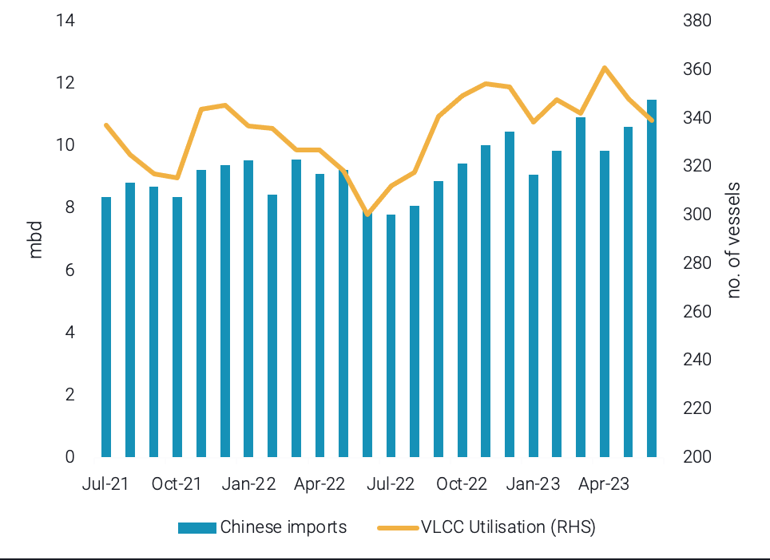
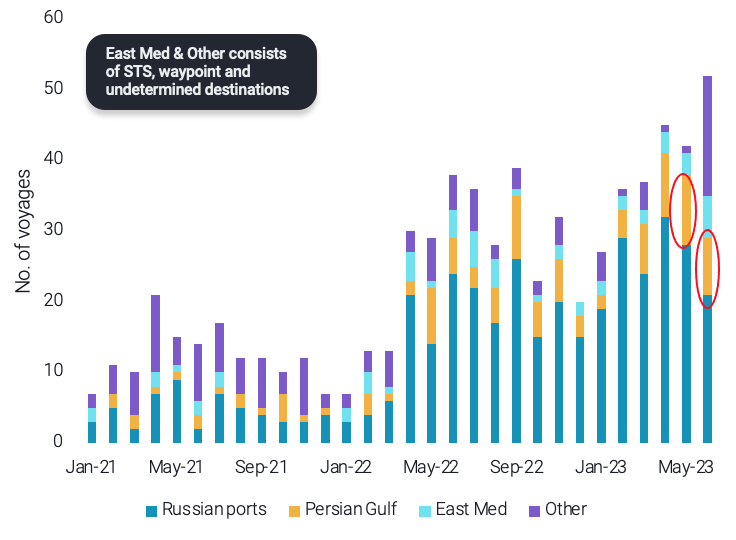

# Vortexa Freight Weekly

**Date:** July 07, 2023  
**Publisher:** Breakwave Advisors | **Category:** Market Insights  
**Original URL:** [https://www.breakwaveadvisors.com/insights/2023/7/7/vortexa-freight-weekly](https://www.breakwaveadvisors.com/insights/2023/7/7/vortexa-freight-weekly)  

---

## VLCC Rates Subside || Impact of New Eu Sanctions Negligible

*By*[*Ioannis Papadimitriou*](https://www.linkedin.com/search/results/all/?fetchDeterministicClustersOnly=true&heroEntityKey=urn%3Ali%3Afsd_profile%3AACoAAB3dQrYBbffaDWLWh_dRcHGHYBOwNhhatgs&keywords=ioannis%20papadimitriou&origin=RICH_QUERY_SUGGESTION&position=0&searchId=05c68e15-083b-466d-a751-8e7f956e02f3&sid=f%2Cq)

ANALYSIS / EAST OF SUEZ / DIRTY

## VLCC Rates Under Pressure, Signalling Weaker Chinese Demand?

> **Figure 1: China Crude Imports (Lhs)**  
> *Chart: China crude imports (LHS), vs VLCC utilisation to Asia (RHS)*  
> **Interactive Data & Source:** [Vortexa](https://www.vortexa.com//oil-gas-data-traders-analysts-data-scientists?gclid=Cj0KCQjw8_qRBhCXARIsAE2AtRZKOvMnbilZ_6_91d7huSFFy71pWLrnPwGwOHVzXsmsG-1a1mZnQw8aAt89EALw_wcB&hsa_acc=1782073842&hsa_ad=548425387665&hsa_cam=14746637662&hsa_grp=125038601902&hsa_kw=&hsa_mt=&hsa_net=adwords&hsa_src=g&hsa_tgt=dsa-1431852288425&hsa_ver=3&utm_campaign=%5BCD%5D%20-%20DSA%20-%20EMEA&utm_medium=cpc&utm_medium=ppc&utm_source=google&utm_source=adwords&utm_term=) | [Local Asset](file:///C:/Users/Dell/Github/Shipping/corpus/03-breakwave/insights/2023/assets/2023-07-07_vortexa-freight-weekly_img_unnamed-2023-07-07t131048859_fa060e204c6b.png)

- All trademark VLCC rates across the globe have dropped markedly from recent peaks observed in late June. More specifically TD3C, TD15 as well as TD22 fell by 32%, 25% and 20% respectively.
- While this is in line with a sharp decline in OPEC voluntary coalition exports in May and June, the fact that VLCC rates out of the US Gulf or West Africa did follow a similar pattern, could likely point out the decline in rates is not triggered solely from the OPEC production but also from China’s import demand.
- China’s imports reached 3-year highs in June, as the country is exploiting weaker crude prices to build up its crude stocks, which have also reached record highs. Nevertheless, VLCC utilisation towards Asia is declining, signalling that a further ramp up on Chinese supplies seems unlikely.

ANALYSIS / WEST OF SUEZ / DIRTY

## What Is the Impact of New Eu Sanctions on Crude Tankers?

> **Figure 2: Suezmaxes Ballast Distribution After Discharging Russia Crude**  
> *Suezmaxes ballast distribution after discharging Russia crude barrels*  
> **Interactive Data & Source:** [Vortexa](https://www.vortexa.com//oil-gas-data-traders-analysts-data-scientists?gclid=Cj0KCQjw8_qRBhCXARIsAE2AtRZKOvMnbilZ_6_91d7huSFFy71pWLrnPwGwOHVzXsmsG-1a1mZnQw8aAt89EALw_wcB&hsa_acc=1782073842&hsa_ad=548425387665&hsa_cam=14746637662&hsa_grp=125038601902&hsa_kw=&hsa_mt=&hsa_net=adwords&hsa_src=g&hsa_tgt=dsa-1431852288425&hsa_ver=3&utm_campaign=%5BCD%5D%20-%20DSA%20-%20EMEA&utm_medium=cpc&utm_medium=ppc&utm_source=google&utm_source=adwords&utm_term=) | [Local Asset](file:///C:/Users/Dell/Github/Shipping/corpus/03-breakwave/insights/2023/assets/2023-07-07_vortexa-freight-weekly_img_unnamed-2023-07-07t131223315_609cb9b6186c.png)

- The introduction of the EU sanctions programme against Russia confirmed a ban on EU ports for tankers that have undertaken “dark” STS transfers or if are suspected to be in breach of the price cap mechanism, or if they do not notify authorities at least 48 hours in advance about STS within a member states' Exclusive Economic Zone (EEZ).
- Looking however, at the fleet behaviour of vessels trading in Russia, the effect of the sanctions is expected to be minimal. On the one hand the majority of the vessels once traded in Russia post-ban have opted to remain in this trade, thus -at least for now - there is no need for these vessels to visit EU ports (only except a handful operators that operate on both markets - see chart).
- On the other hand, not only are there scarce “dark” STS activities occurring regarding Russia-origin cargoes in the West of Suez, the majority of STS (i.e. Kalamata or North Atlantic) are occurring outside of the EU members EEZ.

Data Source:[Vortexa](https://www.vortexa.com//oil-gas-data-traders-analysts-data-scientists?gclid=Cj0KCQjw8_qRBhCXARIsAE2AtRZKOvMnbilZ_6_91d7huSFFy71pWLrnPwGwOHVzXsmsG-1a1mZnQw8aAt89EALw_wcB&hsa_acc=1782073842&hsa_ad=548425387665&hsa_cam=14746637662&hsa_grp=125038601902&hsa_kw=&hsa_mt=&hsa_net=adwords&hsa_src=g&hsa_tgt=dsa-1431852288425&hsa_ver=3&utm_campaign=%5BCD%5D%20-%20DSA%20-%20EMEA&utm_medium=cpc&utm_medium=ppc&utm_source=google&utm_source=adwords&utm_term=)
