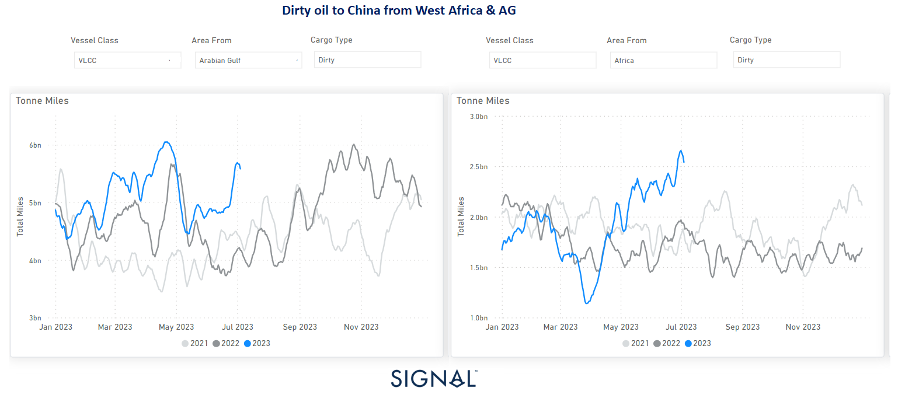
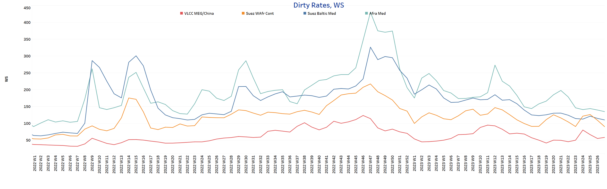
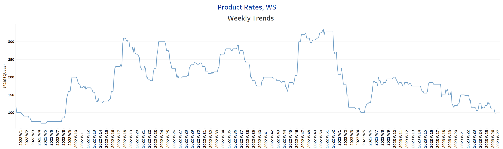
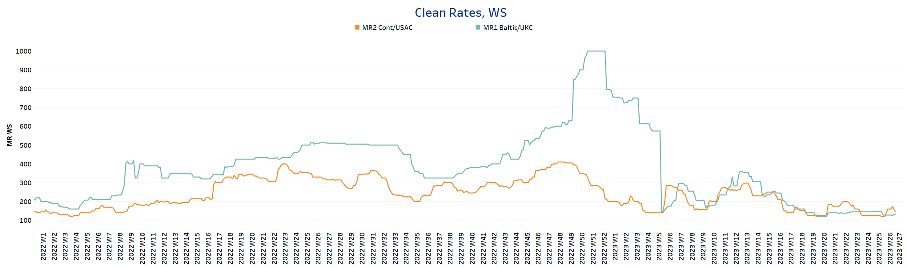
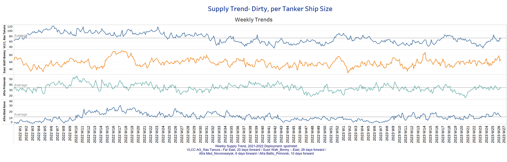
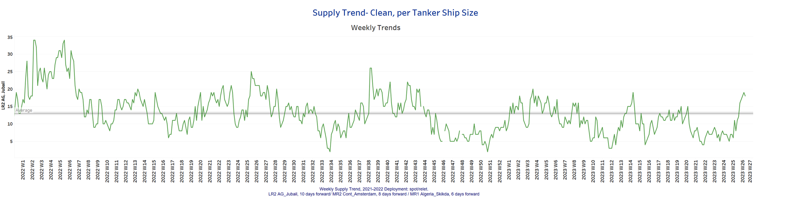
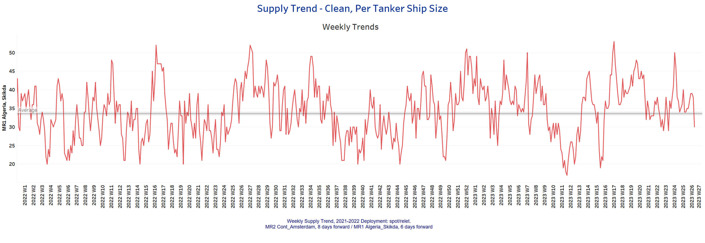
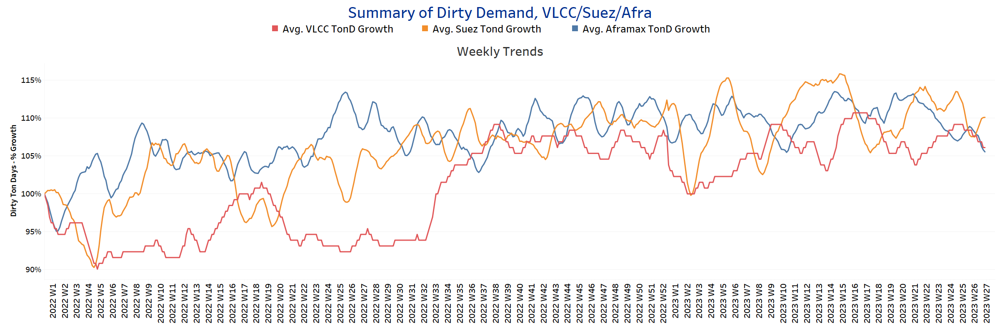
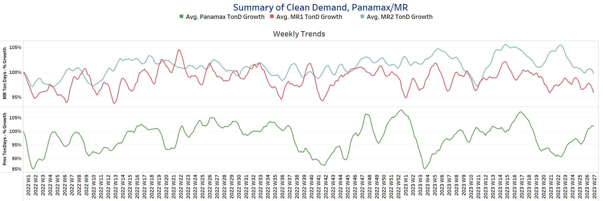

# Signal Tanker Weekly Report

**Date:** July 10, 2023  
**Publisher:** Breakwave Advisors | **Category:** Market Insights  
**Original URL:** [https://www.breakwaveadvisors.com/insights/2023/7/10/v437ovio1v3vh8uqmk11rdyp5x6fur](https://www.breakwaveadvisors.com/insights/2023/7/10/v437ovio1v3vh8uqmk11rdyp5x6fur)  

---

## Chart of the Week: VLCC Tonne Miles From West Africa & AG to China

### VLCC Tonne-Miles From AG and West Africa to China Exhibiting Noticeable Rise Since May

> **Figure 1: Market Chart 1**  
> **Interactive Data & Source:** [Signal Ocean Platform](https://go.signalocean.com/e/983831/tanker-dynamic-oilflows/2p4z2y/331262881?h=oOcNwg5Pn8352_yq_oSs4JkIT3zDFJitCWYC1OYVRAc) | [Local Asset](file:///C:/Users/Dell/Github/Shipping/corpus/03-breakwave/insights/2023/assets/2023-07-10_v437ovio1v3vh8uqmk11rdyp5x6fur_img_unnamed-2023-07-10t125425491_e74f709367ff.png)

Data Source:[Signal Ocean Platform](https://go.signalocean.com/e/983831/tanker-dynamic-oilflows/2p4z2y/331262881?h=oOcNwg5Pn8352_yq_oSs4JkIT3zDFJitCWYC1OYVRAc)

The first week of July ended with rates in the crude oil freight market coming under pressure, while weaker sentiment in clean tanker freight rates continued. Interestingly, Chinese oil demand is driving up tonne-mile volumes for VLCC routes between the Arabian Gulf (AG) and West Africa despite signs of a downward correction. VLCC tonne-miles from Wafr and AG to China have increased significantly in July since early May.

As for the long-term outlook for oil demand, according to the June report from OPEC, the organization forecasts robust growth in global oil demand in 2023. The report cited an estimated growth rate of 2.35 million barrels per day (bpd), a 2.4% year-over-year increase. This surge in demand represents a significant recovery from the lull following the coronavirus pandemic, which had a dampening effect on global oil consumption.

For more information on this week's trends, see the analysis sections below:

Freight Market, Supply and Demand

## Section 1/ Freightmarket Rates (WS)

> **Figure 2: ‘Dirty’ WS​​​​ VLCC - Suezmax - Aframax Weaker**  
> **Interactive Data & Source:** [Signal Ocean Platform](https://www.thesignalgroup.com/signal-ocean-platform) | [Local Asset](file:///C:/Users/Dell/Github/Shipping/corpus/03-breakwave/insights/2023/assets/2023-07-10_v437ovio1v3vh8uqmk11rdyp5x6fur_img_unnamed-2023-07-10t125626189_f6167623f928.png)

The first week of July ends with a mixed picture of the dynamics as dirty oil freight rates are under pressure, however, the VLCC MEG/China route indicated signs for a slightly upward momentum.

- VLCC MEG-China freight rates reached a level of 58 WS, up 3 points from the previous week, while the gap remains wide from the recent peak in week 24, when rates were at 80 WS.
- Suezmax freight rates for shipments from West Africa to continental Europe fell to 90WS, down 29% from week 25. Weakness is also evident on the Suez-Baltic-Med route, with rates at 100WS, down nearly 20 points from two weeks ago.
- Aframax Med freight rates were 135 WS, down 30% from the peak six weeks ago.

> **Figure 3: ‘Product’ Wslr Weaker**  
> **Interactive Data & Source:** [Signal Ocean Platform](https://www.thesignalgroup.com/signal-ocean-platform) | [Local Asset](file:///C:/Users/Dell/Github/Shipping/corpus/03-breakwave/insights/2023/assets/2023-07-10_v437ovio1v3vh8uqmk11rdyp5x6fur_img_unnamed-2023-07-10t125654339_eb4384632ea8.png)

- LR2 AG freight rates, which showed an upward trend the previous week, finally fell to WS98, down 25% from the previous week.

> **Figure 4: PANAMAX (Sentiment: Weaker)**  
> **Interactive Data & Source:** [Signal Ocean Platform](https://www.thesignalgroup.com/signal-ocean-platform) | [Local Asset](file:///C:/Users/Dell/Github/Shipping/corpus/03-breakwave/insights/2023/assets/2023-07-10_v437ovio1v3vh8uqmk11rdyp5x6fur_img_unnamed-2023-07-10t125837524_eb4384632ea8.png)

- Panamax Carib-to-USG rates continued the previous week's downward trend with rates around WS250, down nearly 19% from seven weeks ago.

> **Figure 5: Market Chart 5**  
> **Interactive Data & Source:** [Signal Ocean Platform](https://www.thesignalgroup.com/signal-ocean-platform) | [Local Asset](file:///C:/Users/Dell/Github/Shipping/corpus/03-breakwave/insights/2023/assets/2023-07-10_v437ovio1v3vh8uqmk11rdyp5x6fur_img_unnamed-2023-07-10t125929936_a66c25caf5d1.png)

- **MR1**rates for the**Baltic continent**are now around 130WS, 18 points lower than the levels of week 25

- **MR2 rates for shipments from the continent to the U.S. rose to a level of about WS 170 at the beginning of the week, but in the following days the good mood was disappointed and the level fell to about WS 155.**

> **Figure 6: Section 2/ Supplysupply Trend Lines for Key Load Areas**  
> **Interactive Data & Source:** [Signal Ocean Platform](https://www.thesignalgroup.com/signal-ocean-platform) | [Local Asset](file:///C:/Users/Dell/Github/Shipping/corpus/03-breakwave/insights/2023/assets/2023-07-10_v437ovio1v3vh8uqmk11rdyp5x6fur_img_unnamed-2023-07-10t130134520_064a150e99af.png)

Crude oil tanker supply painted a mixed picture in the first few days of July, as despite signs of a decline in the first week, there were ultimately more vessel movements, with the number of vessels roughly in line with the annual average.

- **​​​​​VLCC Ras Tanura:**The current number of ships is only 3 ships below the annual average and is about 70, which is 10 ships more than the first signs at the beginning of the week.
- **Suezmax Wafr Bonny:**The current vessel count stands now above 68, which is 11 vessels lower compared to the previous week.
- **Aframax Primorsk:**The current vessel count is at an annual average of 34, down 4 ships from the end of the previous week, but up nearly 50% from the last low in week 20.
- **Aframax Med Novo:**The vessel count also dropped to the annual average of 12 amid signs of an increase nearing 18 vessels a week ago.

> **Figure 7: ’Clean’lr2 (#Vessels) - Increasing**  
> **Interactive Data & Source:** [Signal Ocean Platform](https://www.thesignalgroup.com/signal-ocean-platform) | [Local Asset](file:///C:/Users/Dell/Github/Shipping/corpus/03-breakwave/insights/2023/assets/2023-07-10_v437ovio1v3vh8uqmk11rdyp5x6fur_img_unnamed-2023-07-10t130302305_8f623031252e.png)

## MR1 (#Vessels) - Decreasing

> **Figure 8: MR1 (#Vessels) - Decreasing**  
> **Interactive Data & Source:** [Signal Ocean Platform](https://www.thesignalgroup.com/signal-ocean-platform) | [Local Asset](file:///C:/Users/Dell/Github/Shipping/corpus/03-breakwave/insights/2023/assets/2023-07-10_v437ovio1v3vh8uqmk11rdyp5x6fur_img_unnamed-2023-07-10t130517509_84e254c3038b.png)

- Clean LR2 AG Jubail: The current ship count currently stands at the increased level of approximately 18, reflecting an increase of 5 vessels above the annual average.

- Clean MR1 Algeria Skikda: The current ship count is now around 30 vessels, almost 10 vessels lower than the previous week and 20 vessels lower than the sudden peak recorded in week 25.

## Section 3/ Demandsummary of Tanker Demand per Ship Size & Segment

> **Figure 9: ​​‘Dirty’tonne Days Mixed**  
> **Interactive Data & Source:** [Signal Ocean Platform](https://www.thesignalgroup.com/signal-ocean-platform) | [Local Asset](file:///C:/Users/Dell/Github/Shipping/corpus/03-breakwave/insights/2023/assets/2023-07-10_v437ovio1v3vh8uqmk11rdyp5x6fur_img_unnamed-2023-07-10t130700372_678aa39b1990.png)

- **Dirty**Tonne Days: Mixed dynamics are also evident in crude oil tanker demand trends, as the percentage increase in VLCC ton-miles now appears to be declining after a sustained increase in week 20 through the previous week. A downward trend can also be observed in the Aramax segment, while the downward trend in the Suezmax segment seems to have been overcome with a slight increase from the low in week 26.

> **Figure 10: ‘Clean’tonne Days Panamax Increasing - MR Decreasing**  
> **Interactive Data & Source:** [Signal Ocean Platform](https://www.thesignalgroup.com/signal-ocean-platform) | [Local Asset](file:///C:/Users/Dell/Github/Shipping/corpus/03-breakwave/insights/2023/assets/2023-07-10_v437ovio1v3vh8uqmk11rdyp5x6fur_img_unnamed-2023-07-10t130800394_f7358795ad29.png)

- Panamax tonne days: The first week of July ended with a significantly higher percentage growth than the lows recorded seven weeks ago, while the recent trend seems now to continue for the coming days.

- Clean MR tonne days: The sentiment of demand tonne miles growth continues to be weaker with the percentage growth persistently hovering at much lower levels than the peak recorded three weeks ago.

Data Source:[Signal Ocean Platform](https://www.thesignalgroup.com/signal-ocean-platform)
