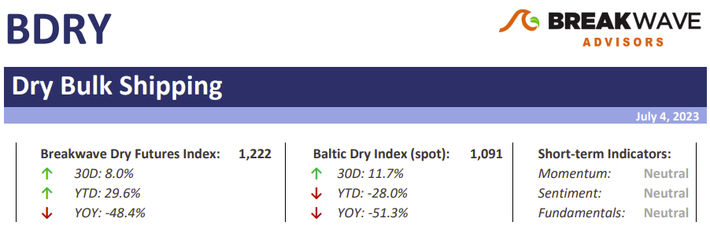

# Weekly Insights Review

**Date:** July 10, 2023  
**Publisher:** Breakwave Advisors | **Category:** Market Insights  
**Original URL:** [https://www.breakwaveadvisors.com/insights/2023/7/7/weekly-insights-review](https://www.breakwaveadvisors.com/insights/2023/7/7/weekly-insights-review)  

---

## Welcome to Our Weekly Insights Review

## Read Here Everything You Need to Know

## Breakwave Bi-Weekly Dry Bulk Report

Dull days usually translate to lower rates as fleet efficiencies prevail – Despite the fact that trade volumes remain strong when it comes to major bulks, the absence of any disruption across the major shipping lanes has translated to lower spot freight rates across the spectrum.
[Read More](https://www.breakwaveadvisors.com/insights/2023/7/3/breakwave-bi-weekly-dry-bulk-report-july-4-2023)

> **Figure 1: Market Chart 1**  
> **Interactive Data & Source:** [Breakwave Advisors Market Insights](https://www.breakwaveadvisors.com/insights/2023/7/3/brs-dry-bulk-weekly-newsletter) | [Local Asset](file:///C:/Users/Dell/Github/Shipping/corpus/03-breakwave/insights/2023/assets/2023-07-10_weekly-insights-review_img_unnamed-2023-07-07t140043642_267b58653e64.png)

> **Figure 2: Market Chart 2**  
> **Interactive Data & Source:** [Breakwave Advisors Market Insights](https://www.breakwaveadvisors.com/insights/2023/7/3/brs-dry-bulk-weekly-newsletter) | [Local Asset](file:///C:/Users/Dell/Github/Shipping/corpus/03-breakwave/insights/2023/assets/2023-07-10_weekly-insights-review_img_unnamed282429_23828b6cb620.jpg)

## Brs Dry Bulk Weekly Newsletter

## Capesize Shipments of Guinea Bauxite Forecasted to Slow Down in Q3 Amid Rainy Seasons

Based on AXSMarine data, during the first five months of 2023, the seaborne export of bauxite remained strong, exhibiting a growth of 2.3 million tons (3.4% year-on-year) compared to the corresponding period of the previous year.
[Read More](https://www.breakwaveadvisors.com/insights/2023/7/3/brs-dry-bulk-weekly-newsletter)

> **Figure 3: Market Chart 3**  
> **Interactive Data & Source:** [Breakwave Advisors Market Insights](https://www.breakwaveadvisors.com/insights/2023/7/3/mazars-comment-sticky-inflation-sticky-rates-volatility) | [Local Asset](file:///C:/Users/Dell/Github/Shipping/corpus/03-breakwave/insights/2023/assets/2023-07-10_weekly-insights-review_img_unnamed282529_4dee898ec121.jpg)

## Mazars Comment :Sticky Inflation = Sticky Rates= Volatility

## The Three Things I Would Tell My Clients This Week

Last week, central bankers held a conference in Sintra, Portugal. There, they confirmed that inflation remains sticky, and interest rates will thus remain elevated for some time. The central banks keep telling us what they will do.
[Read More](https://www.breakwaveadvisors.com/insights/2023/7/3/mazars-comment-sticky-inflation-sticky-rates-volatility)

> **Figure 4: Market Chart 4**  
> **Interactive Data & Source:** [Breakwave Advisors Market Insights](https://www.breakwaveadvisors.com/insights/2023/7/5/crude-oil-gains-after-saudi-cuts-output-further) | [Local Asset](file:///C:/Users/Dell/Github/Shipping/corpus/03-breakwave/insights/2023/assets/2023-07-10_weekly-insights-review_img_unnamed282729_5515faae285d.jpg)

## Crude Oil Gains After Saudi Cuts Output Further

## Liquidity Was Low with Us Markets Closed

The weak economic backdrop continues to weigh on sentiment across the commodity complex.
[Read More](https://www.breakwaveadvisors.com/insights/2023/7/5/crude-oil-gains-after-saudi-cuts-output-further)

> **Figure 5: Market Chart 5**  
> **Interactive Data & Source:** [Breakwave Advisors Market Insights](https://www.breakwaveadvisors.com/insights/2023/7/6/irans-june-crudecondensate-exports-show-decline-from-record-high) | [Local Asset](file:///C:/Users/Dell/Github/Shipping/corpus/03-breakwave/insights/2023/assets/2023-07-10_weekly-insights-review_img_unnamed282829_0f464abb72cc.jpg)

## Iran’s June Crude/condensate Exports Show Decline From Record-High

## Will Iran’s Crude/condensate Exports Return to May Levels?

This insight explores why Iran’s crude/condensate export levels observed in May were not sustained, Iran’s onshore inventories showed stock draws whilst Shandong inventories built stocks and Iranian floating storage declined.
[Read More](https://www.breakwaveadvisors.com/insights/2023/7/6/irans-june-crudecondensate-exports-show-decline-from-record-high)

## Shipfix-Global Market Update

## Macro/geopolitics, Commodity Markets, Freight and Bunker Markets

Following last week’s release of China’s official manufacturing PMI, which suggested that the country’s industrial sector remained in contraction territory for a third consecutive month, the Caixin manufacturing PMI painted a somewhat less negative picture today.
[Read More](https://www.breakwaveadvisors.com/insights/2023/7/4/shipfix-global-market-update)

> **Figure 6: Market Chart 6**  
> **Interactive Data & Source:** [Breakwave Advisors Market Insights](https://www.breakwaveadvisors.com/insights/2023/7/6/chinas-housing-market-remains-weak-but-steel-output-is-at-least-improving) | [Local Asset](file:///C:/Users/Dell/Github/Shipping/corpus/03-breakwave/insights/2023/assets/2023-07-10_weekly-insights-review_img_unnamed283329_30d32702b7cd.jpg)

## Vortexa Freight Weekly

## VLCC Rates Subside || Impact of New Eu Sanctions Negligible

> **Figure 7: VLCC Rates Under Pressure, Signalling Weaker Chinese Demand?read More**  
> **Interactive Data & Source:** [Breakwave Advisors Market Insights](https://www.breakwaveadvisors.com/insights/2023/7/6/chinas-housing-market-remains-weak-but-steel-output-is-at-least-improving) | [Local Asset](file:///C:/Users/Dell/Github/Shipping/corpus/03-breakwave/insights/2023/assets/2023-07-10_weekly-insights-review_img_unnamed283429_ab953f3a019f.jpg)

> **Figure 8: Market Chart 8**  
> **Interactive Data & Source:** [Breakwave Advisors Market Insights](https://www.breakwaveadvisors.com/insights/2023/7/6/chinas-housing-market-remains-weak-but-steel-output-is-at-least-improving) | [Local Asset](file:///C:/Users/Dell/Github/Shipping/corpus/03-breakwave/insights/2023/assets/2023-07-10_weekly-insights-review_img_unnamed283529_331c7d0892c8.jpg)

## China's Housing Market Remains Weak But Steel Output Is at Least Improving

## China's Steel Production Has Continued to Improve at Least

As we have been stressing in Commodore's Weekly Dry Bulk Reports, China’s consumer recovery remains underway and we expect that its industrial recovery will resume this quarter.
[Read More](https://www.breakwaveadvisors.com/insights/2023/7/6/chinas-housing-market-remains-weak-but-steel-output-is-at-least-improving)

## Braemar Weekly Dry Market Report

> **Figure 9: Initial Days of July Concluded on a Positive Note**  
> *The initial days of July concluded on a positive note, with a buoyant sentiment surrounding vessel freight rates in the Capesize segment.Read More*  
> **Interactive Data & Source:** [Breakwave Advisors Market Insights](https://www.breakwaveadvisors.com/insights/2023/7/5/signal-dry-bulk-weekly-report) | [Local Asset](file:///C:/Users/Dell/Github/Shipping/corpus/03-breakwave/insights/2023/assets/2023-07-10_weekly-insights-review_img_unnamed283629_5d3272ec88d5.jpg)

## The Big Picture: El Niño: Risks to Dry Bulk Trades

There are precious few certainties in dry bulk shipping, so the World Meteorological Organisation (WMO)’s assessment on 4 July of a 90% probability of El Niño (of at least moderate strength) extending into the second half of 2023 gives us enough of a reason to a look at the potential consequences.

Read More

## Signal Dry Bulk Weekly Report

## Snapshot of Spot Freight Rates, Supply-Demand Trends, Port Congestions

> **Figure 10: Market Chart 10**  
> [Local Asset](file:///C:/Users/Dell/Github/Shipping/corpus/03-breakwave/insights/2023/assets/2023-07-10_weekly-insights-review_img_unnamed283729_d02bd852d3c7.jpg)
