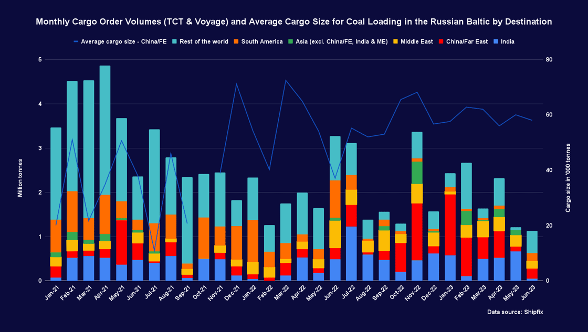

# Shipfix-Global Market Update

**Date:** July 11, 2023  
**Publisher:** Breakwave Advisors | **Category:** Market Insights  
**Original URL:** [https://www.breakwaveadvisors.com/insights/2023/7/11/shipfix-global-market-update](https://www.breakwaveadvisors.com/insights/2023/7/11/shipfix-global-market-update)  

---

*By*[*Ulf Bergman*](https://www.linkedin.com/in/ulf-bergman-81570425/)

## Macro/geopolitics

Last week ended with signs that the US labour market is slowing down amid mounting economic headwinds and rising interest rates. The world’s largest economy added 209,000 jobs in June, the lowest since December 2020. However, the country’s unemployment rate retreated marginally despite the weaker-than-expected reading. The softening labour market contributed to the US dollar declining by more than 0.6 per cent last week, as traders downgraded their expectations for future interest rate hikes.

The new week has started with Chinese inflation data surprising on the downside. Prices remained unchanged in June, compared to the same month last year, while markets had expected a minor increase of 0.2 per cent. The lower-than-expected reading and the mounting risk of deflation in the world’s second-largest economy are likely to lead to further calls for stimulus measures to support growth and prices.

The week ahead will see the release of US inflation data on Wednesday, which will provide further clues on the extent of the remainder of the US interest rate hiking cycle. On Thursday, China will publish its trade data for June, providing additional insights into the state of the world’s second-largest economy.

## Commodity Markets

Following a robust session on Friday, crude oil prices advanced over the course of the past week as concerns over tight global supplies and a weaker dollar supported the prices. The September Brent futures recorded a weekly advance of 4.1 per cent and ended Friday’s session at 78.47 dollars per barrel. However, some gains have been given up during today’s early trading, as the contracts have shed around half a per cent following the weaker-than-expected Chinese inflation.

In contrast, European natural gas prices retreated over the course of the past week as unseasonally high inventories weighed on prices. The front-month TTF futures declined by 9.9 per cent over the past five sessions and settled at 33.48 euros per MWh on Friday. The new week has seen further losses, with the contracts trading nearly five per cent below Friday’s close.

Thermal coal also declined during the past week as the bullish mood from June faded somewhat. The front-month Newcastle futures recorded a weekly decline of 9.3 per cent and ended the week at 141.80 dollars per tonne. The contracts for delivery in Rotterdam next month fared somewhat better and declined by 7.2 per cent for the week, settling at 113.25 dollars per tonne on Friday.

Renewed concerns over the demand outlook amid weak Chinese economic data weighed on iron ore prices last week. The August futures listed on the Singapore Exchange declined by 1.2 per cent over the past five trading sessions and settled at 107.71 dollars per tonne on Friday. Today’s lower-than-expected Chinese inflation data has put further pressure on the prices, with the losses exceeding three per cent.

Base metals had a mixed week with relatively minor price moves. A weaker dollar provided some support, while the demand outlook remained under pressure amid soft Chinese economic data. The three-month copper and nickel futures listed on the LME advanced by 0.7 and 1.4 per cent, respectively. In contrast, the aluminium and zinc contracts declined by 0.3 and 1.1 per cent, respectively.

After extensive price moves during the preceding week, the grain and oilseed futures trading in Chicago delivered more modest performances last week as the demand and supply situation settled somewhat. The wheat and corn September contracts declined by around a quarter of a per cent last week, while the August soybean futures retreated by 1.0 per cent during the same period.

## Freight and Bunker Markets

Despite gains for the larger segments on Thursday and Friday, the Baltic Dry Index recorded a sharp decline last week. The headline index shed 7.5 per cent amid weekly losses across all dry bulk segments. The sub-index for the Capesizes recorded a weekly drop of 10.7 per cent, as vessel supply remained relatively elevated. The freight rate indicator for the Panamaxes declined by 4.5 per cent over the week as demand remained below levels of recent months. The Supramaxes saw their freight rate gauge falling by 3.3 per cent, while the Handysizes shed 4.9 per cent.

The Baltic’s wet freight indices were also mostly in the red during the past week. The dirty tanker gauge recorded a weekly decline of 7.9 per cent as the lower demand outlook for crude oil weighed on sentiments, while the clean tanker indicator shed 2.4 per cent. Despite a strong performance on Friday, the index for the LPG carriers recorded a weekly loss of 3.7 per cent. On the other hand, the LNG spot freight advanced by a marginal 0.3 per cent for the week.

Last week’s rising crude oil prices provided some support for most bunker fuel prices. The MGO saw weekly gains of two to three per cent across Singapore, Rotterdam and Houston. On the other hand, the trading in VLSFO was more mixed. In Singapore, the fuel declined by 1.3 per cent, while Rotterdam and Houston saw weekly gains of 1.0 and 2.5 per cent, respectively.

## The View From the Shipfix Desk

Cargo order volumes for Russian coal loading in the Baltic Sea remained under pressure during the past month. The loss of the European market in the wake of sanctions initially saw an increase in shipments to the distant ports in Asia. However, aggregate monthly order volumes have been trending lower year to date. Last month was no exception, with the aggregate marginally below the reading for May. While demand for seaborne transportation to China recovered somewhat compared to May, the aggregate volumes for June remained well below the readings seen earlier in the year. In contrast, cargo order volumes for coal discharging in India dropped sharply after trending higher since February.

Despite the decline in demand for seaborne transportation of Russian coal from the Baltic Sea to China, the average cargo order size for the trade has remained relatively stable. Since the beginning of the year, the typical cargo for the long voyage from the Baltic Sea to China has remained around 60,000 tonnes***.***

> **Figure 1: Market Chart 1**  
> **Interactive Data & Source:** [Shipfix](https://shipfix.com/) | [Local Asset](file:///C:/Users/Dell/Github/Shipping/corpus/03-breakwave/insights/2023/assets/2023-07-11_shipfix-global-market-update_img_unnamed-2023-07-11t111746349_3daa060de78d.png)

Data Source:[Shipfix](https://shipfix.com/)
