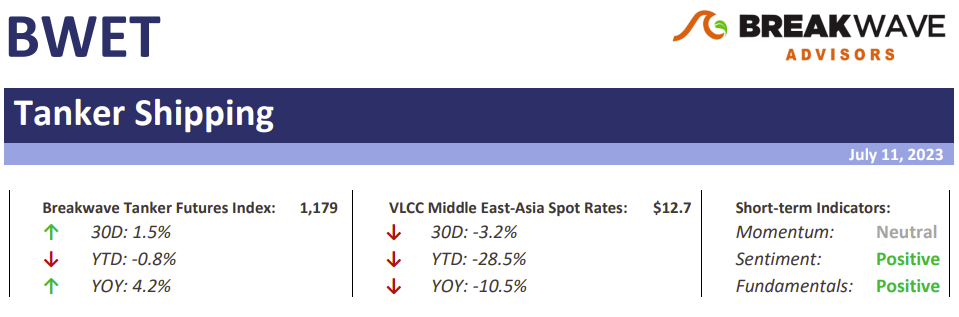
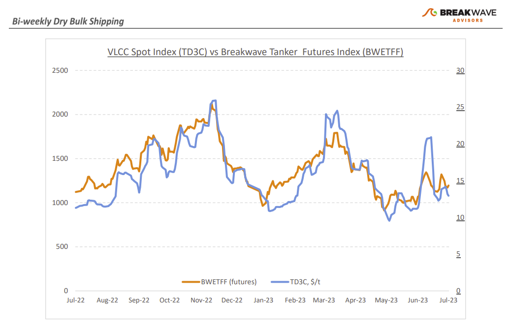
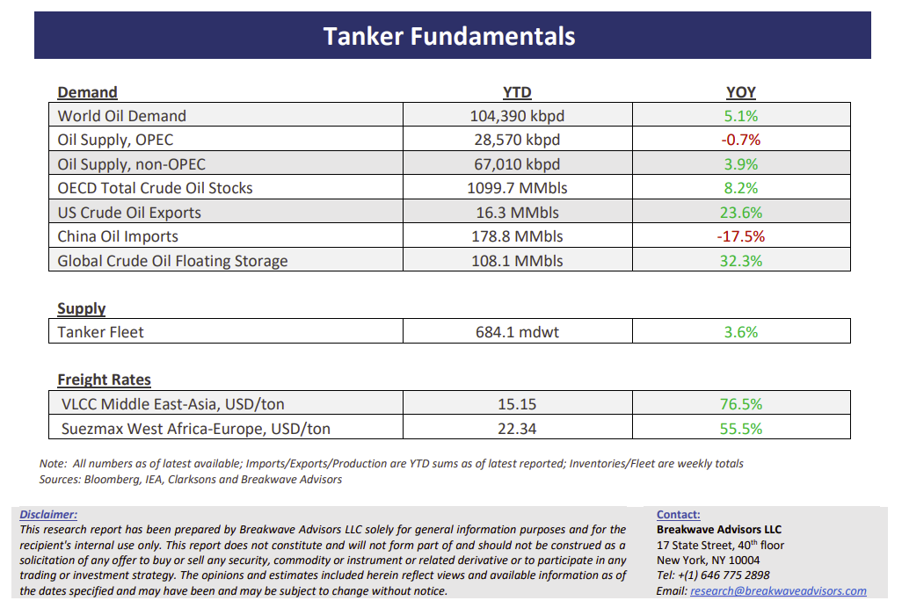

# Breakwave Bi-Weekly Tanker Report - July 11, 2023

**Date:** July 11, 2023  
**Publisher:** Breakwave Advisors | **Category:** Market Insights  
**Original URL:** [https://www.breakwaveadvisors.com/insights/2023/7/11/tanker-july-11-2023-3jftj](https://www.breakwaveadvisors.com/insights/2023/7/11/tanker-july-11-2023-3jftj)  

---

> **Figure 1: Tankerreporttop**  
> [Local Asset](file:///C:/Users/Dell/Github/Shipping/corpus/03-breakwave/insights/2023/assets/2023-07-11_tanker-july-11-2023-3jftj_img_tankerreporttop_fcd674e436a0.png)

**• VLCC rates weaken as vessel surplus takes a toll**– The brief spike in VLCC spot rates around mid-June proved unstainable and, as widely expected, the first week of July pushed spot rates lower in the Middle East to China route along with the West Africa to China route. Shipowners are now facing increased pressure as they anticipate further rate decreases due to an ever-weakening Atlantic market. Interest in chartering for August shipments from West Africa has so far been limited, prompting shipowners to seek alternative employment opportunities. The broader oil macro picture also took a turn for the worse, and despite the early glimmer of hope in the crude tanker market with estimates of sustained Chinese oil demand and significant crude oil purchases in the first half of 2023, recent data pointed to weakening trends: China's crude oil imports fell to a 47-month low of 8.75 million barrels per day (b/d) in June, abruptly ending a recovery trend seen since March. As is often the case during the summer months, we expect a rather stagnant market for VLCCs for the time being until some tightness appears, most likely in the form of Atlantic basin demand, where increasing production and oil exports combined with the longer shipping distances to Asia (versus shipments from the Middle East) can provide the necessary fuel for potentially another leg higher to take place later in the fall.

**• As oil supply tightens, prices continue to focus on demand negatives**– The oil market remains in a dichotomy, as bullish arguments associated with the supply side (i.e., production cuts) are easily being rebuffed by expectations of slower economic activity and thus the associated decline in oil demand. Both sides have valid arguments: Production and exports have indeed declined; however, such production cuts are coming ahead of what most econometric models are showing, namely a slower demand growth outlook and potentially increasing global inventories. Yet, the calls for slower economic activity have been loud for months now, but in real time, there is little evidence of such weaker activity especially when it comes to the booming jet fuel market. A recent exception has been the month of June, when indeed Chinese oil imports took a hit, but before one can see a clear trend in such statistics, it would be premature to call it a downturn for oil demand. The voices around a meaningful Chinese stimulus are getting louder by the day, as recent inflation data is pointing to declines in prices across the board reflecting weak demand trends and a rather stagnant economic activity for the most important country in the world when it comes to oil fundamentals.

**• Tanker cycle driven by tight supply, recovering demand**– The tanker market is recovering from a long period of staggered rates as the growth in new vessel supply shrinks while oil demand is recovering in line with the global economy. A historically low orderbook combined with favorable demand fundamentals should continue to support increased spot rate volatility, which combined with the ongoing geopolitical turmoil, should support freight rates in the medium term.

> **Figure 2: Tankerreportchart**  
> [Local Asset](file:///C:/Users/Dell/Github/Shipping/corpus/03-breakwave/insights/2023/assets/2023-07-11_tanker-july-11-2023-3jftj_img_tankerreportchart_e4d847a186ae.png)

> **Figure 3: Tankerreportbottom**  
> [Local Asset](file:///C:/Users/Dell/Github/Shipping/corpus/03-breakwave/insights/2023/assets/2023-07-11_tanker-july-11-2023-3jftj_img_tankerreportbottom_f0862e131b5c.png)

## Subscribe:
