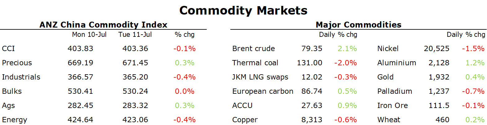

# Metals gain as China's power issues threaten to curb supply

**Date:** July 12, 2023  
**Publisher:** Breakwave Advisors | **Category:** Market Insights  
**Original URL:** [https://www.breakwaveadvisors.com/insights/2023/7/12/metals-gain-as-chinas-power-issues-threaten-to-curb-supply](https://www.breakwaveadvisors.com/insights/2023/7/12/metals-gain-as-chinas-power-issues-threaten-to-curb-supply)  

---

*By*[*Daniel Hynes*](https://www.linkedin.com/in/dahynes/)

Supply side issues helped offset ongoing concerns of weaker economic growth. A weaker USD also provided some support.

> **Figure 1: Data Source:commodities Wrap**  
> *Data source:Commodities Wrap*  
> **Interactive Data & Source:** [Linkedin](https://www.linkedin.com/newsletters/commodities-wrap-6692196755876012032/?fbclid=IwAR3kiXJqZdxmp9ZcRwBNI7FsBySI-XSC0pfPur1qzjt7OZp7PTE59Tsl1QI) | [Local Asset](file:///C:/Users/Dell/Github/Shipping/corpus/03-breakwave/insights/2023/assets/2023-07-12_metals-gain-as-chinas-power-issues-threaten-to-curb-supply_img_1689113641604_28b23be71922.png)

Aluminium gained as threats of further curbs on output rose. Power consumption in Sichuan reached a record high on Monday amid scorching temperatures. That’s exacerbating already low hydro dam levels after a drought over the last year. Aluminium smelters near the provincial capital of Chengdu have been ordered to reduce power consumption, which puts at risk about 50kt of metal. Overall Sichuan produces around 1mt of aluminium, from a total of around 40mt across the country. These disruptions may be offset by the resumption of smelters in nearby Yunnan province, which suffered similar curbs earlier this year. The rest of the complex was mixed as the sector waits for additional stimulus measures. Data showed that credit growth remains robust, with aggregate financing and new bank yuan loans both beating expectations. However, its transmission into economic growth remains weak.

Critical minerals gained across the board last week amid strong demand. The International Energy Agency said demand has reached new heights as worries over energy security mounts. Governments are pouring money into the sector, with investment rising 30% in 2022. It estimates the market size of critical minerals, including cobalt, nickel & lithium, to be around USD320bn

Iron ore gained as Beijing stepped up efforts to support the struggling property sector. Regulators announced further support measures, including the postponement of some loan repayments. Lenders will also be encouraged to ramp up support to ensure delivery of homes under construction. However, new home sales in the country’s first-tier cities are flagging, with only Shanghai seeing a slight pickup last week.

Gold edged higher as US Treasury yields fell and the USD appreciated ahead of critical inflation data later this week.

Crude oil rallied as signs of falling OPEC+ production emerged. Average shipments of Russian crude have dropped below their February averages, according to ship tracking data. Nationwide exports of crude fell to 2.86mb/d in the week to 9 July. There was no obvious sign of maintenance at Russian ports that may have led to the sharp drop in flows. There are also signs that the market for Saudi crude is tightening. Spot prices have pushed above longer dated futures in the country’s Dubai crude. Sentiment was also supported by rising expectations on demand. The Energy Information Administration raised its forecast for global demand, which will see the market move into deficit in coming months.

European gas fell amid tepid demand. Hot weather in some countries has failed to translate into significantly stronger demand for cooling needs. Strong supply of cargoes into the North Asian LNG market weighed on prices.
