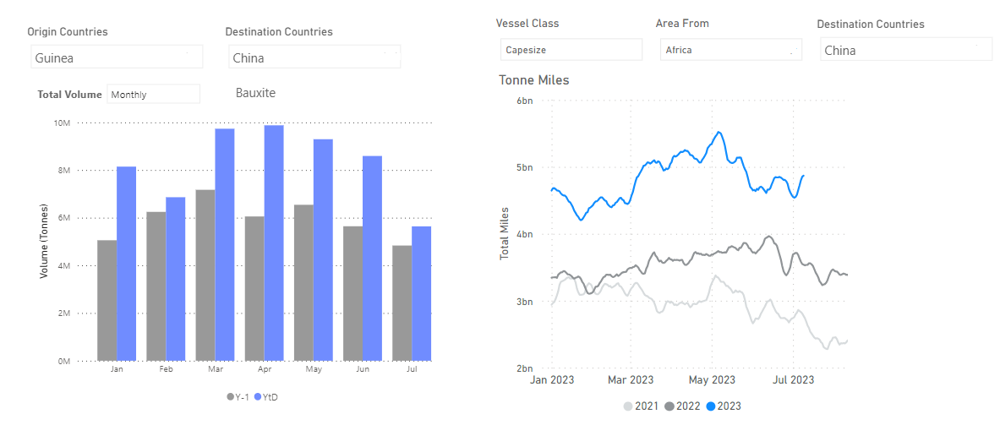
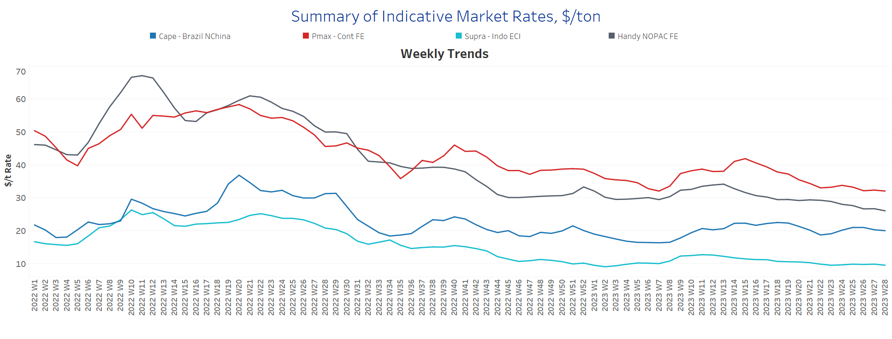
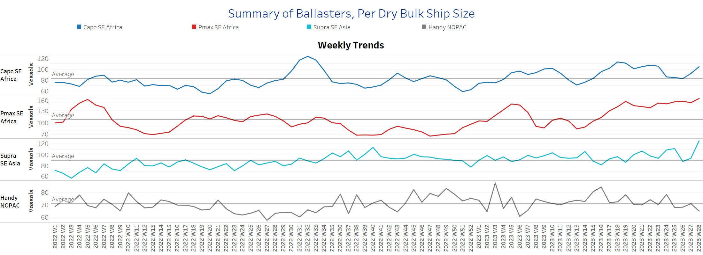
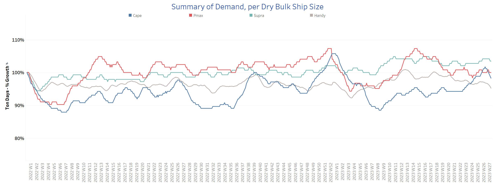
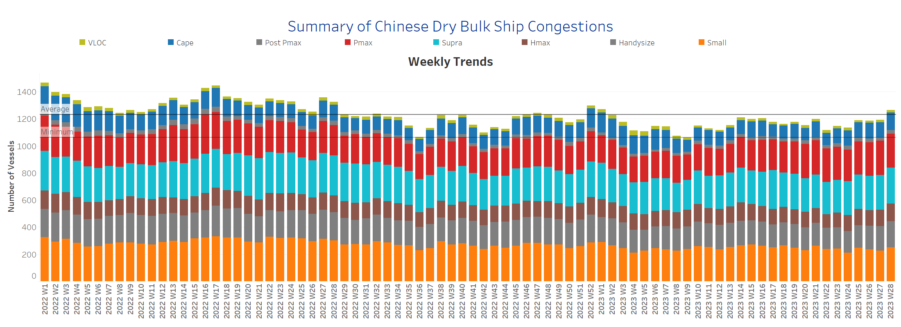

# Signal Dry Bulk Weekly Report

**Date:** July 12, 2023  
**Publisher:** Breakwave Advisors | **Category:** Market Insights  
**Original URL:** [https://www.breakwaveadvisors.com/insights/2023/7/12/signal-dry-bulk-weekly-report](https://www.breakwaveadvisors.com/insights/2023/7/12/signal-dry-bulk-weekly-report)  

---

## Chart of the Week: Capesize Bauxite From Guinea to China

Bauxite volumes from Wafr to China experienced significant growth in the first half of 2023

> **Figure 1: Market Chart 1**  
> **Interactive Data & Source:** [Signal Ocean Platform](https://go.signalocean.com/e/983831/amic-drybulkflows-downloadable/2p5gdg/332070280?h=IPQ5AM-Hwe-2OaL2pT8xR7NK3j-OA26TxbVrnIAoei4) | [Local Asset](file:///C:/Users/Dell/Github/Shipping/corpus/03-breakwave/insights/2023/assets/2023-07-12_signal-dry-bulk-weekly-report_img_unnamed-2023-07-12t131934144_13d7850d2550.png)

The start of the week on July 28 brought a downward trend in freight rates across all vessel sizes, indicating negative momentum. While concerns about rate stability continue, there was some positive news for the Capesize and Panamax segments as the Baltic Dry Index closed with a positive signal on July 10.

Specifically for the Capesize segment, there were promising developments on the Africa to China route. Monthly bauxite shipments exceeded the levels recorded in the first half of last year, indicating a potential upturn in activity (see chart above). The transportation of bauxite from South Africa to China has increased significantly since the beginning of 2023, resulting in a notable increase in capesize tonne-miles.

Meanwhile, the market remains uncertain about the possible extension of the Black Sea Grain Deal, as discussions between Russia and Turkey continue. Both countries are reportedly engaged in talks for a potential agreement, which is expected to be reached in the next few days. The outcome of these discussions will have significant implications for the grain market.

For more information on this week's trends, see the analysis sections below:

Freight Market, Supply, Demand and Port Congestion

## Section 1/ Freight​​​

‘The Big Picture’ - Capesize and Panamax Bulkers and Smaller Ship Sizes
**Market Rates ($/t) Weaker**

> **Figure 2: Market Chart 2**  
> **Interactive Data & Source:** [Signal Ocean Platform](https://www.thesignalgroup.com/signal-ocean-platform) | [Local Asset](file:///C:/Users/Dell/Github/Shipping/corpus/03-breakwave/insights/2023/assets/2023-07-12_signal-dry-bulk-weekly-report_img_unnamed-2023-07-12t132317045_817a8bfb7a61.png)

The second week of July begins with downward pressure on interest rates, while the recent sentiment appears relatively flat compared with the results of the previous two weeks.

- Capesize vessel freight rates from Brazil to North China are now around $20 per tonne, with rates not falling below the recent low of week 22.
- Panamax vessel freight rates from the Continent to the Far East continue to hover around $32 per tonne for the past three weeks, and recent indications suggest a similar pattern for the first half of July.
- Supramax vessel freight rates for the Indo-ECI route dropped eventually below $10 per tonne, while the overall sentiment remains relatively flat with no yet clear upward direction over the last ten weeks.
- Handysize freight rates for the NOPAC Far East route are now around $26 per tonne, missing last week's sentiment of around $27. The downward trend continues, with the recent high recorded in week 13 (~32/tonne).

## Section 2/ Supply ​​​

Supply Trend Lines for Key Load Areas

> **Figure 3: Ballasters (# Vessels) Increasing**  
> **Interactive Data & Source:** [Signal Ocean Platform](https://www.thesignalgroup.com/signal-ocean-platform) | [Local Asset](file:///C:/Users/Dell/Github/Shipping/corpus/03-breakwave/insights/2023/assets/2023-07-12_signal-dry-bulk-weekly-report_img_unnamed-2023-07-12t132504900_b5d0d229c37b.png)

In the second week of July, contrary to earlier indications for a drop nearly to the annual average, we now see an increasing pattern with a downward trend in the Handysize segment.

- Capesize SE Africa: Presently, the ship count stands above 100, which is significantly higher compared to the last week ending at the annual average of 83.
- Panamax SE Africa: The number of ships rose rapidly to about 160, nearly 20 more than four weeks earlier.
- Supramax SE Asia: The current vessel count also shows a sharp increase to 125 ships, which is 35 ships more than the annual average.
- Handysize NOPAC: The number of vessels has surprisingly dropped to 65, 7 fewer than the average for the year, and it remains to be seen whether the downward trend will remain stable over the next week.​​​

## Section 3/ Demand

Summary of Dry Bulk Demand, per Ship Size
TonneDays Decreasing

> **Figure 4: Second Week of July Saw Negative Momentum in the Growth of Tonne**  
> *The second week of July saw negative momentum in the growth of tonne days with the first signs of a downward correction in the Capesize segment, while the other vessel sizes continue to face serious challenges stemming from the uncertainty surrounding the possible extension of the Black Sea Grain Agreement.*  
> **Interactive Data & Source:** [Signal Ocean Platform](https://www.thesignalgroup.com/signal-ocean-platform) | [Local Asset](file:///C:/Users/Dell/Github/Shipping/corpus/03-breakwave/insights/2023/assets/2023-07-12_signal-dry-bulk-weekly-report_img_unnamed-2023-07-12t132714100_367e96f14af9.png)

- Capesize: Demand growth immediately declined from the previous weak peak, but is still well above the level of week 22.
- Panamax: There is still a halt in the downward spiral, however, there seems to be a relatively steady situation for a short-term recent spike.
- Supramax: Sentiment maintained the previous week's growth with a hint of a downward trend, while the July trend seems to be developing with a higher growth rate than in June.
- Handysize: Tonne days growth continued to follow a downward trend over the last three weeks, with lower values observed than in week 17.

## Section 4/ Port Congestion ​​​​​

> **Figure 5: Dry Bulk Ships Congested at Chinese Portsno of Vessels Increasing**  
> **Interactive Data & Source:** [Signal Ocean Platform](https://www.thesignalgroup.com/signal-ocean-platform) | [Local Asset](file:///C:/Users/Dell/Github/Shipping/corpus/03-breakwave/insights/2023/assets/2023-07-12_signal-dry-bulk-weekly-report_img_unnamed-2023-07-12t132836228_24fa837d3538.png)

The second week of July began with a further increase in the number of vessel overloads, mainly from the Capesize, Supramax and Handysize segments.

- Capesize: The current number of ships is around 130, which is 20 more than the previous week, and it remains to be seen if today's level can be maintained or if it will drop again to a number around 110 ships.
- Panamax: The number of is now around 250, while there seems to be a recent trend of congestion stabilizing around 250 mark in the last three weeks. ​​​​​
- Supramax: The ship count sustained the remarkable surge of the previous week and is now around 267, which is the highest point recorded since the end of week 19.
- Handysize: The number of congested vessels has now reached 194, surpassing the mark of 190 vessels, for the first time since the ending of week 3.

Data Source:[Signal Ocean Platform](https://www.thesignalgroup.com/signal-ocean-platform)
