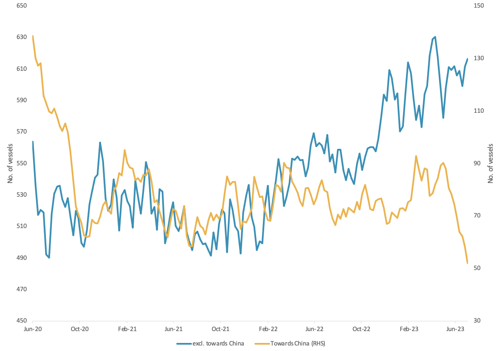
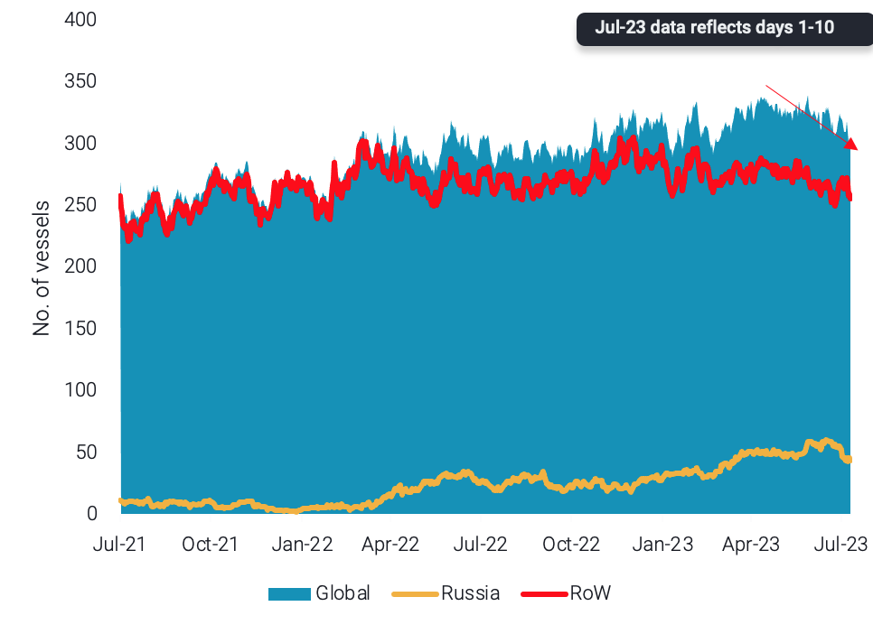

# Vortexa Freight Weekly

**Date:** July 13, 2023  
**Publisher:** Breakwave Advisors | **Category:** Market Insights  
**Original URL:** [https://www.breakwaveadvisors.com/insights/2023/7/13/vortexa-freight-weekly](https://www.breakwaveadvisors.com/insights/2023/7/13/vortexa-freight-weekly)  

---

*By*[*Dylan Simpson*](https://www.linkedin.com/search/results/all/?fetchDeterministicClustersOnly=false&heroEntityKey=urn%3Ali%3Afsd_profile%3AACoAACDtdn0BzHNR8syu_G8WxL-JXL-9PRT5AP4&keywords=dylan%20simpson&origin=RICH_QUERY_SUGGESTION&position=0&searchId=55ecee69-a408-47b2-8686-68f172e21af1&sid=mVl)

### Analysis / East of Suez / Dirty

## Chinese Crude Demand Sees Crude Tankers Slump Across the Board

> **Figure 1: Aframax & Suezmax Utilisation Towards China (Rhs) vs Towards The**  
> *Aframax & Suezmax utilisation towards China (RHS) vs towards the rest of the world*  
> **Interactive Data & Source:** [Vortexa](https://www.vortexa.com//oil-gas-data-traders-analysts-data-scientists?gclid=Cj0KCQjw8_qRBhCXARIsAE2AtRZKOvMnbilZ_6_91d7huSFFy71pWLrnPwGwOHVzXsmsG-1a1mZnQw8aAt89EALw_wcB&hsa_acc=1782073842&hsa_ad=548425387665&hsa_cam=14746637662&hsa_grp=125038601902&hsa_kw=&hsa_mt=&hsa_net=adwords&hsa_src=g&hsa_tgt=dsa-1431852288425&hsa_ver=3&utm_campaign=%5BCD%5D%20-%20DSA%20-%20EMEA&utm_medium=cpc&utm_medium=ppc&utm_source=google&utm_source=adwords&utm_term=) | [Local Asset](file:///C:/Users/Dell/Github/Shipping/corpus/03-breakwave/insights/2023/assets/2023-07-13_vortexa-freight-weekly_img_unnamed-2023-07-13t104552434_d3f29ef84456.png)

- Overall crude tanker demand towards China has declined almost 25% since May, mostly led by a drop in VLCC utilisation. However, other tanker classes are also being hit hard. Suezmax tankers have seen almost a 50% drop in tonne-miles towards China (mostly out of the Black Sea) and Aframax tonne-miles towards China have decreased by over 40% - mostly driven by sharp declines out of the Baltic.
- At the same time, Aframax and Suezmax tanker demand (excl. towards China) is finding support in the West of Suez, specifically out of the US Gulf, supporting freight rates.
- Current indications show that tankers discharging crude in China are not heading to the West of Suez. Aframax tankers are largely heading back to Russia Far East as competition for ESPO barrels increases between India and China. However, Suezmax tanker ballast destinations have suggested a move to West African and Middle East trade towards Europe.

### Analysis / West of Suez / Dirty

## Suezmax Utilisation Drops and Availability Creeps Upwards, Signalling a Slowdown on Tradeflows

> **Figure 2: Suezmax Utilisation for Selected Flows**  
> *Suezmax utilisation for selected flows*  
> **Interactive Data & Source:** [Vortexa](https://www.vortexa.com//oil-gas-data-traders-analysts-data-scientists?gclid=Cj0KCQjw8_qRBhCXARIsAE2AtRZKOvMnbilZ_6_91d7huSFFy71pWLrnPwGwOHVzXsmsG-1a1mZnQw8aAt89EALw_wcB&hsa_acc=1782073842&hsa_ad=548425387665&hsa_cam=14746637662&hsa_grp=125038601902&hsa_kw=&hsa_mt=&hsa_net=adwords&hsa_src=g&hsa_tgt=dsa-1431852288425&hsa_ver=3&utm_campaign=%5BCD%5D%20-%20DSA%20-%20EMEA&utm_medium=cpc&utm_medium=ppc&utm_source=google&utm_source=adwords&utm_term=) | [Local Asset](file:///C:/Users/Dell/Github/Shipping/corpus/03-breakwave/insights/2023/assets/2023-07-13_vortexa-freight-weekly_img_unnamed-2023-07-13t105344643_6f23b91fc807.png)

- Suezmax strength has started to subside on a global level, as utilisation is on a downward trajectory since late May. This is reflected both on the utilisation of the segment on both the “mainstream” trade as well as out of Russia.
- This is a product of softening exports from hubs that were supporting Suezmax demand, (US Gulf, West Africa, Middle East), following robust exports in the months of April and May. At the same time, Russia is focusing on exporting higher value products for revenue generation and as a result is displaying softer crude exports the past 2 months.
- This has resulted in a drop in Suezmax freight rates (TD20 around 30% down from recent peak). The trend will likely continue as Suezmax availability in key regions is creeping upwards. This indicates weaker trade flows in an environment where crude demand finds it difficult to absorb supply owing to historically high exported volumes during the previous months.

Data Source:[Vortexa](https://www.vortexa.com//oil-gas-data-traders-analysts-data-scientists?gclid=Cj0KCQjw8_qRBhCXARIsAE2AtRZKOvMnbilZ_6_91d7huSFFy71pWLrnPwGwOHVzXsmsG-1a1mZnQw8aAt89EALw_wcB&hsa_acc=1782073842&hsa_ad=548425387665&hsa_cam=14746637662&hsa_grp=125038601902&hsa_kw=&hsa_mt=&hsa_net=adwords&hsa_src=g&hsa_tgt=dsa-1431852288425&hsa_ver=3&utm_campaign=%5BCD%5D%20-%20DSA%20-%20EMEA&utm_medium=cpc&utm_medium=ppc&utm_source=google&utm_source=adwords&utm_term=)
