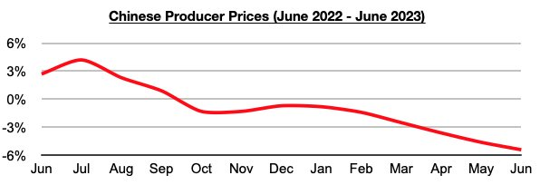

# China's Major Dry Bulk Imports Collectively Up 25% Y-O-Y In June

**Date:** July 14, 2023  
**Publisher:** Breakwave Advisors | **Category:** Market Insights  
**Original URL:** [https://www.breakwaveadvisors.com/insights/2023/7/14/chinas-major-dry-bulk-imports-collectively-up-25-y-o-y-in-june](https://www.breakwaveadvisors.com/insights/2023/7/14/chinas-major-dry-bulk-imports-collectively-up-25-y-o-y-in-june)  

---

*By*[*Jeffrey Landsberg*](https://www.linkedin.com/in/jeffrey-landsberg-70ab957/)

As we have continued to stress in our Weekly Dry Bulk Reports and Weekly China Reports, China's dry bulk commodity imports have remained strong as we have been anticipating despite the unevenness in China's industrial recovery. China's import data for June has now been released and shows that China's coal, iron ore, and soybean imports totaled a very robust 145.7 million tons. This is down month-on-month by just 2 million tons (-1%) and is up year-on-year by 29.5 million tons (25%). This sum is also close to the all-time high of 148.8 million tons that was imported in July 2020.

China's coal imports totaled a very robust 39.9 million tons last month. This is up month-on-month by 400,000 tons (1%) and is up year-on-year by 20.9 million tons (110%). Iron ore imports totaled 95.5 million tons. This is down month-on-month by 700,000 tons (-1%) but is up year-on-year by 6.5 million tons (7%). Soybean imports totaled 10.3 million tons. This is down month-on-month by 1.7 million tons (-14%) but is up year-on-year by 2 million tons (24%). Looking forward, we continue to stress that there are still no signs that China's robust appetite for commodity imports is set to suddenly reverse.

With global commodity prices remaining down this year compared to 2022’s prices (due primarily to weakness in demand from the world outside of China), China has continued to benefit greatly and happily import robust amounts of commodities. Of particular significance is that China’s producer prices (which includes commodities and production materials) most recently fell year-on-year in June by 5.4%. China’s producer prices have now contracted on a year-on-year basis for nine straight months, and June’s 5.4% contraction has marked the largest contraction during this period.

> **Figure 1: Chart**  
> [Local Asset](file:///C:/Users/Dell/Github/Shipping/corpus/03-breakwave/insights/2023/assets/2023-07-14_chinas-major-dry-bulk-imports-collectively-up-25-y-o-y-in-june_img_chart_9ec27b44b893.jpg)
