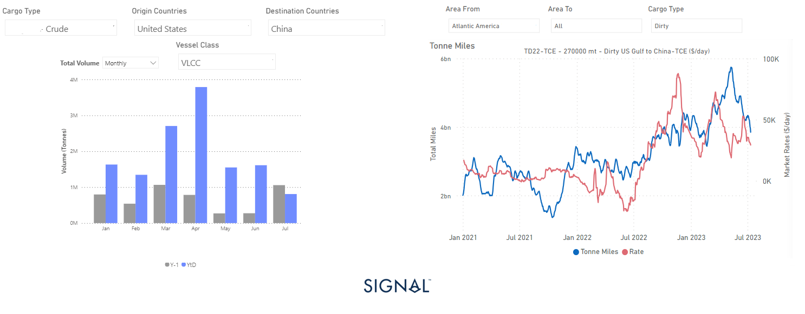
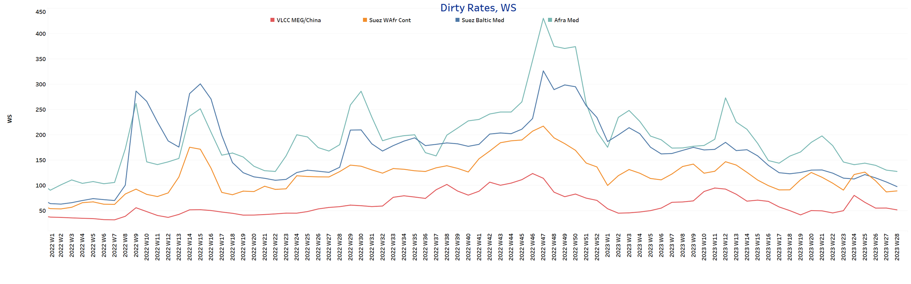
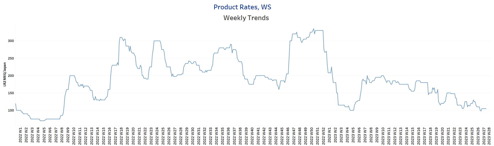
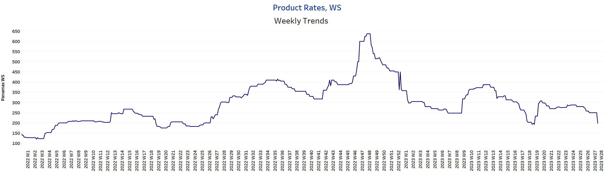
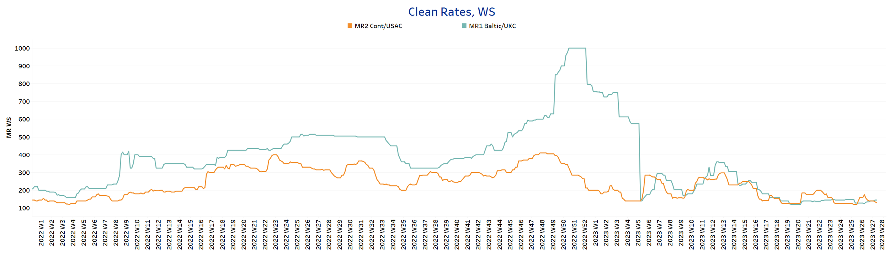
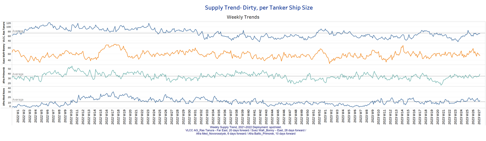
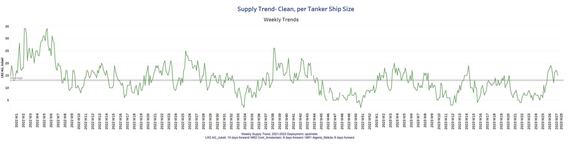
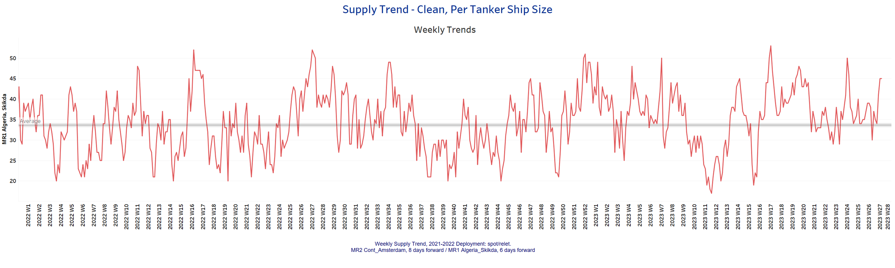
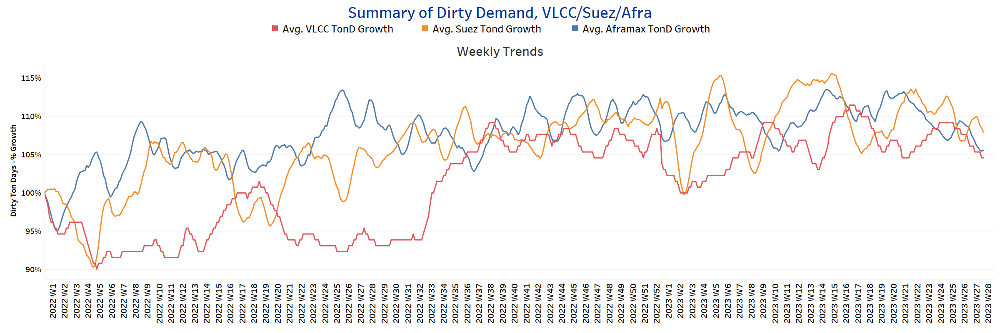
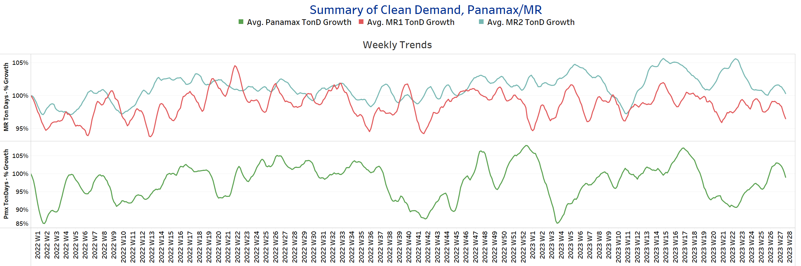

# Signal Tanker Weekly Report

**Date:** July 14, 2023  
**Publisher:** Breakwave Advisors | **Category:** Market Insights  
**Original URL:** [https://www.breakwaveadvisors.com/insights/2023/7/14/signal-tanker-weekly-report](https://www.breakwaveadvisors.com/insights/2023/7/14/signal-tanker-weekly-report)  

---

### Chart of the Week: VLCC Tonne Miles From the Us to China

*Decline in U.S. crude oil exports to China from May puts downward pressure on VLCC tonne-mile*

> **Figure 1: Data Source:https://go**  
> *Data Source:https://go.signalocean.com/e/983831/timeseries-tanker-downloadable/2p5nsv/332670064?h=l31rh6iwHoJW1yw5qcv1gecEue5Fz9P9xJ-jnNZRjjghttps://go.signalocean.com/e/983831/tanker-dynamic-oilflows/2p5nsy/332670064?h=l31rh6iwHoJW1yw5qcv1gecEue5Fz9P9xJ-jnNZRjjg*  
> **Interactive Data & Source:** [Signal Ocean Platform](https://go.signalocean.com/e/983831/tanker-dynamic-oilflows/2p5nsy/332670064?h=l31rh6iwHoJW1yw5qcv1gecEue5Fz9P9xJ-jnNZRjjg) | [Local Asset](file:///C:/Users/Dell/Github/Shipping/corpus/03-breakwave/insights/2023/assets/2023-07-14_signal-tanker-weekly-report_img_unnamed-2023-07-14t133216355_04431ad79748.png)

The second week of July has witnessed a sustained decline in crude tanker freight rates, which is further compounded by the challenges posed by the summer season on the market. Particularly, Chinese oil demand from the United States has significantly dropped compared to the levels seen a year ago. Analyzing the chart provided, it becomes evident that both May and June marked the lowest monthly volume of U.S. crude oil shipments to China via Very Large Crude Carriers (VLCC) tankers since early last year.
This recent trend of VLCC shipments carrying U.S. crude oil from the U.S. Gulf (USG) region has consequently resulted in a downward trajectory in the growth of dirty VLCC USG tonne-miles destined for China. This decline is notable, especially after reaching its peak in VLCC US tonne-miles just before the end of May.

For more information on this week's trends, see the analysis sections below:

Freight Market, Supply and Demand

## Section 1/ Freightmarket Rates (WS)

> **Figure 2: ‘Dirty’ WS​​​​ VLCC - Suezmax - Aframax Weaker**  
> **Interactive Data & Source:** [Signal Ocean Platform](https://www.thesignalgroup.com/signal-ocean-platform) | [Local Asset](file:///C:/Users/Dell/Github/Shipping/corpus/03-breakwave/insights/2023/assets/2023-07-14_signal-tanker-weekly-report_img_unnamed-2023-07-14t133334910_2b67d62acde8.png)

The second week of July witnessed a continuation of the downward trend in crude oil tanker freight rates. However, the Suezmax Wafr to Continent rates showed a slight improvement compared to the previous week's decline.

- VLCC MEG-China freight rates fell to 51.5 WS, down 4 points from the week 25 peak, and it appears that the downward trend will continue in the coming days in July.
- Suezmax freight rates for shipments from West Africa to continental Europe rose to 89WS, up 2 points from the end of the previous week. In the Suez-Baltic-Med route, rates lost significant strength and fell below the 100WS mark, which seems to be the low point for this year.
- Aframax Med freight rates fell to WS128, down 35% from the peak seven weeks ago.

> **Figure 3: ‘Product’ Wslr Steady**  
> **Interactive Data & Source:** [Signal Ocean Platform](https://www.thesignalgroup.com/signal-ocean-platform) | [Local Asset](file:///C:/Users/Dell/Github/Shipping/corpus/03-breakwave/insights/2023/assets/2023-07-14_signal-tanker-weekly-report_img_unnamed-2023-07-14t133435879_02a6cc1ddd28.png)

- LR2 AG freight rates now seem to have found a fairly stable sentiment at a level almost above the WS100 mark after the weaker dynamics of the previous week.

> **Figure 4: Market Chart 4**  
> **Interactive Data & Source:** [Signal Ocean Platform](https://www.thesignalgroup.com/signal-ocean-platform) | [Local Asset](file:///C:/Users/Dell/Github/Shipping/corpus/03-breakwave/insights/2023/assets/2023-07-14_signal-tanker-weekly-report_img_unnamed-2023-07-14t133534874_22573d5add86.png)

- Panamax Carib-to-USG rates fell well below the WS200 mark, down nearly 20% from the first week of July.

> **Figure 5: Market Chart 5**  
> **Interactive Data & Source:** [Signal Ocean Platform](https://www.thesignalgroup.com/signal-ocean-platform) | [Local Asset](file:///C:/Users/Dell/Github/Shipping/corpus/03-breakwave/insights/2023/assets/2023-07-14_signal-tanker-weekly-report_img_unnamed-2023-07-14t133629415_776768cf62a3.png)

- MR1 rates for the Baltic continent are now at 145WS, 20 points higher than in the first week of July, and it remains to be seen whether sentiment will remain at a similar level.

- MR2 rates for shipments from the continent to the U.S. fell below WS150 and reached levels around WS 130, down 26% from the week 27 peak.

## Section 2/ Supplysupply Trend Lines for Key Load Areas

> **Figure 6: Supply Trend Lines for Key Load Areas**  
> **Interactive Data & Source:** [Signal Ocean Platform](https://www.thesignalgroup.com/signal-ocean-platform) | [Local Asset](file:///C:/Users/Dell/Github/Shipping/corpus/03-breakwave/insights/2023/assets/2023-07-14_signal-tanker-weekly-report_img_unnamed-2023-07-14t133745406_9b0eeafce704.png)

The supply of crude oil tankers is steadily moving towards a higher number, almost exceeding the annual average, while Suezmax vessels are showing signs of easing.

- VLCC Ras Tanura: The current count is about 70 ships, which is 10 more than the last low in week 26.
- Suezmax Wafr Bonny: The current number of ships is now 55, which is 23 more ships than two weeks ago.
- Aframax Primorsk: The current ship count is now 5 ships above the annual average of 34 ships, with an unbroken upward trend since the end of the previous week.
- Aframax Med Novo: The number of ships continued the strong volatility of the previous days and increased to 14, which is 3 above the annual average.

> **Figure 7: ’Clean’lr2 (#Vessels) - Decreasing**  
> **Interactive Data & Source:** [Signal Ocean Platform](https://www.thesignalgroup.com/signal-ocean-platform) | [Local Asset](file:///C:/Users/Dell/Github/Shipping/corpus/03-breakwave/insights/2023/assets/2023-07-14_signal-tanker-weekly-report_img_unnamed-2023-07-14t133849666_e8adac844208.png)

> **Figure 8: MR1 (#Vessels) - Increasing**  
> **Interactive Data & Source:** [Signal Ocean Platform](https://www.thesignalgroup.com/signal-ocean-platform) | [Local Asset](file:///C:/Users/Dell/Github/Shipping/corpus/03-breakwave/insights/2023/assets/2023-07-14_signal-tanker-weekly-report_img_unnamed-2023-07-14t133943170_b4d9691170ce.png)

- Clean LR2 AG Jubail: The current number of ships is currently 15, which is 2 less than the previous week, and it remains to be seen if the numbers will continue to drop below the annual average of 13.

- Clean MR1 Algeria Skikda: The current ship count has now reached a high of 45 ships, which is about 15 ships more than the previous week and almost 10 ships more than the average for the year.​​​​​​

## Section 3/ Demandsummary of Tanker Demand per Ship Size & Segment

> **Figure 9: ​​‘Dirty’tonne Days Decreasing**  
> **Interactive Data & Source:** [Signal Ocean Platform](https://www.thesignalgroup.com/signal-ocean-platform) | [Local Asset](file:///C:/Users/Dell/Github/Shipping/corpus/03-breakwave/insights/2023/assets/2023-07-14_signal-tanker-weekly-report_img_unnamed-2023-07-14t134048619_142fcbe3eaad.png)

- Dirty tonne days: The second week of July ends with a downward correction in the percentage increase in demand (tonne days) in all size classes of oil tankers. It appears that the summer season is challenging crude demand, with the VLCC segment not showing the firmness that was seen in the May-June preriod due to Chinese oil demand.

> **Figure 10: ‘Clean’tonne Days Panamax / MR Decreasing**  
> **Interactive Data & Source:** [Signal Ocean Platform](https://www.thesignalgroup.com/signal-ocean-platform) | [Local Asset](file:///C:/Users/Dell/Github/Shipping/corpus/03-breakwave/insights/2023/assets/2023-07-14_signal-tanker-weekly-report_img_unnamed-2023-07-14t134223832_937266c6a89e.png)

- Panamax tonne days: The second week of July contradicted the optimism of early July, with significantly higher percentage growth and a level that again began to lose the momentum of the previous days.

- Clean MR tonne days: The sentiment of demand tonne miles continues to weaken and the percentage growth is still well below the peak recorded in week 23.

Data Source:[Signal Ocean Platform](https://www.thesignalgroup.com/signal-ocean-platform)
