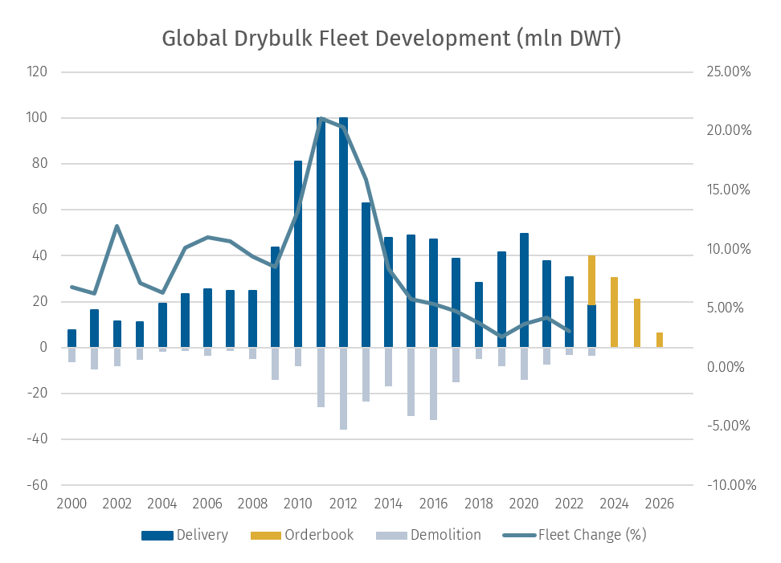
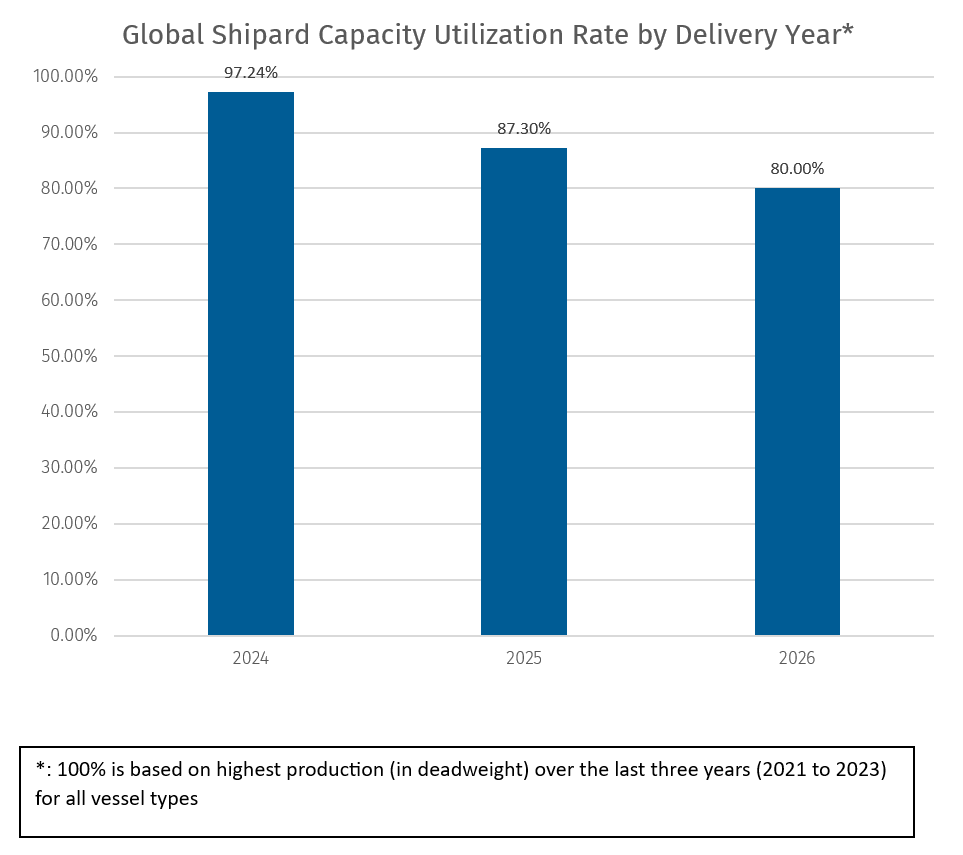
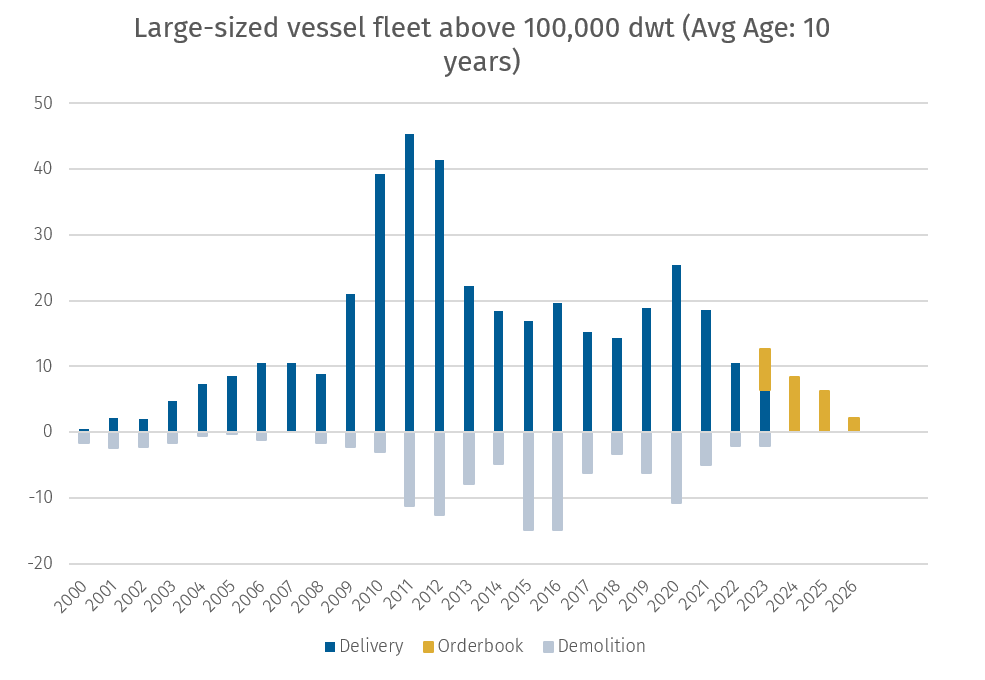
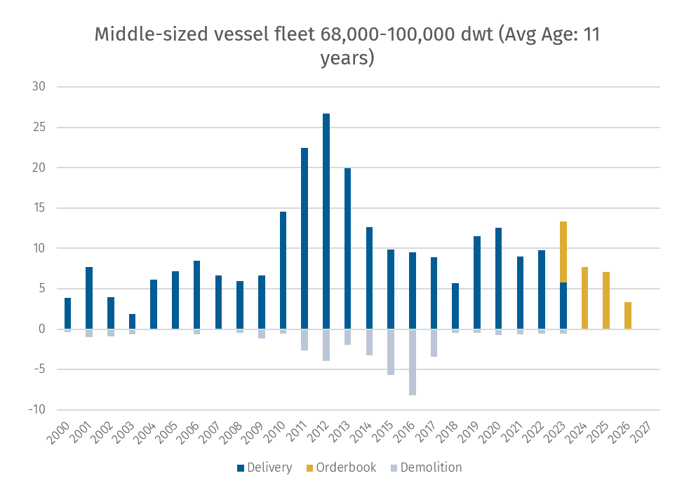
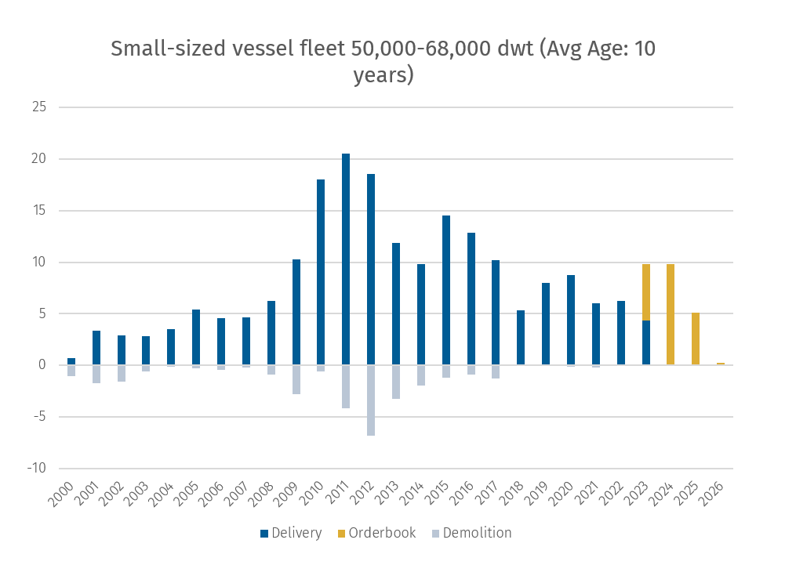

# BRS DRY BULK WEEKLY NEWSLETTER

**Date:** July 17, 2023  
**Publisher:** Breakwave Advisors | **Category:** Market Insights  
**Original URL:** [https://www.breakwaveadvisors.com/insights/2023/7/17/brs-dry-bulk-weekly-newsletter](https://www.breakwaveadvisors.com/insights/2023/7/17/brs-dry-bulk-weekly-newsletter)  

---

> **Figure 1: Brs Shipbrokers Monogram Logo**  
> [Local Asset](file:///C:/Users/Dell/Github/Shipping/corpus/03-breakwave/insights/2023/assets/2023-07-17_brs-dry-bulk-weekly-newsletter_img_brs-shipbrokers-monogram-logo_ee79606c8e74.png)

## 1h-23 Dry Bulk Fleet Recap

In the absence of an unexpected curveball(s), such as a sudden spike in fresh shipyard capacity or a unified consensus in fuel regulations, the supply narrative of dry bulkers (since 2018) is one of muted growth (see chart below). As fresh ordering gradually dissipated, the incumbent dry bulk orderbook represents just 8.13% of the active bulk fleet. By the end of 2023, and considering slippage (deliveries delayed or canceled), we anticipate a historically low net growth rate of 2.5%-3.0%.

> **Figure 2: Screenshot 2023 07 17 11.29.43**  
> [Local Asset](file:///C:/Users/Dell/Github/Shipping/corpus/03-breakwave/insights/2023/assets/2023-07-17_brs-dry-bulk-weekly-newsletter_img_screenshot2023-07-17112943_332771db4771.png)

In the chart below, we can observe that global shipyards (mainly China, Japan and South Korea based) currently possess very limited spare capacity for 2024-26 delivery. Indeed, the availability of shipyard slots has dwindled following the surge in orders for container liners and LNG carriers over the past few years.

> **Figure 3: Screenshot 2023 07 17 11.36.45**  
> [Local Asset](file:///C:/Users/Dell/Github/Shipping/corpus/03-breakwave/insights/2023/assets/2023-07-17_brs-dry-bulk-weekly-newsletter_img_screenshot2023-07-17113645_760146c0d5c1.png)

Among the new building orders for dry bulkers, it can be observed that the majority of fresh orders are concentrated in the Ultramax (60,000-68,000 dwt) and Kamsarmax (79,000-84,000 dwt) vessel segments. These aim to replace the traditional Supramax (50,000-60,000 dwt) and Panamax (68,000-79,000 dwt) segements. Next, we will categorized the dry bulk vessels into three major segments and discuss them accordingly.

### 1. Vessels Above 100,000 DWT

Looking at the active large-sized vessel fleet, which includes Babycape to VLOC (100K dwt & above), we can see that capacity is overwhelmingly dominated by Capesize (160 to 220K), followed by VLOC (220K & above). The fleet remains relatively young, with only 11.5% falling under the “15 & above” age bracket. This statistic implies the lack of suitable demolition candidates that can be immediately sent to the scrapyard in the event of a major freight downturn. Meantime, deliveries for VLOC had halted to nil by 2023 and Capesize expected deliveries for 2023 and 2024 remained low by historical averages. In addition, should fresh ordering remain muted while demolition levels not returning to 2011-2020 averages, then the age demographic of the large-size vessel fleet could worsen considerably by 2026/2027, with the majority of the carriers now within the “10-15 year” age bracket slipping to “15-20 year” age bracket by then, dragging up the average age of the fleet.

Based on the above statements, these provide credence for improved “supply fundamentals” in the coming years, which should arrive together with higher premiums for young carriers, assuming demand does not disappoint. Altogether, these forward tonnage tightening projections are reflected in the rising asset prices for new Capesize bulk carriers, despite the somewhat lackluster C5TC spot rates being printed for this year. From a low of $30.5 mln in early June 2020, the value of a Baltic Capesize 5-year-old carrier had peaked at $52 mln in just 2 years (a staggering 70% increase). While asset values have cooled down considerably from July 2022 to July 2023, they had managed to hover around a respectable $45 mln mark.

> **Figure 4: Screenshot 2023 07 17 11.37.48**  
> [Local Asset](file:///C:/Users/Dell/Github/Shipping/corpus/03-breakwave/insights/2023/assets/2023-07-17_brs-dry-bulk-weekly-newsletter_img_screenshot2023-07-17113748_d84af7b0d3c4.png)

### 2. Vessels Between 68,000 and 100,000 DWT

For the middle-sized vessel fleet, which includes Panamax to Over Panamax (68,000 to 100,000 dwt), we can see that Kamsarmaxes have surpassed Panamax vessels in terms of total deadweight tonnage, further solidifying its leading position in this middle-sized vessel fleet sector. There is a significant divergence within this subsegment between the older and younger fleets. Among the fleet aged 15 years and above, Panamax vessels account for 65.6%, while Kamsarmax vessels are much younger, only accounting for 19.7%. With an average age of only 6 years, it is fair to say that even for the Kamsarmax fleets in their original designs, there is still a considerable amount of time before the shipowners consider scrapping these vessels.

Shipowners have benefitted from a booming market from 2021 to 2022, allowing them to be more resilient in today’s lower freight environment and as a consequence, they can still afford to delay their scrapping plans. However, if freight rates in 2H23 fail to impress, scrapping older ships would be a feasible option for some owners. Meantime, prices for a 5-year-old Panamax fell from a high of $38 mln a year ago to $30 mln (-21.1%) range in Jul-23.

> **Figure 5: Screenshot 2023 07 17 11.38.38**  
> [Local Asset](file:///C:/Users/Dell/Github/Shipping/corpus/03-breakwave/insights/2023/assets/2023-07-17_brs-dry-bulk-weekly-newsletter_img_screenshot2023-07-17113838_a515d05c6c96.png)

### 3. Vessels Between 40,000 and 68,000 DWT

For the small-sized vessel fleet, which includes Supramax to Ultramax (50,000 to 68,000 dwt), it presents a similar situation as that of the middle-sized vessel fleet. Slightly slower in the pace of renewal and replacement for small-sized fleets compared to mid-sized fleets, Supramax remains the main staple in the small-sized vessel fleet sector and occupies a larger share of the fleet (58.3%). Given the expected annual delivery of nearly 100 Ultramax vessels over the coming years and a rather younger Supramax fleet, the Supramax is expected to remain the dominant vessel type in the next few years.

The segment is still digesting the oversupply of vessels due to the freight market boom in 2008, which lead to a surge in delivery in 2010 onwards (see chart below). Accordingly, currently 57.0% of the Supramax fleet fall into the 10-15 year age bracket. Over the next 2 to 3 years, the Supramax fleet might encounter similar demographic issues as the Capesize fleet. For a 5-year-old Supramax, following the decline in freight rates, ship value dropped to $26 mln from $31 mln a year ago.

> **Figure 6: Screenshot 2023 07 17 11.39.23**  
> [Local Asset](file:///C:/Users/Dell/Github/Shipping/corpus/03-breakwave/insights/2023/assets/2023-07-17_brs-dry-bulk-weekly-newsletter_img_screenshot2023-07-17113923_5a9944c66392.png)

In conclusion, looking at the supply side for all mainstream vessel types, there is no denying that we have a rosy prospect being painted as tonnage will tighten over the coming years. However, supply is just one side of the equation, the demand factor cannot be overlooked or understated. In the first half of this year, we witnessed a sluggish freight market due to global economic weakness, this has led year-on-year falls in daily returns for the shipowners, and as we have consistently emphasized (see Issue 62 for more information), recovery time is needed given the macro headwinds facing China.

---

**Tags:** Drybulk, Shipping, Supplychain  
