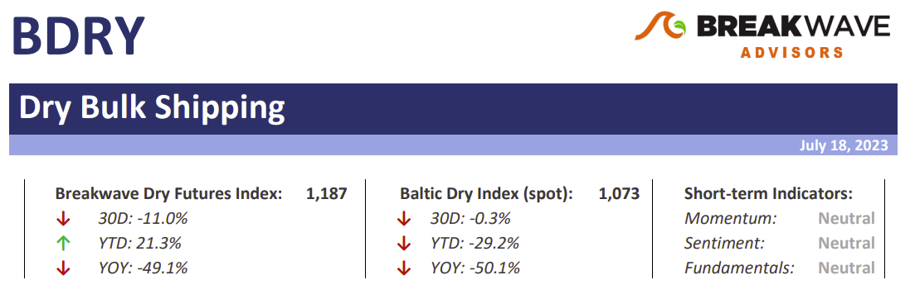
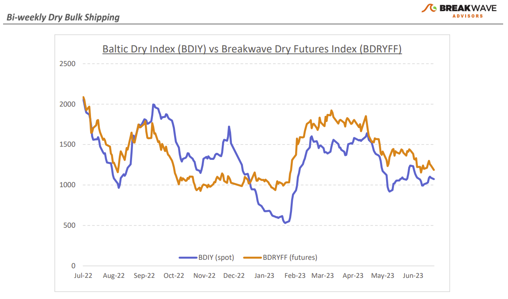
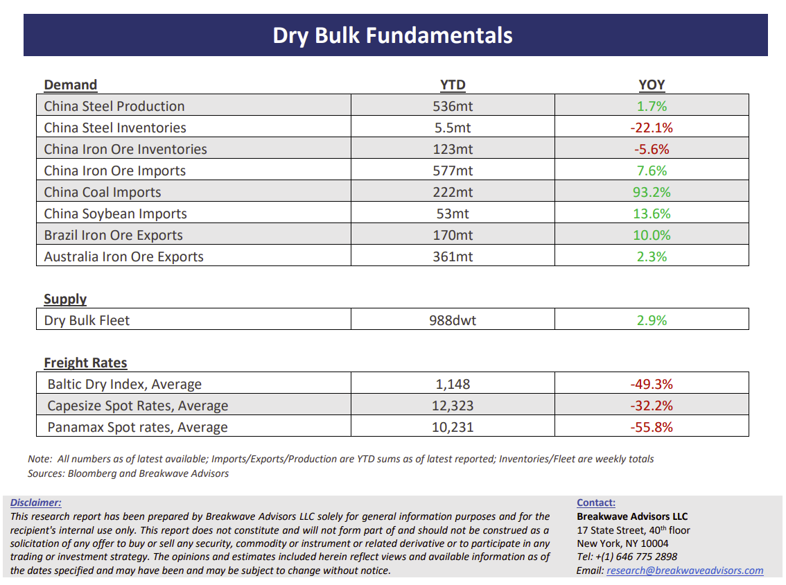

# Breakwave Bi-Weekly Dry Bulk Report - July 18, 2023

**Date:** July 18, 2023  
**Publisher:** Breakwave Advisors | **Category:** Market Insights  
**Original URL:** [https://www.breakwaveadvisors.com/insights/2023/7/11/template-breakwave-bi-weekly-tanker-report-july-11-2023-ndecc](https://www.breakwaveadvisors.com/insights/2023/7/11/template-breakwave-bi-weekly-tanker-report-july-11-2023-ndecc)  

---

> **Figure 1: Dbreporttop**  
> [Local Asset](file:///C:/Users/Dell/Github/Shipping/corpus/03-breakwave/insights/2023/assets/2023-07-18_template-breakwave-bi-weekly-tanker-report-july-11-2023-ndecc_img_dbreporttop_47d557713518.png)

**• Steady as she goes, with Capesize spot rates in a tight range**– With the summer doldrums in full swing, the Capesize spot market has remained in a tight range, reflecting the uninspiring chartering activity and a stable, normalized export rate when it comes to the major dry bulk commodities. Seasonal weather-related disruptions in West Africa are currently reducing the rate of bauxite loadings and that is gradually having a negative impact in the Atlantic basin, which is naturally showing in the form of vessel oversupply in that part of the world. In the Pacific, iron ore exports from Australia remain strong but steady, and the absence of any tightness in the supply of vessels (i.e., congestion, weather disruptions, etc.) have also allowed steady spot rates there. Overall, it appears that both charters and ship owners are pleased with the current status quo, and the next leg higher for spot Capesize rates might appear only after the seasonally strong demand returns, sometime in mid-August, when we expect the Atlantic market to take the lead once again. The sub-Cape segments have now weakened to their pre-Covid ranges, and we also expect some strengthening there in line with seasonal patterns. In dry bulk shipping, it is the rapid, unexpected bursts of demand that can make the difference when it comes to the spot market, and as much as such a change comes always without warning, anticipating seasonal shifts could potentially provide an edge for traders and investors alike. We believe we are getting closer to such a turning point, yet patience is a virtue and positioning ahead of such an event is key, given the rapid nature of the futures market moves once such a change is sniffed by traders.

**• Another set of soft Chinese economic data renews hopes for additional stimulus**– Once again, economic data out of China disappoints, with GDP growth now pointing to a sub-5% rate for the full year, a stark difference from the high growth expectations set earlier in the year. Real estate remains the main hurtle, as both properties sold and home prices took a tumble versus previous months. The disappointing growth rates combined with what is now a higher risk of deflation have raised hopes for stimulus measures, but once again, we feel that any such measures will be targeted and limited in scale, thus not changing much the course of the economy in the near-term. Demand remains the main obstacle for recovery, both domestic and external, but absent a major stimulus program that floods the Chinese economy with cash (a very unlikely scenario in our view), we believe policy support will only maintain the current soft trajectory rather than turn things around.

**• Dry bulk focus shifts back to fundamentals**– Following a period of high uncertainty and significant disruptions across the commodity spectrum, the gradual normalization of trade is shifting the market’s attention back to the traditional demand and supply dynamics that have shaped dry bulk profitability for decades. As effective fleet supply growth for the next few years looks marginal, demand will be the main determinant of spot freight rates with China returning back to the driver’s seat as the dominant force of bulk imports and thus shipping demand.

> **Figure 2: Dbreportchart**  
> [Local Asset](file:///C:/Users/Dell/Github/Shipping/corpus/03-breakwave/insights/2023/assets/2023-07-18_template-breakwave-bi-weekly-tanker-report-july-11-2023-ndecc_img_dbreportchart_892dabcdbe39.png)

> **Figure 3: Dbreportbottom**  
> [Local Asset](file:///C:/Users/Dell/Github/Shipping/corpus/03-breakwave/insights/2023/assets/2023-07-18_template-breakwave-bi-weekly-tanker-report-july-11-2023-ndecc_img_dbreportbottom_2a2c9ac032f5.png)
