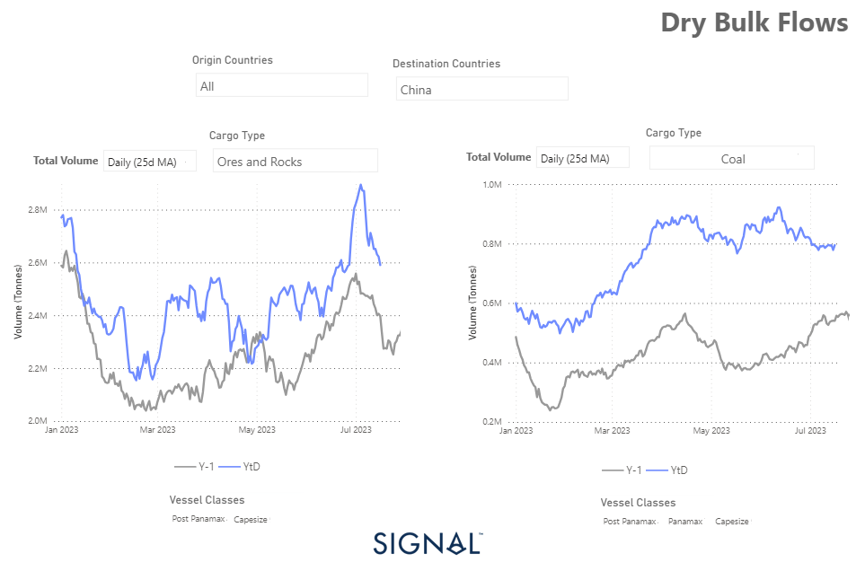
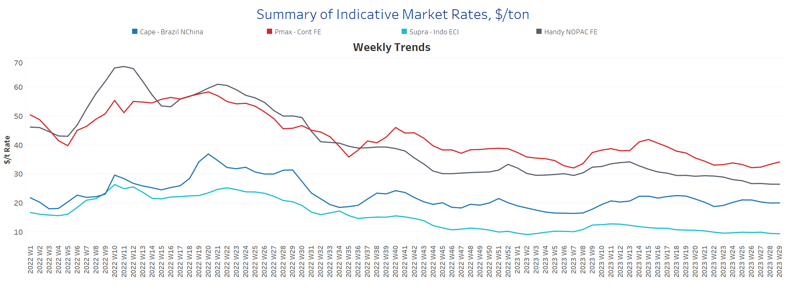
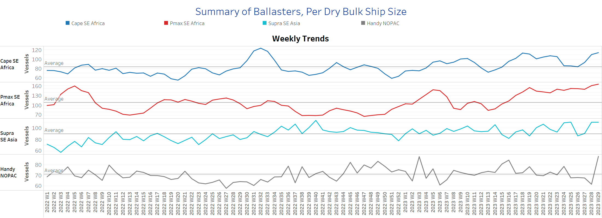
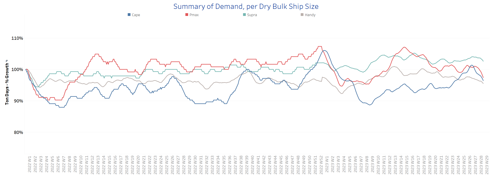
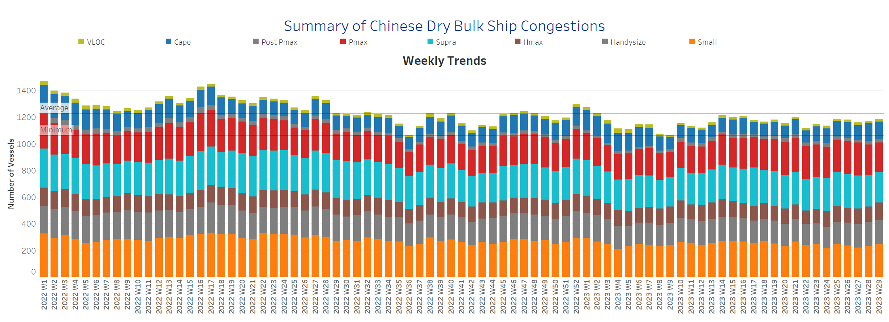

# Signal Dry Bulk Weekly Report

**Date:** July 19, 2023  
**Publisher:** Breakwave Advisors | **Category:** Market Insights  
**Original URL:** [https://www.breakwaveadvisors.com/insights/2023/7/19/signal-dry-bulk-weekly-report](https://www.breakwaveadvisors.com/insights/2023/7/19/signal-dry-bulk-weekly-report)  

---

## Chart of the Week: Iron Ore and Coal to China

*Iron ore and coal dry bulk flows to China daily (25d MA) above year-earlier level*

> **Figure 1: 241**  
> **Interactive Data & Source:** [Signal Ocean Platform](https://www.thesignalgroup.com/signal-ocean-platform) | [Local Asset](file:///C:/Users/Dell/Github/Shipping/corpus/03-breakwave/insights/2023/assets/2023-07-19_signal-dry-bulk-weekly-report_img_241_25c52ebf5204.png)

The third week of July sustained the downward trend of freight market rates of the previous days of July, however, signs of an upward trend were recorded in the Panamax Continent to Far East rates. On the supply side, the number of ballast ships increased significantly across all vessel size categories implying that freight rates are potentially likely to keep struggling to perform at higher levels, while uncertainty looms around Chinese economic performance.

Amid concerns about Chinese solid demand, we can see that a higher volume of coal and iron ore is heading to the second world’s largest economy from all origin countries. As we see in the image above, the daily 25 days moving average is surpassing throughout the year the levels recorded a year ago per month. This gives a pillar of resistance for freight rates to fall sharply to weaker levels than those recorded throughout July for the Capesize and Panamax vessel size segments.

Meanwhile, it is worth noting that most research houses have lowered their forecast for iron ore prices for the remainder of the year. But the market is fuelling optimism over a Chinese stimulus package to support the industry, in general. Currently, iron ore is trading at around $112 a tonne.

For more information on this week's trends, see the analysis sections below:

Freight Market, Supply, Demand and Port Congestion

## Section 1/ Freight​​​

‘The Big Picture’ - Capesize and Panamax Bulkers and Smaller Ship Sizes
**Market Rates ($/t) Weaker**

> **Figure 2: 242**  
> **Interactive Data & Source:** [Signal Ocean Platform](https://www.thesignalgroup.com/signal-ocean-platform) | [Local Asset](file:///C:/Users/Dell/Github/Shipping/corpus/03-breakwave/insights/2023/assets/2023-07-19_signal-dry-bulk-weekly-report_img_242_c8e07ea97658.png)

The third week of July begins with a still weaker sentiment of freight rates, while there has been an upward movement for the Panamax Cont-FE rates.

- **Capesize**vessel freight rates from Brazil to North China have fallen below $20 per tonne since the end of the previous week, with the last low in week 22 when rates fell below $19 per tonne.
- **Panamax**vessel freight rates from the Continent to the Far East moved upward to $34 per tonne at the beginning of the week, although it remains to be seen whether the upward trend will continue during the week.
- **Supramax**vessel freight rates for the Indo-ECI route fell below $9.5 per tonne, while the latest level resembles week 23 sentiment.
- **Handysize**freight rates for the NOPAC Far East route hovering around the previous week's level of $26.5 per tonne, and it is questionable whether the downward trend will continue through the end of the month.

## Section 2/ Supply ​​​

Supply Trend Lines for Key Load Areas
**Ballasters (# vessels) Increasing**

> **Figure 3: 243**  
> **Interactive Data & Source:** [Signal Ocean Platform](https://www.thesignalgroup.com/signal-ocean-platform) | [Local Asset](file:///C:/Users/Dell/Github/Shipping/corpus/03-breakwave/insights/2023/assets/2023-07-19_signal-dry-bulk-weekly-report_img_243_f48003792f1a.png)

The third week of July saw a strengthening of the upward trend of the previous week, as all ship size categories saw significantly more ship movements.

- **Capesize SE Africa**: The number of ballasters is 114, well above the annual average of 83.
- **Panamax SE Africa**: The number of ships maintained the accelerated level of the previous week and exceeded the mark of 160, which is almost 60 above the average for the year.
- **Supramax SE Asia**: The current number of ballast ships has increased to 110, which is almost 20 more than two weeks ago.
- **Handysize NOPAC**: The number of ballast ships has surprisingly risen to 88, 27 more than a week ago and one of the highest since the beginning of the year.

## Section 3/ Demand

Summary of Dry Bulk Demand, per Ship Size
**TonneDays Decreasing**

> **Figure 4: 244**  
> **Interactive Data & Source:** [Signal Ocean Platform](https://www.thesignalgroup.com/signal-ocean-platform) | [Local Asset](file:///C:/Users/Dell/Github/Shipping/corpus/03-breakwave/insights/2023/assets/2023-07-19_signal-dry-bulk-weekly-report_img_244_9118ef6b0979.png)

The third week of July persisted with the similar downward trend of the previous days of the month with the Capesize and Panamax vessel size segments recording a clear decrease.

- **Capesize:**Demand growth declined further from the previous weak peak, but is still well above the level of week 22, and it remains to be seen if July will bring significant weakness with the summer season ahead.
- **Panamax**: A similar trend of decrease is noted as in the Capesize, while Chinese coal demand will significantly determine the evolution of tonne days till the end of the third quarter this year.
- **Supramax:**Sentiment maintained a similar momentum to the previous two weeks’ growth, however, July’s trend is still developing with a higher growth rate than in June.
- **Handysize:**Tonne days growth has not yet shown hints of upward revival, while the extension of the Black Sea Grain Initiative is on the air following Russia’s decision to withdraw from the deal.

## Section 4/ Port Congestion ​​​​​

Dry bulk ships congested at Chinese ports
**No of VesselsDecreasing**

> **Figure 5: Data Source:signal Ocean Platform**  
> *Data Source:Signal Ocean Platform*  
> **Interactive Data & Source:** [Signal Ocean Platform](https://www.thesignalgroup.com/signal-ocean-platform) | [Local Asset](file:///C:/Users/Dell/Github/Shipping/corpus/03-breakwave/insights/2023/assets/2023-07-19_signal-dry-bulk-weekly-report_img_245_d2a83ef8cb2f.png)

The third week of July opened with a trend of downward revision of congestion defying last week’s estimates for a sudden increase. In the Capesize vessel size segment, there was only a trend of increase compared to the levels at the beginning of the month.

- **Capesize**: The current number of ship congestions held levels of last week at around 130, which is 20 more than two weeks ago.
- **Panamax**: The number is now around 221, which is 6 lower than the previous week, while there seems to be a downward revision compared to the highs recorded at week 25 of around 250.
- **Supramax**: The ship count of congestions dropped to 231, which is 7 lower than the previous week, and seems to be the lowest point recorded following four consecutive weekly increases.
- **Handysize**: The number of congested vessels has now reached 185, falling below the mark of 190 vessels since the end of the previous week, despite signs of an increase to around 190.

---

**Tags:** Drybulk, Shipping, Markets  
