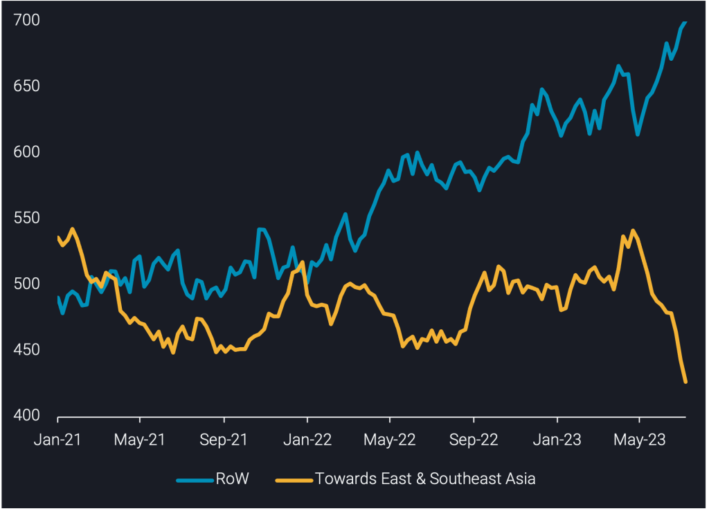
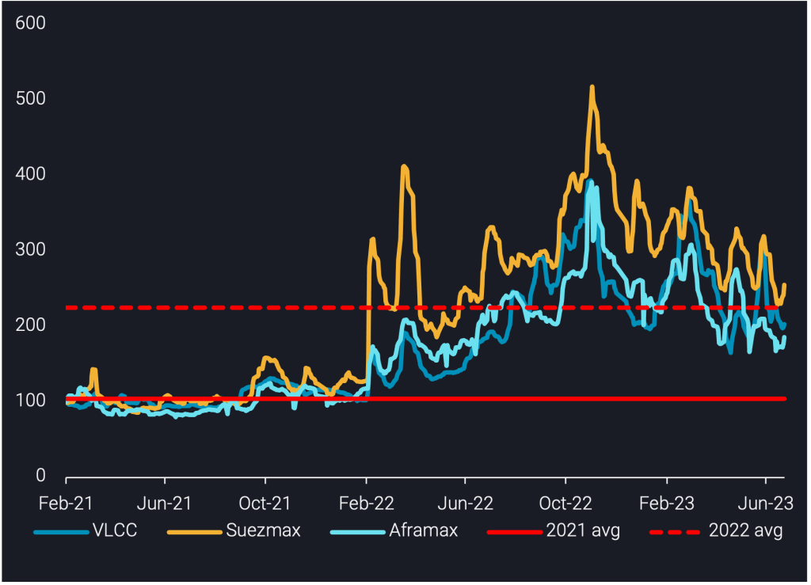

# Falling Chinese crude demand puts pressure on tanker demand, but post-summer support is likely

**Date:** July 20, 2023  
**Publisher:** Breakwave Advisors | **Category:** Market Insights  
**Original URL:** [https://www.breakwaveadvisors.com/insights/2023/7/19/falling-chinese-crude-demand-puts-pressure-on-tanker-demand-but-post-summer-support-is-likely](https://www.breakwaveadvisors.com/insights/2023/7/19/falling-chinese-crude-demand-puts-pressure-on-tanker-demand-but-post-summer-support-is-likely)  

---

***In this insight we provide an update on the current decline in crude tanker demand across the board. We drill down to identify the drivers of this as well as where crude tankers could find support in the latter half of 2023.***

***By***[***Dylan Simpson***](https://www.linkedin.com/search/results/all/?fetchDeterministicClustersOnly=false&heroEntityKey=urn%3Ali%3Afsd_profile%3AACoAACDtdn0BzHNR8syu_G8WxL-JXL-9PRT5AP4&keywords=dylan%20simpson&origin=RICH_QUERY_SUGGESTION&position=0&searchId=55ecee69-a408-47b2-8686-68f172e21af1&sid=mVl)

As we move into the second half of 2023, overall[crude tanker demand](https://analytics.vortexa.com/?dateRange=2021-01-01T00%3A00%3A00.000Z__2023-07-14T23%3A59%3A59.999Z&filtersEnabled=%5B%22v_v_st%22%2C%22v%22%2C%22l_c%22%2C%22o%22%2C%22d%22%2C%22d_r%22%2C%22v_o%22%5D&geoBreakdownDestinationGlobal=destination_shipping_region&latestProducts=%5B%2254af755a090118dcf9b0724c9a4e9f14745c26165385ffa7f1445bc768f06f11%22%5D&page=FleetUtilisation&primaryChartView1=line&primaryChartView3=bar&primarySplitProperty2=origin_shipping_region&primarySplitProperty3=vessel_class&primaryTimeSeries1=utilisation&primaryTimeSeries2=tonne-miles&primaryTimeSeries3=tonne-days&secondaryTimeSeries1=hide&tabId=46d966b9-07a9-4569-a584-3fc8a0c9aaf5&v=3&voyageStatus=%5B%22laden%22%5D)is slowing and trending slightly lower after a strong H1, particularly in the start of the second quarter of the year. Most of the current slump can be attributed to the[VLCC](https://analytics.vortexa.com/?dateRange=2021-01-01T00%3A00%3A00.000Z__2023-07-14T23%3A59%3A59.999Z&filtersEnabled=%5B%22v_v_st%22%2C%22v%22%2C%22l_c%22%2C%22o%22%2C%22d%22%2C%22d_r%22%2C%22v_o%22%5D&geoBreakdownDestinationGlobal=destination_shipping_region&latestProducts=%5B%2254af755a090118dcf9b0724c9a4e9f14745c26165385ffa7f1445bc768f06f11%22%5D&page=FleetUtilisation&primaryChartView1=line&primaryChartView3=bar&primarySplitProperty2=origin_shipping_region&primarySplitProperty3=destination_shipping_region&primaryTimeSeries1=utilisation&primaryTimeSeries2=tonne-miles&primaryTimeSeries3=tonne-days&secondaryTimeSeries1=hide&tabId=46d966b9-07a9-4569-a584-3fc8a0c9aaf5&v=3&vesselClasses=%5B%22vlcc_plus%22%5D&voyageStatus=%5B%22laden%22%5D)segment, which is seeing tonne-mile declines towards East and Southeast Asia, mostly out of the Middle East, West Africa and the US. This is partly due to the materialising OPEC production cuts, however, the declines towards China from non-OPEC countries indicate that Chinese demand is also behind this lower crude tanker demand.

> **Figure 1: Crude Tanker Utilisation Towards East & Southeast Asia vs The**  
> *Crude tanker utilisation towards East & Southeast Asia vs the rest of the world (no. of vessels)*  
> **Interactive Data & Source:** [Analytics Vortexa](https://analytics.vortexa.com/?dateRange=2021-01-04T00%3A00%3A00.000Z__2023-07-16T23%3A59%3A59.999Z&filtersEnabled=%5B%22v_v_st%22%2C%22v%22%2C%22l_c%22%2C%22o%22%2C%22d%22%2C%22d_r%22%2C%22v_o%22%5D&frequency1=week&geoBreakdownDestinationGlobal=destination_shipping_region&geoBreakdownOriginGlobal=origin_shipping_region&latestProducts=%5B%2254af755a090118dcf9b0724c9a4e9f14745c26165385ffa7f1445bc768f06f11%22%5D&page=FleetUtilisation&primaryChartView1=line&primaryChartView3=bar&primarySplitProperty2=origin_shipping_region&primarySplitProperty3=destination_country&primaryTimeSeries1=utilisation&primaryTimeSeries2=tonne-miles&primaryTimeSeries3=tonne-miles&secondaryTimeSeries1=hide&tabId=46d966b9-07a9-4569-a584-3fc8a0c9aaf5&to=%5B%22212fb4cfc862391faeacc63aa3ceb446a1c5ba6073da2a4e514a496e4c850635%22%2C%220e62f0e257232123903546d411a3325cd27e78c9088c6ba0d54bfe26717ee1de%22%5D&v=3&vesselClasses=%5B%22aframax%22%2C%22suezmax%22%5D&voyageStatus=%5B%22laden%22%5D) | [Local Asset](file:///C:/Users/Dell/Github/Shipping/corpus/03-breakwave/insights/2023/assets/2023-07-20_falling-chinese-crude-demand-puts-pressure-on-tanker-demand-but-post-summer-supp_img_241_f626d8f4f676.png)

The Aframax and Suezmax tanker classes have also seen declines but have been slightly supported in the West of Suez by increased US crude exports towards Europe. These tanker classes have seen the majority of their[tonne-mile](https://analytics.vortexa.com/?dateRange=2021-01-04T00%3A00%3A00.000Z__2023-07-16T23%3A59%3A59.999Z&filtersEnabled=%5B%22v_v_st%22%2C%22v%22%2C%22l_c%22%2C%22o%22%2C%22d%22%2C%22d_r%22%2C%22v_o%22%5D&frequency1=week&geoBreakdownDestinationGlobal=destination_shipping_region&geoBreakdownOriginGlobal=origin_shipping_region&latestProducts=%5B%2254af755a090118dcf9b0724c9a4e9f14745c26165385ffa7f1445bc768f06f11%22%5D&page=FleetUtilisation&primaryChartView1=line&primaryChartView3=bar&primarySplitProperty2=origin_shipping_region&primarySplitProperty3=destination_country&primaryTimeSeries1=utilisation&primaryTimeSeries2=tonne-miles&primaryTimeSeries3=tonne-miles&secondaryTimeSeries1=hide&tabId=46d966b9-07a9-4569-a584-3fc8a0c9aaf5&to=%5B%22212fb4cfc862391faeacc63aa3ceb446a1c5ba6073da2a4e514a496e4c850635%22%2C%220e62f0e257232123903546d411a3325cd27e78c9088c6ba0d54bfe26717ee1de%22%5D&v=3&vesselClasses=%5B%22aframax%22%2C%22suezmax%22%5D&voyageStatus=%5B%22laden%22%5D)declines stemming out of Russia (as they prioritise higher-value diesel exports at the expense of crude exports), mostly towards China but also to other Asian countries.

In the last 3 months, Suezmaxes have stood out as showing significantly more flexibility for switching between different crude trades. Specifically, data from our[Freight API/SDK](https://www.vortexa.com/product-api-and-sdk/)shows operators using trade routes such as Middle East-to-Med in between Russian crude voyages to optimise operations. Additionally, Suezmax tankers have shown signs of moving away from the Chinese crude trade by signalling West Africa after discharging in China, suggesting a switch for those tankers to European crude trade as well. In contrast, Aframax and VLCC tankers operating in the Chinese crude trade have shown little to no signs of altering ballast destinations after discharging in China.

> **Figure 2: Crude Tanker Freight Rate Indices per Vessel Class**  
> *Crude tanker freight rate indices per vessel class*  
> **Interactive Data & Source:** [Vortexa](https://www.vortexa.com//oil-gas-data-traders-analysts-data-scientists?gclid=Cj0KCQjw8_qRBhCXARIsAE2AtRZKOvMnbilZ_6_91d7huSFFy71pWLrnPwGwOHVzXsmsG-1a1mZnQw8aAt89EALw_wcB&hsa_acc=1782073842&hsa_ad=548425387665&hsa_cam=14746637662&hsa_grp=125038601902&hsa_kw=&hsa_mt=&hsa_net=adwords&hsa_src=g&hsa_tgt=dsa-1431852288425&hsa_ver=3&utm_campaign=%5BCD%5D%20-%20DSA%20-%20EMEA&utm_medium=cpc&utm_medium=ppc&utm_source=google&utm_source=adwords&utm_term=) | [Local Asset](file:///C:/Users/Dell/Github/Shipping/corpus/03-breakwave/insights/2023/assets/2023-07-20_falling-chinese-crude-demand-puts-pressure-on-tanker-demand-but-post-summer-supp_img_242_43a93e7d5d94.png)

In conclusion, the slow down in crude tanker demand is likely a result of current crude demand not quite being able to match the surge in crude supply to the market earlier in the year. This is causing a slowdown in seaborne trade, and the current freight rate picture for crude tankers suggests that this will likely propagate in the summer months. However, the flexibility shown by Suezmax tankers may keep tanker supply tight in the segment as they compete in alternative markets. Finally, a seasonal pick up in flows is expected to materialise in Q4 as the market digests crude supply, which – along with limited scheduled deliveries – will likely provide some upside for crude tanker rates as we close out the year.

***Data Source:***[***Vortexa***](https://www.vortexa.com//oil-gas-data-traders-analysts-data-scientists?gclid=Cj0KCQjw8_qRBhCXARIsAE2AtRZKOvMnbilZ_6_91d7huSFFy71pWLrnPwGwOHVzXsmsG-1a1mZnQw8aAt89EALw_wcB&hsa_acc=1782073842&hsa_ad=548425387665&hsa_cam=14746637662&hsa_grp=125038601902&hsa_kw=&hsa_mt=&hsa_net=adwords&hsa_src=g&hsa_tgt=dsa-1431852288425&hsa_ver=3&utm_campaign=%5BCD%5D%20-%20DSA%20-%20EMEA&utm_medium=cpc&utm_medium=ppc&utm_source=google&utm_source=adwords&utm_term=)

---

**Tags:** Tankers, Crude, Oil  
